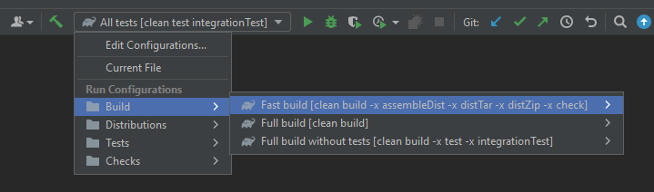

* [Prerequisites](#prerequisites)
* [Quick Start](#quick-start)
* [Building Ignite](#building-ignite)
* [Running sanity checks](#running-sanity-checks)
* [Running tests](#running-tests)
* [Checking and generating Javadoc](#checking-and-generating-javadoc)
* [Setting up IntelliJ Idea project](#setting-up-intellij-idea-project)
* [Use prepared IntelliJ Idea run configurations](#use-prepared-idea-run-configurations)
* [Code structure](#code-structure)
* [Release candidate verification](#release-candidate-verification)
***


## Prerequisites
 * Java 11 SDK
***


## Quick Start
Apache Ignite 3 follows standard guidelines for multi-module Gradle projects, so it can be built by using the following command from the
project root directory:
```shell
./gradlew clean build
```
This command builds a project and performs a few additional actions, for example it also runs tests. The build runs faster if
these actions are disabled as described in the next section.

To start an ignite-3 instance, package Apache Ignite 3 as described below and then follow [the user guide](https://ignite.apache.org/docs/3.0.0-beta/quick-start/getting-started-guide).
***


## Building Ignite
Apache Ignite 3 follows standard guidelines for multi-module Gradle projects, so it can be built by using the following command from the
project root directory (the tests are disabled with `-x test -x integrationTest` options):
```shell
./gradlew clean build -x test -x integrationTest
```
For a really fast build some other actions can be disabled too:
```shell
./gradlew clean build -x assembleDist -x distTar -x distZip -x check
```
***


## Running sanity checks

Run all checks:
```shell
./gradlew clean check
```

Skip all checks:
```shell
./gradlew clean build -x check
```

### Code style
Code style is checked with [Gradle Checkstyle Plugin](https://docs.gradle.org/current/userguide/checkstyle_plugin.html).
* [Checkstyle rules](check-rules/checkstyle-rules.xml)
* [Checkstyle suppressions](check-rules/checkstyle-suppressions.xml)
* [Checkstyle rules for javadocs](https://checkstyle.sourceforge.io/config_javadoc.html)

It is enabled by default and is bound to `check` task.

Build project without code style check:
```shell
./gradlew clean build -x checkstyleMain -x checkstyleIntegrationTest -x checkstyleTest -x checkstyleTestFixtures
```

Run code style checks only:
```shell
./gradlew checkstyleMain checkstyleIntegrationTest checkstyleTest checkstyleTestFixtures
```

Code style check results are generated at:
* `<mudule-dir>/build/reports/checkstyle/`

### Spotbugs
The project is checked for bugs with [Spotbugs Gradle Plugin](https://github.com/spotbugs/spotbugs-gradle-plugin).
* [Spotbugs exclusion rules](check-rules/spotbugs-excludes.xml)

Plugin is enabled by default and is bound to `build` task.

Note that currently only main sources are validated with Spotbugs.

Build project without spotbugs checks:
```shell
./gradlew clean build -x spotbugsMain
```

Run spotbugs checks only:
```shell
./gradlew spotbugsMain
```

### PMD
Static code analyzer is run with [Apache Gradle PMD Plugin](https://docs.gradle.org/current/userguide/pmd_plugin.html).
* [PMD rules](check-rules/pmd-rules.xml)
```shell
./gradlew pmdMain pmdTest
```
PMD check result (only if there are any violations) is generated at `<module-name>/build/reports/pmd/`.
***


## Running tests
Run unit tests only:
```shell
./gradlew clean test
```
Run unit + integration tests:
```shell
./gradlew clean test integrationTest
```
Run integration tests only:
```shell
./gradlew clean integrationTest
```
***

## Checking and generating Javadoc
Javadoc is generated and checked for correctness with [Gradle Javadoc Plugin](https://docs.gradle.org/current/dsl/org.gradle.api.tasks.javadoc.Javadoc.html).

Build Javadoc site (found in `build/docs/aggregateJavadoc/index.html`):
```
./gradlew aggregateJavadoc 
```

If you don't need to aggregate all javadoc you can use javadoc task and find generated 
artifacts in each module (for example `modules/api/build/docs/javadoc`)
```
./gradlew javadoc
```
***


## Setting up IntelliJ Idea project
You can quickly import Ignite project to your IDE using the root `build.gradle` file. In IntelliJ, choose `Open Project` from the
`Quick Start` box or choose `Open...` from the `File` menu and select the root `build.gradle` file.

After opening the project in IntelliJ, double check that the Java SDK is properly configured for the project:
* Open the `File` menu and select `Project Structure...`
* In the SDKs section, ensure that JDK 11 is selected (create one if none exist)
* In the `Project` section, make sure the project language level is set to 11.0 as Ignite makes use of several Java 11
  language features

Apache Ignite 3 uses machine code generation for some of its modules. Occasionally, IDEs may fail to trigger this code generation. In
this case, run a gradle build command from the command line. Subsequent builds can be performed from IDE without problems.
***

## Use prebuilt IntelliJ Idea run configurations
The Apache Ignite 3 project contains prebuilt IntelliJ Idea run configurations that can be useful in common cases. 



These configurations are stored in `.run` root folder and committed to GIT repo.

***NOTE: DO NOT MODIFY THESE CONFIGURATION FILES MANUALLY.***

For modification use Idea `Edit Configurations...` option.
***

## Code structure
High-level modules structure and detailed modules description can be found in the [modules readme](modules/README.md).
***

## Packaging

> Change the `<version>` placeholder into the version you'd like to use.

### Zip packaging
```shell
./gradlew clean allDistZip
```
Uber zip package will be located in `packaging/build/distributions`.

If you wand to build CLI, you can do it with:
```shell
./gradlew clean packaging-cli:distZip 
```
Zip package will be located in `packaging/cli/build/distributions`.

For Ignite node:
```shell
./gradlew clean packaging-db:distZip
```
Zip package will be located in `packaging/db/build/distributions`.

You can build zip and run CLI with the following commands:
```shell
./gradlew clean packaging-cli:distZip 
cd packaging/cli/build/distributions
unzip ignite3-cli-<version>
cd ignite3-cli-<version>
./bin/ignite3
```

To build a zip file with ignite-runner and run it:
```shell
./gradlew clean packaging-db:distZip
cd packaging/db/build/distributions
unzip ignite3-db-<version>
cd ignite3-db-<version>
./bin/ignite3db start
```

To stop the started node run:
```shell
./bin/ignite3db stop
```

### RPM/DEB packaging

There is also RPM/DEB packaging for Ignite. To build those packages run:
```shell
./gradlew clean buildDeb buildRpm -x check
```
`ignite3-cli` packages are located in `packaging/cli/build/distributions/` and `ignite3-db` packages in `packaging/db/build/distributions/`.
***

To install RPM packages run:
```shell
rpm -i ignite3-cli-<version>.noarch.rpm
rpm -i ignite3-db-<version>.noarch.rpm
```

To install DEB packages run:
```shell
dpkg --install ignite3-cli_<version>_all.deb
dpkg --install ignite3-db_<version>_all.deb
```

Run ignite3db service:
```shell
service ignite3db start
```

Stop ignite3db service:
```shell
service ignite3db stop
```

Use CLI:
```shell
ignite3
```

To uninstall RPM packages run:
```shell
rpm -e ignite3-cli
rpm -e ignite3-db
```

To uninstall DEB packages run:
```shell
dpkg --remove ignite3-cli
dpkg --remove ignite3-db
```

### Docker image

Gradle build also provides the task that can build docker image. To run this task make sure you have docker installed.
```shell
./gradlew clean docker -x test -x check
```

Run docker container with ignite node:
```shell
docker run -it --rm -p 10300:10300 -p 10800:10800 apacheignite/ignite3
```

There's a sample docker compose file which allows to run 3 nodes in a cluster in the `packaging/docker` directory. You can also use CLI from
the docker image using `cli` parameter and connect to nodes using their names from the docker network.
```shell
docker compose --file packaging/docker/docker-compose.yml up -d
docker run -it --rm --net ignite3_default apacheignite/ignite3 cli
> connect http://node1:10300
> cluster init --name cluster --ms-node node1 --ms-node node2 --ms-node node3
```

### How to launch multiple nodes on the same machine

The easiest way to start as many nodes as you want is to use the docker-compose file located in the `packaging/docker` directory.
If instead you want to start nodes manually, you can use the following commands:


```shell
./gradlew clean allDistZip
mkdir ignite-3-cluster
cd ignite-3-cluster
unzip ../packaging/build/distributions/ignite3-<version>.zip
```
This is what you've already done when you've launched single-node Ignite cluster. Now you need to copy node directory as many times as you 
want to start nodes. Then you need to change the name of the node in the `etc/ignite-config.conf` file in each node directory. 

Let's first rename current node directory to `node1` and copy it to `node2` and `node3`:
```shell
mv ignite3-db-<version> node1
cp -r node1 node2
cp -r node1 node3
```

After that you have to change the name of the node in `etc/vars.env` file in each node directory:

Linux:
```shell
sed -i 's/NODE_NAME=defaultNode/NODE_NAME=node1/' node1/etc/vars.env
sed -i 's/NODE_NAME=defaultNode/NODE_NAME=node2/' node2/etc/vars.env
sed -i 's/NODE_NAME=defaultNode/NODE_NAME=node3/' node3/etc/vars.env
```

MacOS: 
```shell
sed -i '' 's/NODE_NAME=defaultNode/NODE_NAME=node1/' node1/etc/vars.env
sed -i '' 's/NODE_NAME=defaultNode/NODE_NAME=node2/' node2/etc/vars.env
sed -i '' 's/NODE_NAME=defaultNode/NODE_NAME=node3/' node3/etc/vars.env
```

Each node binds to its set of ports: HTTP, HTTPS(if configured), internal TCP for communication between nodes, and client TCP.
By default the following configuration is used:
```
clientConnector.port = 10800,
network.port = 3344,
rest: { port = 10300, ssl.port = 10400 }
```
If you want to start nodes on the same machine, you have to change the ports in the `etc/ignite-config.conf` file in each node directory.

You can do it manually or use the following commands:

Linux:
```shell
sed -i 's/port=10300/port=10301/' node1/etc/ignite-config.conf
sed -i 's/port=10300/port=10302/' node2/etc/ignite-config.conf
sed -i 's/port=10300/port=10303/' node3/etc/ignite-config.conf

sed -i 's/port=3344/port=3301/' node1/etc/ignite-config.conf
sed -i 's/port=3344/port=3302/' node2/etc/ignite-config.conf
sed -i 's/port=3344/port=3303/' node3/etc/ignite-config.conf

sed -i 's/port=10800/port=10801/' node1/etc/ignite-config.conf
sed -i 's/port=10800/port=10802/' node2/etc/ignite-config.conf
sed -i 's/port=10800/port=10803/' node3/etc/ignite-config.conf

sed -i '/netClusterNodes=\[/,/\]/s/"localhost:3344"/"localhost:3301", "localhost:3302", "localhost:3303"/' node1/etc/ignite-config.conf
sed -i '/netClusterNodes=\[/,/\]/s/"localhost:3344"/"localhost:3301", "localhost:3302", "localhost:3303"/' node2/etc/ignite-config.conf
sed -i '/netClusterNodes=\[/,/\]/s/"localhost:3344"/"localhost:3301", "localhost:3302", "localhost:3303"/' node3/etc/ignite-config.conf
```

MacOS:
```shell
sed -i '' 's/port=10300/port=10301/' node1/etc/ignite-config.conf
sed -i '' 's/port=10300/port=10302/' node2/etc/ignite-config.conf
sed -i '' 's/port=10300/port=10303/' node3/etc/ignite-config.conf

sed -i '' 's/port=3344/port=3301/' node1/etc/ignite-config.conf
sed -i '' 's/port=3344/port=3302/' node2/etc/ignite-config.conf
sed -i '' 's/port=3344/port=3303/' node3/etc/ignite-config.conf

sed -i '' 's/port=10800/port=10801/' node1/etc/ignite-config.conf
sed -i '' 's/port=10800/port=10802/' node2/etc/ignite-config.conf
sed -i '' 's/port=10800/port=10803/' node3/etc/ignite-config.conf

sed -i '' '/netClusterNodes=\[/,/\]/s/"localhost:3344"/"localhost:3301", "localhost:3302", "localhost:3303"/' node1/etc/ignite-config.conf
sed -i '' '/netClusterNodes=\[/,/\]/s/"localhost:3344"/"localhost:3301", "localhost:3302", "localhost:3303"/' node2/etc/ignite-config.conf
sed -i '' '/netClusterNodes=\[/,/\]/s/"localhost:3344"/"localhost:3301", "localhost:3302", "localhost:3303"/' node3/etc/ignite-config.conf
```

Now all the nodes are set up and you can start them with the following commands:

```shell
./node1/bin/ignite3db start
./node2/bin/ignite3db start
./node3/bin/ignite3db start
```

After that connect to any node with CLI:
```shell
./ignite3-cli-<version>/bin/ignite3 connect http://localhost:10301
```

Then you can check that all nodes see each other:

```shell
cluster topology physical
```

To initialize a cluster run the following command inside Ignite CLI:

```shell
cluster init 
  --name myClusterOfThreeNodes 
  --cmg-node node1 --cmg-node node2 --cmg-node node3 
  --ms-node node1 --ms-node node2 --ms-node node3
```

To stop all nodes:

```shell
./node1/bin/ignite3db stop
./node2/bin/ignite3db stop
./node3/bin/ignite3db stop
```


### Run Swagger UI with docker-compose

To run Swagger UI in docker, run the following command:
```shell
  cd modules/rest-api/openapi
  docker-compose up
```

Swagger UI will be available at http://localhost:8082

## Release candidate verification
1. Build all packages (this will also run unit tests and all checks)
    ```shell
    ./gradlew clean docker distZip allDistZip buildRpm buildDeb
    ```
2. Go to the `packaging/build/distributions` directory which now contains the packaged CLI tool and Ignite
    ```shell
   cd packaging/build/distributions
   unzip ignite3-<version> 
    ```
3. Run the tool without parameters (full list of available commands should appear)
    ```shell
   cd ignite3-cli-<version>
   ./bin/ignite3
    ```
4. Start a node
    ```shell
   cd ../ignite3-db-<version>
   ./bin/ignite3db start
    ```
5. Check that the new node is up and running
    ```shell
    cd ../ignite3-cli-<version>
   ./bin/ignite3 node status
    ```
6. Stop the node
    ```shell
    cd ../ignite3-db-<version>
   ./bin/ignite3db stop
    ```
