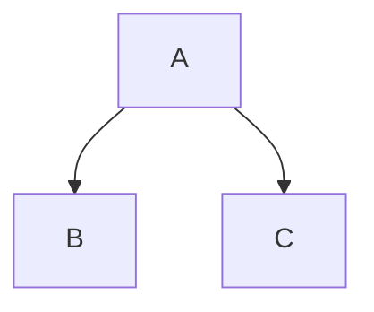

# Apache Ignite 3 Documentation

This is the documentation website for Apache Ignite 3, built using [Docusaurus](https://docusaurus.io/), a modern static website generator.

## Project Status

This documentation site is currently being migrated from Jekyll + AsciiDoc to Docusaurus + Markdown/MDX as part of [JIRA ticket IGNITE-26681](https://issues.apache.org/jira/browse/IGNITE-26681).

**Migration Progress:** Sections 1-8 Complete (Environment, Navigation, Conversion Agent, Content Conversion)

All 86 documentation files have been converted from AsciiDoc to Markdown/MDX. See [IGNITE-26681/docusaurus-migration-project-plan.md](../IGNITE-26681/docusaurus-migration-project-plan.md) for detailed migration plan and progress tracking.

## Features

- **Multi-version documentation**: Supports versions 3.0.0 and 3.1.0 (current)
- **Local search**: ASF-compliant search without external dependencies
- **Multi-language code examples**: Java, C#/.NET, C++, Python, SQL
- **Mermaid diagrams**: Built-in support for flowcharts, sequence diagrams, and more
- **Railroad diagrams**: Custom component for SQL syntax diagrams with clickable links
- **Syntax highlighting**: Prism.js with custom themes
- **Responsive design**: Mobile-friendly layout
- **Custom styling**: Apache Ignite branding and colors

## Requirements

- Node.js >= 20.0
- npm >= 9.0

## Installation

Navigate to the docs directory and install dependencies:

```bash
cd docs
npm install
```

For a clean install (recommended for CI/CD or when troubleshooting):

```bash
npm ci
```

**Note**: All npm commands in this guide should be run from the `docs/` directory.

## Local Development

Start the development server from the `docs/` directory:

```bash
npm start
```

This command:
- Starts a local development server at `http://localhost:3000/docs/ignite3/`
- Enables hot reload (most changes are reflected live without restarting)
- Makes the server accessible on your local network via your IP address (e.g., `http://192.168.1.x:3000/docs/ignite3/`)

**What you'll see**:
- The documentation homepage with navigation to all sections
- Version selector dropdown (3.0.0 and 3.1.0)
- Search functionality (keyboard shortcut: `Cmd+K` or `Ctrl+K`)
- All converted documentation pages with proper formatting, code highlighting, and diagrams

For faster startup during active development:

```bash
npm run start:fast
```

The development server is accessible on your local network via your IP address (e.g., `http://192.168.1.x:3000/docs/ignite3/`).

## Build

Build the site for production:

```bash
npm run build
```

This generates static content into the `build` directory. The build output can be served using any static web hosting service.

For a full production build with TypeScript validation:

```bash
npm run build:prod
```

For faster builds during testing (without minification):

```bash
npm run build:fast
```

## Testing Production Build

**IMPORTANT**: You must build the site before serving it. The search functionality requires the build step to generate search indexes.

Build and serve in one command (recommended):

```bash
npm run serve:build
```

Or build and serve separately:

```bash
npm run build
npm run serve
```

The production build will be available at `http://localhost:3000/docs/ignite3/`.

## Validation

Validate documentation quality before committing:

### Quick Validation

Runs TypeScript checks, link validation, and image validation:

```bash
npm run validate:quick
```

### Full Validation

Runs all validations including production build:

```bash
npm run validate
```

### Individual Checks

Check internal links:

```bash
npm run check:links
```

Check image references and alt text:

```bash
npm run check:images
```

Validate production build output:

```bash
npm run check:build
```

TypeScript type checking:

```bash
npm run typecheck
```

## Project Structure

```
docs/
├── docs/                      # Current version documentation (3.1.0)
│   └── *.md, *.mdx           # Documentation pages
├── versioned_docs/            # Archived versions
│   └── version-3.0.0/        # Version 3.0.0 documentation
├── static/                    # Static assets
│   └── img/                  # Images and icons
├── src/
│   ├── components/           # React components
│   ├── css/                  # Custom CSS
│   │   └── custom.css        # Theme customization
│   └── pages/                # Custom pages
├── scripts/                   # Validation scripts
│   ├── check-links.js        # Link validation
│   ├── check-images.js       # Image validation
│   └── check-build.js        # Build validation
├── build/                     # Production build output (generated)
├── docusaurus.config.ts      # Site configuration
├── sidebars.ts               # Navigation structure
├── package.json              # Dependencies and scripts
└── tsconfig.json             # TypeScript configuration
```

## Configuration

### Site Configuration

Main configuration is in [docusaurus.config.ts](docusaurus.config.ts):

- Site metadata (title, tagline, URLs)
- Theme configuration (colors, navbar, footer)
- Plugin configuration (docs, search, mermaid)
- Version management

### Navigation

Sidebar navigation is configured in [sidebars.ts](sidebars.ts).

### Styling

Custom styles are in [src/css/custom.css](src/css/custom.css):

- Apache Ignite brand colors
- Typography (Open Sans font family)
- Code block styling
- Tab styling
- Admonition styling
- Table styling

## Versioning

The site supports multiple documentation versions. Version 3.1.0 is the current version.

To create a new version:

```bash
npm run docusaurus docs:version 3.2.0
```

See [IGNITE-26681/versioning-workflow.md](../IGNITE-26681/versioning-workflow.md) for detailed versioning procedures.

## Search

Search is implemented using [@easyops-cn/docusaurus-search-local](https://github.com/easyops-cn/docusaurus-search-local), providing local search without external dependencies (ASF-compliant).

**IMPORTANT**: Search indexes are generated during the build process. You must run `npm run build` before the search functionality will work in production builds.

Search features:
- Keyboard shortcut: `Cmd+K` (Mac) or `Ctrl+K` (Windows/Linux)
- Version-specific search indexes
- Result highlighting
- English language support

## Diagrams

### Mermaid

Mermaid diagrams are supported via [@docusaurus/theme-mermaid](https://docusaurus.io/docs/markdown-features/diagrams):

````markdown

````

Supported diagram types: flowcharts, sequence diagrams, class diagrams, state diagrams, ER diagrams, Gantt charts, git graphs, pie charts.

### Railroad Diagrams

Railroad diagrams (syntax diagrams) are supported via a custom React component using the railroad.js library. This component preserves the ability to create clickable links within diagrams for navigation between SQL grammar rules.

**Component Location**: `src/components/RailroadDiagram/`

**Usage**:

```mdx
---
title: My SQL Reference Page
---

import RailroadDiagram from '@site/src/components/RailroadDiagram';

## CREATE TABLE

<RailroadDiagram>
{`
Diagram(
  Terminal('CREATE'),
  Terminal('TABLE'),
  Optional(Terminal('IF NOT EXISTS')),
  NonTerminal('table_name', {href:'./grammar-reference/#qualified_table_name'}),
  Terminal('('),
  NonTerminal('column_definition', {href:'./grammar-reference/#column_definition'}),
  Terminal(')')
)
`}
</RailroadDiagram>
```

**Key Features**:
- Supports all railroad diagram functions: `Terminal()`, `NonTerminal()`, `Optional()`, `Sequence()`, `Choice()`, `Skip()`, `OneOrMore()`, `ZeroOrMore()`, `Comment()`
- Clickable links via `href` parameter on `NonTerminal()` and `Terminal()`
- Automatic conversion of relative links to Docusaurus routes
- Custom styling: white bubble backgrounds with blue clickable links (red on hover)
- Dark mode support

**Important Notes**:
- Use template literals `{` ... `}` to wrap the diagram code
- The `Diagram()` function automatically adds `Start()` and `End()` (don't include them unless using `ComplexDiagram()`)
- Preserve href parameters exactly as they appear in the railroad syntax for clickable navigation

**Examples**: See `docs/sql/reference/ddl.mdx`, `docs/sql/reference/dml.mdx`, and `docs/sql/reference/grammar-reference.mdx` for 52 railroad diagram examples with clickable links.

## Code Examples

### Syntax Highlighting

Prism.js provides syntax highlighting for:
- Java
- C# / .NET
- C++
- Python
- SQL
- Bash/Shell
- JSON
- YAML

Light theme: GitHub
Dark theme: Dracula

### Multi-language Tabs

Use tabs to show code examples in multiple languages:

```mdx
import Tabs from '@theme/Tabs';
import TabItem from '@theme/TabItem';

<Tabs groupId="programming-language">
  <TabItem value="java" label="Java">
    ```java
    // Java code
    ```
  </TabItem>
  <TabItem value="csharp" label="C#">
    ```csharp
    // C# code
    ```
  </TabItem>
</Tabs>
```

The `groupId` enables tab synchronization across the page.

## Troubleshooting

### Clear Cache

If you encounter build issues, clear the cache:

```bash
npm run clear
```

### Stale Development Server

If the development server becomes unresponsive:

```bash
pkill -f "docusaurus start"
npm start
```

### Validation Errors

If validation scripts report errors:

1. Check the script output for specific issues
2. Fix broken links or missing images
3. Run validation again to confirm fixes

### TypeScript Errors

Check TypeScript errors without building:

```bash
npm run typecheck
```

## CI/CD Integration

The documentation build can be integrated into CI/CD pipelines using the validation scripts.

Example CI workflow:

```bash
npm ci                      # Install dependencies
npm run typecheck          # Type check
npm run check:links        # Validate links
npm run check:images       # Validate images
npm run build:prod         # Production build
npm run check:build        # Validate build output
```

See [IGNITE-26681/build-scripts-documentation.md](../IGNITE-26681/build-scripts-documentation.md) for detailed CI/CD integration examples including GitHub Actions and TeamCity configurations.

## Documentation

Additional documentation for this project:

- [Migration Project Plan](../IGNITE-26681/docusaurus-migration-project-plan.md) - Complete migration plan and progress
- [Build Scripts Documentation](../IGNITE-26681/build-scripts-documentation.md) - Detailed npm scripts and CI/CD integration
- [Versioning Workflow](../IGNITE-26681/versioning-workflow.md) - Version management procedures
- [Search Implementation](../IGNITE-26681/search-implementation.md) - Search configuration and maintenance
- [Plugins and Dependencies](../IGNITE-26681/plugins-dependencies-implementation.md) - Plugin details and usage

## Contributing

When contributing documentation changes:

1. Run `npm run validate:quick` before committing
2. Ensure all links and images are valid
3. Add alt text to images (accessibility requirement)
4. Follow the existing documentation structure
5. Test changes locally with `npm start`

## Support

For issues related to the documentation site:

- **JIRA**: [IGNITE-26681](https://issues.apache.org/jira/browse/IGNITE-26681)
- **Docusaurus**: [Official Documentation](https://docusaurus.io/)
- **Apache Ignite**: [Community Resources](https://ignite.apache.org/community.html)

## License

This documentation is licensed under the Apache License 2.0. See the project root for license details.
