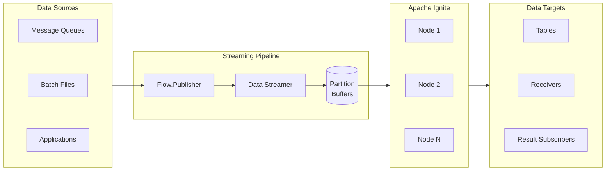
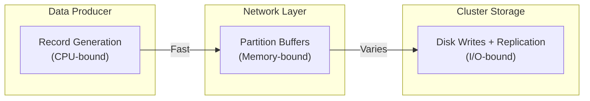
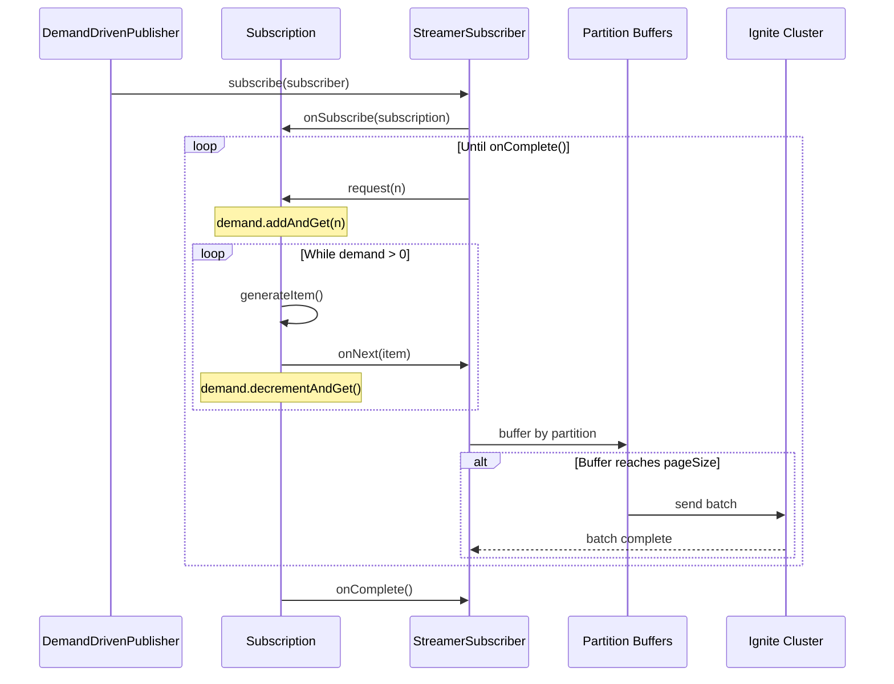
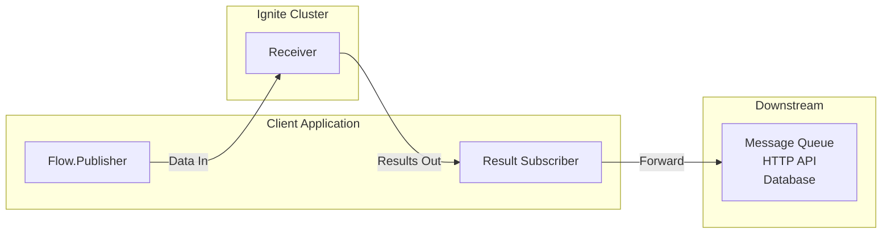

import Tabs from '@theme/Tabs';
import TabItem from '@theme/TabItem';

Apache Ignite participates in streaming architectures as both a data consumer and data source. The Data Streamer API accepts entries from any Java Flow publisher, partitions them by key, and delivers batches to cluster nodes for processing. You can stream data into tables, use receivers to transform and route data across multiple tables, or return computed results to downstream systems.



Data streaming provides at-least-once delivery guarantee. Under normal operation, each item is delivered exactly once. If a batch fails and is retried, some items in that batch may be delivered again. Design your data model to handle potential duplicates, either through idempotent operations (upsert) or by using primary keys that allow safe re-insertion.

## Using Data Streamer API

The [Data Streamer API](../../api-reference/native-clients/java/data-streamer-api) uses the Java Flow API (`java.util.concurrent.Flow`) publisher-subscriber model. You create a publisher that streams data entries to a table view, and the streamer distributes these entries across the cluster. The `DataStreamerOptions` object configures batch sizes, parallelism, auto-flush intervals, and retry limits.

### Configuring Data Streamer

`DataStreamerOptions` controls how data flows into your cluster:

<Tabs>
<TabItem value="java" label="Java">

```java
DataStreamerOptions options = DataStreamerOptions.builder()
    .pageSize(1000)
    .perPartitionParallelOperations(1)
    .autoFlushInterval(5000)
    .retryLimit(16)
    .build();
```

</TabItem>
<TabItem value="dotnet" label=".NET">

```csharp
var options = new DataStreamerOptions
{
    PageSize = 1000,
    RetryLimit = 16,
    AutoFlushInterval = TimeSpan.FromSeconds(5)
};
```

</TabItem>
</Tabs>

| Option | Default | Description |
|--------|---------|-------------|
| `pageSize` | 1000 | Number of entries per batch sent to the cluster. |
| `perPartitionParallelOperations` | 1 | Concurrent batches allowed per partition. |
| `autoFlushInterval` | 5000 ms | Time before incomplete buffers are flushed. |
| `retryLimit` | 16 | Maximum retry attempts for failed submissions. |

#### Memory and Throughput Considerations

The streamer allocates buffers based on these settings. Client memory usage per partition:

```text
memoryPerPartition = pageSize × perPartitionParallelOperations × avgRecordSize
```

For a table with 25 partitions and 1KB average record size:

| Configuration | Page Size | Parallel Ops | Memory |
|---------------|-----------|--------------|--------|
| Default | 1,000 | 1 | ~25 MB |
| High throughput | 500 | 8 | ~100 MB |

Smaller page sizes with higher parallelism create more frequent, smaller batches. This produces smoother I/O patterns that align with cluster checkpoint and replication cycles.

### Streaming Data

Each entry must be wrapped in a `DataStreamerItem<T>` before streaming:

- `DataStreamerItem.of(entry)` performs an upsert: inserts the entry if the key does not exist, or updates it if the key already exists.
- `DataStreamerItem.removed(entry)` deletes the entry by key. The entry object only needs to contain the primary key fields.

The example below uses `SubmissionPublisher` to stream account records:

<Tabs>
<TabItem value="java" label="Java">

```java
public class DataStreamerExample {
    private static final int ACCOUNTS_COUNT = 1000;

    public static void main(String[] args) throws Exception {
        try (IgniteClient client = IgniteClient.builder()
                .addresses("127.0.0.1:10800")
                .build()) {
            RecordView<Account> view = client.tables().table("accounts").recordView(Account.class);

            streamAccountDataPut(view);
            streamAccountDataRemove(view);
        }
    }

    private static void streamAccountDataPut(RecordView<Account> view) {
        DataStreamerOptions options = DataStreamerOptions.builder()
                .pageSize(1000)
                .perPartitionParallelOperations(1)
                .autoFlushInterval(5000)
                .retryLimit(16)
                .build();

        CompletableFuture<Void> streamerFut;
        try (var publisher = new SubmissionPublisher<DataStreamerItem<Account>>()) {
            streamerFut = view.streamData(publisher, options);
            ThreadLocalRandom rnd = ThreadLocalRandom.current();
            for (int i = 0; i < ACCOUNTS_COUNT; i++) {
                Account entry = new Account(i, "name" + i, rnd.nextLong(100_000), rnd.nextBoolean());
                publisher.submit(DataStreamerItem.of(entry));
            }
        }
        streamerFut.join();
    }

    private static void streamAccountDataRemove(RecordView<Account> view) {
        DataStreamerOptions options = DataStreamerOptions.builder()
                .pageSize(1000)
                .perPartitionParallelOperations(1)
                .autoFlushInterval(5000)
                .retryLimit(16)
                .build();

        CompletableFuture<Void> streamerFut;
        try (var publisher = new SubmissionPublisher<DataStreamerItem<Account>>()) {
            streamerFut = view.streamData(publisher, options);
            for (int i = 0; i < ACCOUNTS_COUNT; i++) {
                Account entry = new Account(i);
                publisher.submit(DataStreamerItem.removed(entry));
            }
        }
        streamerFut.join();
    }
}
```

</TabItem>
<TabItem value="dotnet" label=".NET">

```csharp
using Apache.Ignite;
using Apache.Ignite.Table;

using var client = await IgniteClient.StartAsync(new("localhost"));
ITable? table = await client.Tables.GetTableAsync("accounts");
IRecordView<Account> view = table!.GetRecordView<Account>();

var options = new DataStreamerOptions
{
    PageSize = 10_000,
    AutoFlushInterval = TimeSpan.FromSeconds(1),
    RetryLimit = 32
};

await view.StreamDataAsync(GetAccountsToAdd(5_000), options);
await view.StreamDataAsync(GetAccountsToRemove(1_000), options);

async IAsyncEnumerable<DataStreamerItem<Account>> GetAccountsToAdd(int count)
{
    for (int i = 0; i < count; i++)
    {
        yield return DataStreamerItem.Create(
            new Account(i, $"Account {i}"));
    }
}

async IAsyncEnumerable<DataStreamerItem<Account>> GetAccountsToRemove(int count)
{
    for (int i = 0; i < count; i++)
    {
        yield return DataStreamerItem.Create(
            new Account(i, string.Empty), DataStreamerOperationType.Remove);
    }
}

public record Account(int Id, string Name);
```

</TabItem>
</Tabs>

## High-Volume Streaming

The basic examples above work well for moderate data volumes. When streaming millions of records, the rate at which your application produces data typically exceeds the rate at which the cluster can persist it. This section covers flow control mechanisms that keep memory bounded and cluster load stable.

### Understanding Backpressure

Backpressure is a flow control mechanism that allows a slower consumer to signal a faster producer to slow down. Without backpressure, a fast producer overwhelms a slow consumer, causing unbounded memory growth, increased latency, or dropped data.

In data streaming, three components operate at different speeds:



- **Record generation** runs at CPU speed, potentially millions of records per second
- **Network transmission** depends on bandwidth and batch size
- **Cluster storage** involves disk writes, replication, and consensus protocols

The Java Flow API provides backpressure through a request-based model. The consumer (data streamer) tells the producer (your publisher) exactly how many items it can accept by calling `subscription.request(n)`. The producer should deliver at most `n` items, then wait for the next request. This creates a pull-based flow where the slowest component controls the overall rate.

When the streamer's partition buffers fill, it stops calling `request(n)`. A well-behaved publisher pauses generation until the next request arrives. This keeps memory bounded and prevents the producer from overwhelming downstream components.

### Choosing a Publisher Approach

How your publisher responds to backpressure signals determines memory usage and cluster load patterns. Two common approaches exist:

**SubmissionPublisher** (shown in the basic example above) provides a ready-made implementation with an internal buffer (default 256 items). Records go into this buffer via `submit()`, and the streamer pulls from it. When the buffer fills, `submit()` blocks until space becomes available. This provides backpressure through blocking, which works well when your data source can tolerate pauses.

**Demand-driven publishers** generate records only when the streamer requests them via `request(n)`. Instead of blocking on a full buffer, generation simply pauses when demand is zero and resumes when new requests arrive. This approach requires implementing `Flow.Publisher` and `Flow.Subscription`, but gives precise control over when data is created.

| Consideration | SubmissionPublisher | Demand-Driven Publisher |
|---------------|---------------------|------------------------|
| Backpressure response | `submit()` blocks when buffer full | Generation pauses when demand is zero |
| Memory profile | Publisher buffer + partition buffers | Partition buffers only |
| Implementation effort | Minimal (JDK provided) | Custom implementation required |
| Use case | Existing data sources, moderate volumes | Synthetic data, large volumes, controlled generation |

For streaming from existing collections or external data sources, `SubmissionPublisher` offers simplicity. For generating or transforming millions of records, a demand-driven publisher provides predictable memory usage by creating data only when the cluster is ready to accept it.

### Flow API Handshake

The streaming lifecycle follows this sequence:

1. `view.streamData(publisher, options)` initiates streaming
2. The streamer calls `publisher.subscribe(subscriber)`
3. Your publisher calls `subscriber.onSubscribe(subscription)`
4. The streamer calls `subscription.request(n)` when ready for items
5. Your publisher generates `n` items and calls `subscriber.onNext(item)` for each
6. Steps 4-5 repeat until your publisher calls `subscriber.onComplete()`

The streamer calculates how many items to request:

```text
desiredInFlight = Math.max(1, buffers.size()) × pageSize × perPartitionParallelOperations
toRequest = desiredInFlight - inFlight - pending
```

When `toRequest` is zero or negative, the streamer applies backpressure by not requesting more items.

### Demand-Driven Publisher

A demand-driven publisher inverts the control flow. Instead of pushing records into a buffer and waiting for space, the publisher waits for the streamer to request records and generates them on demand. This requires implementing two interfaces:

- **`Flow.Publisher<T>`**: The outer class that accepts a subscriber and creates a subscription
- **`Flow.Subscription`**: The inner class that tracks demand and delivers items

The subscription maintains an `AtomicLong` counter for outstanding demand. When the streamer calls `request(n)`, the subscription increments the counter and begins delivery. Each `onNext()` call decrements the counter. When demand reaches zero, the publisher pauses until the next `request(n)` call.



The following implementation demonstrates this pattern:

<Tabs>
<TabItem value="java" label="Java">

```java
public class DemandDrivenPublisher implements Flow.Publisher<DataStreamerItem<Tuple>> {

    private final long totalRecords;
    private final AtomicBoolean subscribed = new AtomicBoolean(false);

    public DemandDrivenPublisher(long totalRecords) {
        this.totalRecords = totalRecords;
    }

    @Override
    public void subscribe(Flow.Subscriber<? super DataStreamerItem<Tuple>> subscriber) {
        // Flow.Publisher allows only one subscriber
        if (subscribed.compareAndSet(false, true)) {
            subscriber.onSubscribe(new DemandDrivenSubscription(subscriber));
        } else {
            subscriber.onError(new IllegalStateException("Publisher already has a subscriber"));
        }
    }

    private class DemandDrivenSubscription implements Flow.Subscription {
        private final Flow.Subscriber<? super DataStreamerItem<Tuple>> subscriber;
        private final AtomicLong demand = new AtomicLong(0);
        private final AtomicLong generated = new AtomicLong(0);
        private final AtomicBoolean cancelled = new AtomicBoolean(false);

        DemandDrivenSubscription(Flow.Subscriber<? super DataStreamerItem<Tuple>> subscriber) {
            this.subscriber = subscriber;
        }

        @Override
        public void request(long n) {
            if (n <= 0 || cancelled.get()) {
                return;
            }
            // Accumulate demand from streamer
            demand.addAndGet(n);
            deliverItems();
        }

        @Override
        public void cancel() {
            cancelled.set(true);
        }

        private void deliverItems() {
            // Generate items only while demand exists
            while (demand.get() > 0 && !cancelled.get()) {
                long index = generated.get();

                if (index >= totalRecords) {
                    // Signal completion when all records are generated
                    subscriber.onComplete();
                    return;
                }

                // Generate record on-demand (replace with your data source)
                Tuple tuple = Tuple.create()
                    .set("id", index)
                    .set("data", "Record " + index);

                subscriber.onNext(DataStreamerItem.of(tuple));
                generated.incrementAndGet();
                demand.decrementAndGet();
            }
            // Loop exits when demand reaches zero; publisher pauses until next request(n)
        }
    }
}
```

</TabItem>
</Tabs>

Use the publisher with `streamData`:

<Tabs>
<TabItem value="java" label="Java">

```java
RecordView<Tuple> view = client.tables().table("records").recordView();

DataStreamerOptions options = DataStreamerOptions.builder()
    .pageSize(500)
    .perPartitionParallelOperations(8)
    .autoFlushInterval(1000)
    .build();

DemandDrivenPublisher publisher = new DemandDrivenPublisher(20_000_000);
CompletableFuture<Void> streamFuture = view.streamData(publisher, options);
streamFuture.join();
```

</TabItem>
</Tabs>

### Configuration Tuning

The `pageSize` and `perPartitionParallelOperations` settings control batch size and concurrency. Their interaction affects throughput and cluster load:

| Configuration | Behavior | Tradeoff |
|---------------|----------|----------|
| Large `pageSize`, low parallelism (e.g., 1000 × 1) | Fewer, larger batches | Lower network overhead, but uneven I/O |
| Small `pageSize`, high parallelism (e.g., 500 × 8) | More frequent, smaller batches | Higher network overhead, but steadier I/O |

Cluster nodes periodically flush data to disk and synchronize replicas. Batch size and timing can affect how streaming interacts with these operations. Monitor your cluster's performance metrics and adjust settings based on observed behavior.

## Streaming Results Out

The previous sections covered streaming data into Ignite tables. To stream data through Ignite and forward results to downstream systems, use receivers with result subscribers. A receiver processes incoming batches on cluster nodes and returns results that flow back to your application for delivery to the next pipeline stage.

Receivers execute on cluster nodes, not on the client. The receiver class must be deployed to all cluster nodes before streaming begins. See [Code Deployment](./code-deployment) for deployment options.

Result delivery differs from input streaming: the streamer does not respect backpressure signals from `subscription.request(n)` on the result subscriber. Results arrive as fast as the cluster produces them, regardless of how many items your subscriber requests. Your subscriber must handle results without blocking or buffer them internally when downstream systems are slower than the cluster.



### Understanding Receivers

A receiver implements `DataStreamerReceiver<T, A, R>` with three type parameters:

- **T** (payload type): The data type sent to cluster nodes for processing
- **A** (argument type): Optional parameters passed to every receiver invocation
- **R** (result type): The data type returned from cluster nodes to your subscriber

The receiver's `receive()` method executes on cluster nodes, not on your client. Each invocation receives a batch of items that share the same partition, enabling data-local operations. The method returns a `CompletableFuture<List<R>>` containing results for each processed item, or `null` if no results are needed.

The `DataStreamerReceiverContext` parameter provides access to the Ignite API within the receiver. Use `ctx.ignite()` to access tables, execute SQL, or perform other cluster operations during processing.

### Enrichment Example

The following example demonstrates data flowing through Ignite. Account events enter the stream, receive processing metadata on cluster nodes, and continue to a downstream system. This complements the account streaming example from the previous section.

#### Step 1: Create an Enrichment Receiver

The receiver transforms each incoming record by adding processing metadata. This pattern applies to any enrichment scenario: adding timestamps, looking up related data, validating against cluster state, or computing derived fields.

The receiver class must be deployed to all cluster nodes before streaming begins. When the streamer sends a batch to a node, that node instantiates the receiver class and calls its `receive()` method.

<Tabs>
<TabItem value="java" label="Java">

```java
public class EnrichmentReceiver implements DataStreamerReceiver<Tuple, Void, Tuple> {
    @Override
    public CompletableFuture<List<Tuple>> receive(
            List<Tuple> page,
            DataStreamerReceiverContext ctx,
            Void arg) {

        String nodeName = ctx.ignite().name();
        Instant processedAt = Instant.now();

        List<Tuple> enriched = new ArrayList<>(page.size());

        for (Tuple item : page) {
            Tuple result = Tuple.create()
                .set("accountId", item.intValue("accountId"))
                .set("eventType", item.stringValue("eventType"))
                .set("amount", item.longValue("amount"))
                .set("processedAt", processedAt.toString())
                .set("processedBy", nodeName);

            enriched.add(result);
        }

        return CompletableFuture.completedFuture(enriched);
    }
}
```

</TabItem>
<TabItem value="dotnet" label=".NET">

```csharp
public class EnrichmentReceiver : IDataStreamerReceiver<IIgniteTuple, object?, IIgniteTuple>
{
    public ValueTask<IList<IIgniteTuple>?> ReceiveAsync(
        IList<IIgniteTuple> page,
        object? arg,
        IDataStreamerReceiverContext context,
        CancellationToken cancellationToken)
    {
        var nodeName = context.Ignite.Name;
        var processedAt = DateTime.UtcNow;

        var enriched = new List<IIgniteTuple>(page.Count);

        foreach (var item in page)
        {
            var result = new IgniteTuple
            {
                ["accountId"] = item["accountId"],
                ["eventType"] = item["eventType"],
                ["amount"] = item["amount"],
                ["processedAt"] = processedAt.ToString("O"),
                ["processedBy"] = nodeName
            };

            enriched.Add(result);
        }

        return ValueTask.FromResult<IList<IIgniteTuple>?>(enriched);
    }
}
```

</TabItem>
</Tabs>

#### Step 2: Create a Forwarding Subscriber

The result subscriber receives enriched records as they return from cluster nodes. Because the streamer ignores backpressure on the result side, your subscriber must keep pace with incoming results or buffer them internally.

This subscriber implements a common pattern: buffer incoming results until a batch threshold is reached, then forward the batch to a downstream system. Batching amortizes the cost of downstream operations (network calls, disk writes) across multiple records.

The `onSubscribe()` method requests `Long.MAX_VALUE` items because backpressure signals have no effect on result delivery. The `onNext()` method accumulates results and flushes when the buffer fills. The `onComplete()` and `onError()` methods flush any remaining buffered items before the stream ends.

<Tabs>
<TabItem value="java" label="Java">

```java
class ForwardingSubscriber implements Flow.Subscriber<Tuple> {
    private final int batchSize;
    private final List<Tuple> buffer;
    private final Consumer<List<Tuple>> downstream;

    ForwardingSubscriber(Consumer<List<Tuple>> downstream, int batchSize) {
        this.downstream = downstream;
        this.batchSize = batchSize;
        this.buffer = new ArrayList<>(batchSize);
    }

    @Override
    public void onSubscribe(Flow.Subscription subscription) {
        subscription.request(Long.MAX_VALUE);
    }

    @Override
    public void onNext(Tuple item) {
        buffer.add(item);

        if (buffer.size() >= batchSize) {
            downstream.accept(new ArrayList<>(buffer));
            buffer.clear();
        }
    }

    @Override
    public void onError(Throwable throwable) {
        if (!buffer.isEmpty()) {
            downstream.accept(new ArrayList<>(buffer));
            buffer.clear();
        }
    }

    @Override
    public void onComplete() {
        if (!buffer.isEmpty()) {
            downstream.accept(new ArrayList<>(buffer));
            buffer.clear();
        }
    }
}
```

</TabItem>
<TabItem value="dotnet" label=".NET">

In .NET, the `IAsyncEnumerable` pattern provides natural iteration over results. Buffering can be implemented inline:

```csharp
var buffer = new List<IIgniteTuple>(batchSize);

await foreach (IIgniteTuple result in results)
{
    buffer.Add(result);

    if (buffer.Count >= batchSize)
    {
        await downstream.SendBatchAsync(buffer);
        buffer.Clear();
    }
}

if (buffer.Count > 0)
{
    await downstream.SendBatchAsync(buffer);
}
```

</TabItem>
</Tabs>

#### Step 3: Wire the Pipeline

The `streamData()` overload for receivers accepts additional parameters that control how data flows through the pipeline:

| Parameter | Purpose |
|-----------|---------|
| `publisher` | Source of input data (your `Flow.Publisher` or `SubmissionPublisher`) |
| `receiverDesc` | Descriptor identifying the receiver class and deployment units |
| `keyFunc` | Extracts a key from each input item for partition routing |
| `payloadFunc` | Transforms input items into the payload type expected by the receiver |
| `receiverArg` | Optional argument passed to every receiver invocation |
| `resultSubscriber` | Receives results returned by the receiver (can be `null` if no results needed) |
| `options` | Streaming configuration (batch size, parallelism, flush interval) |

The `keyFunc` determines which cluster node processes each item. Items with keys that hash to the same partition are batched together and sent to that partition's primary node. This enables data-local operations when the receiver accesses tables that share the same partitioning scheme.

The `payloadFunc` separates the key extraction concern from the data sent to receivers. Your input items might contain fields used only for routing, while the receiver needs a different shape. Use `Function.identity()` when the input and payload types are the same.

<Tabs>
<TabItem value="java" label="Java">

```java
// Source: account events from your data source
List<Tuple> accountEvents = List.of(
    Tuple.create().set("accountId", 1).set("eventType", "deposit").set("amount", 500L),
    Tuple.create().set("accountId", 2).set("eventType", "withdrawal").set("amount", 200L),
    Tuple.create().set("accountId", 3).set("eventType", "transfer").set("amount", 1000L)
);

// Downstream: where enriched events go next
Consumer<List<Tuple>> downstream = batch -> {
    // Send to Kafka, HTTP endpoint, another database, etc.
    messageBroker.send("enriched-events", batch);
};

// Configure receiver
DataStreamerReceiverDescriptor<Tuple, Void, Tuple> receiverDesc =
    DataStreamerReceiverDescriptor.builder(EnrichmentReceiver.class).build();

// Configure subscriber
ForwardingSubscriber resultSubscriber = new ForwardingSubscriber(downstream, 100);

// Use accounts table for partition routing
RecordView<Tuple> accountsView = client.tables().table("accounts").recordView();

Function<Tuple, Tuple> keyFunc = event -> Tuple.create().set("id", event.intValue("accountId"));
Function<Tuple, Tuple> payloadFunc = Function.identity();

// Stream data through Ignite
try (var publisher = new SubmissionPublisher<Tuple>()) {
    CompletableFuture<Void> streamFuture = accountsView.streamData(
        publisher,
        receiverDesc,
        keyFunc,
        payloadFunc,
        null,
        resultSubscriber,
        DataStreamerOptions.DEFAULT
    );

    accountEvents.forEach(publisher::submit);
}

streamFuture.join();
```

</TabItem>
<TabItem value="dotnet" label=".NET">

```csharp
// Source: account events from your data source
async IAsyncEnumerable<IIgniteTuple> GetAccountEvents()
{
    yield return new IgniteTuple
        { ["accountId"] = 1, ["eventType"] = "deposit", ["amount"] = 500L };
    yield return new IgniteTuple
        { ["accountId"] = 2, ["eventType"] = "withdrawal", ["amount"] = 200L };
    yield return new IgniteTuple
        { ["accountId"] = 3, ["eventType"] = "transfer", ["amount"] = 1000L };
}

// Configure receiver
var receiverDesc = ReceiverDescriptor.Of(new EnrichmentReceiver());

// Use accounts table for partition routing
var accountsView = (await client.Tables.GetTableAsync("accounts"))!.RecordBinaryView;

// Stream data through Ignite
IAsyncEnumerable<IIgniteTuple> results = accountsView.StreamDataAsync(
    GetAccountEvents(),
    receiverDesc,
    keySelector: e => new IgniteTuple { ["id"] = e["accountId"] },
    payloadSelector: e => e,
    receiverArg: null
);

// Forward to downstream
var buffer = new List<IIgniteTuple>(100);

await foreach (IIgniteTuple enrichedEvent in results)
{
    buffer.Add(enrichedEvent);

    if (buffer.Count >= 100)
    {
        await messageBroker.SendAsync("enriched-events", buffer);
        buffer.Clear();
    }
}

if (buffer.Count > 0)
{
    await messageBroker.SendAsync("enriched-events", buffer);
}
```

</TabItem>
</Tabs>

### Managing Result Flow

For high-volume streams, the rate at which cluster nodes produce results may exceed the rate at which your downstream system can accept them. Unlike input streaming where backpressure signals control flow, result delivery continues regardless of subscriber readiness.

Consider these patterns for managing result flow:

- **Bounded queue**: Place a `BlockingQueue` between the subscriber and downstream operations. The subscriber adds to the queue (blocking if full), while a separate thread drains to downstream. This decouples cluster throughput from downstream latency.

- **Async forwarding**: If your downstream client supports async operations, use `CompletableFuture` to pipeline multiple in-flight requests. This overlaps network latency with continued result processing.

- **Batch size alignment**: Match the forwarding subscriber's batch size to your downstream system's optimal batch size. Mismatched sizes cause either too many small operations or memory pressure from oversized batches.

If results arrive faster than your subscriber can process them, memory usage grows until the JVM runs out of heap. Monitor result processing throughput relative to cluster output and adjust batch sizes or add buffering as needed.

## Handling Failures

Whether streaming to tables or receivers, network failures, schema mismatches, or cluster issues can cause batch failures. The data streamer automatically retries failed batches up to `retryLimit` times (default 16). Items that exhaust all retry attempts are collected in a `DataStreamerException`.

Access failed entries using the `failedItems()` method:

<Tabs>
<TabItem value="java" label="Java">

```java
RecordView<Account> view = client.tables().table("accounts").recordView(Account.class);

List<DataStreamerItem<Account>> failedItems = new ArrayList<>();
CompletableFuture<Void> streamerFut;

try (var publisher = new SubmissionPublisher<DataStreamerItem<Account>>()) {
    streamerFut = view.streamData(publisher, options)
        .exceptionally(e -> {
            if (e.getCause() instanceof DataStreamerException dse) {
                failedItems.addAll(dse.failedItems());
            }
            return null;
        });

    Account entry = new Account(1, "Account name", rnd.nextLong(100_000), rnd.nextBoolean());
    publisher.submit(DataStreamerItem.of(entry));
} catch (DataStreamerException e) {
    failedItems.addAll(e.failedItems());
}

streamerFut.join();

// Handle failed items after streaming completes
if (!failedItems.isEmpty()) {
    // Log failures for investigation
    logger.error("Failed to stream {} items after {} retries",
        failedItems.size(), options.retryLimit());

    // Option 1: Write to dead-letter queue for later processing
    // Option 2: Retry with different options (e.g., smaller batch size)
    // Option 3: Use direct table operations for individual items
}
```

</TabItem>
<TabItem value="dotnet" label=".NET">

```csharp
ITable? table = await Client.Tables.GetTableAsync("my-table");
IRecordView<IIgniteTuple> view = table!.RecordBinaryView;
IList<IIgniteTuple> data = [new IgniteTuple { ["key"] = 1L, ["val"] = "v" }];

try
{
    await view.StreamDataAsync(data.ToAsyncEnumerable());
}
catch (DataStreamerException e)
{
    Console.WriteLine("Failed items: " + string.Join(",", e.FailedItems));

    // Items have exhausted retryLimit attempts
    // Investigate failure cause before retrying
}
```

</TabItem>
</Tabs>

### Handling Persistent Failures

Items fail after exhausting retries for reasons such as:

- **Schema mismatch**: Entry fields do not match the table schema
- **Constraint violations**: Duplicate keys or foreign key violations
- **Cluster unavailability**: Partition leader unavailable during all retry attempts

Before retrying failed items:

1. Examine the exception cause to determine the failure reason
2. Fix data issues (schema mismatches, constraint violations)
3. Verify cluster health if failures were caused by unavailability
4. Consider using direct table operations (`upsert`, `insert`) for small numbers of failed items rather than restarting the streamer

## Tuning Flush Behavior

The `autoFlushInterval` setting (default 5000ms) controls how long the streamer waits before sending incomplete batches. This addresses two scenarios:

- **Slow data sources**: When your publisher produces data slowly, buffers may not fill to `pageSize` within a reasonable time. The auto-flush ensures data reaches the cluster without waiting for a full batch.
- **Uneven partition distribution**: If your data keys cluster into a few partitions, some partition buffers fill while others remain nearly empty. Auto-flush sends partial batches from slow-filling partitions.

Set a shorter interval for latency-sensitive workloads. Set a longer interval (or increase `pageSize`) for throughput-focused bulk loads where latency is less critical.
