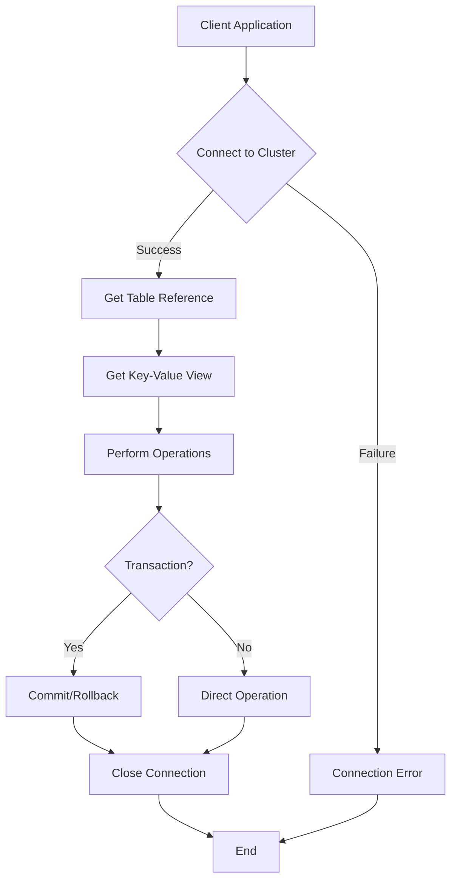
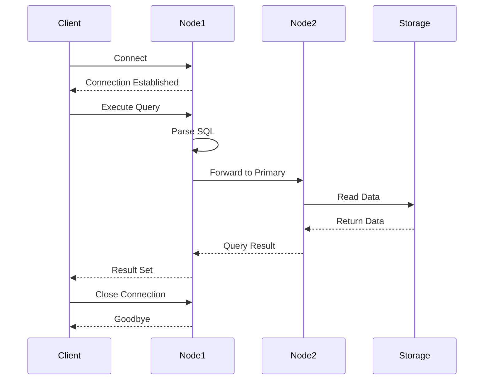
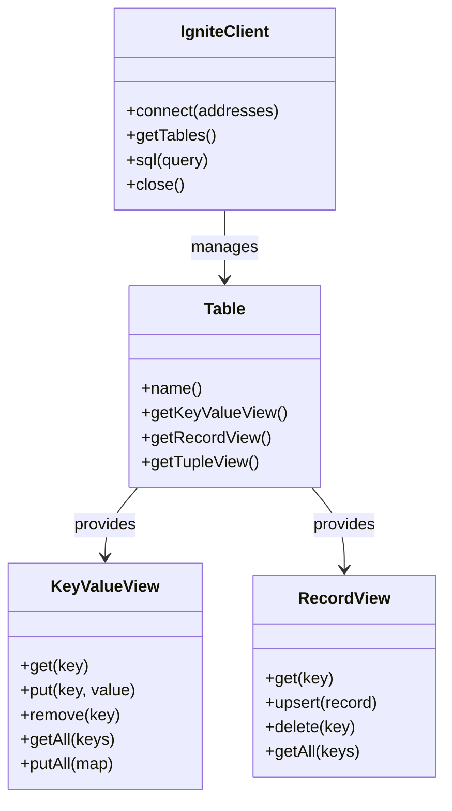
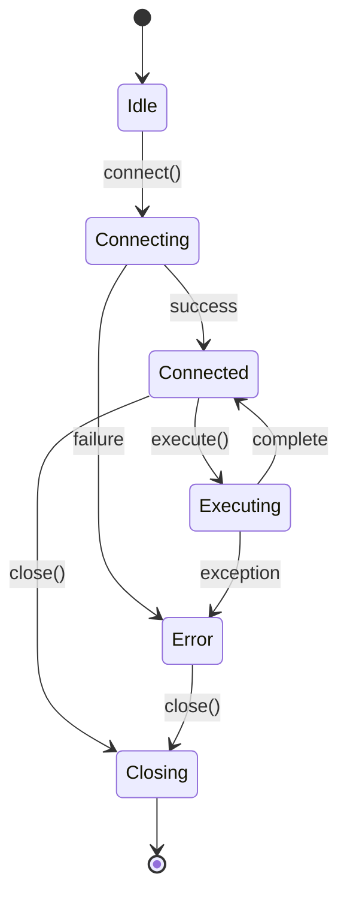
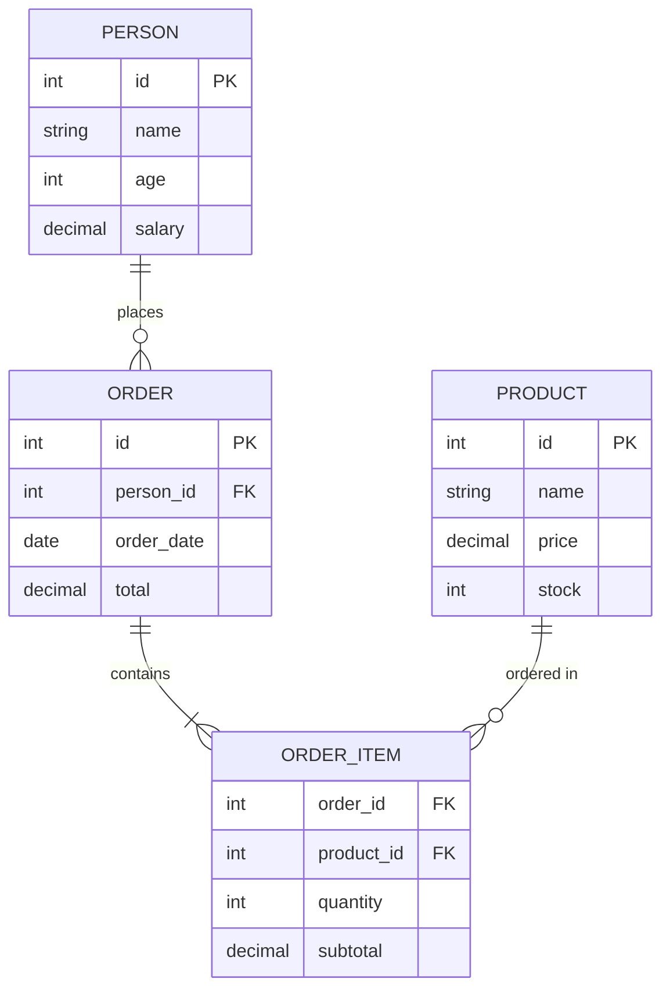
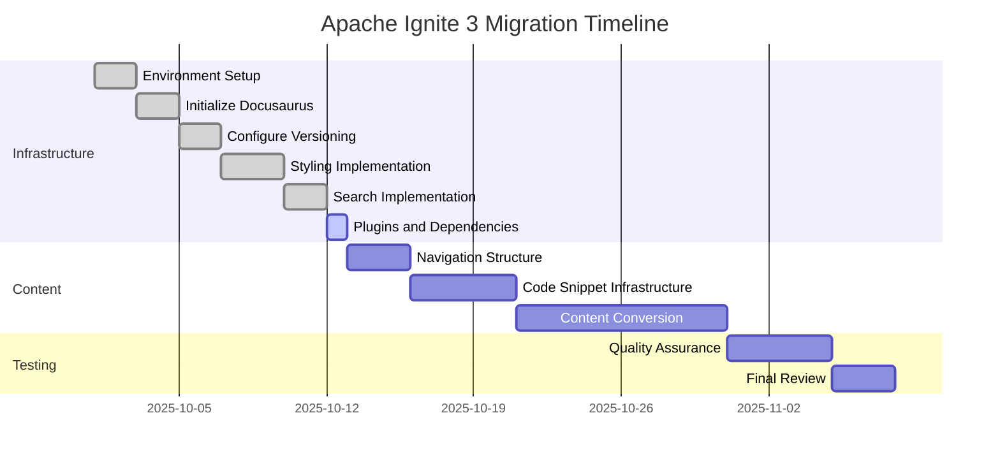
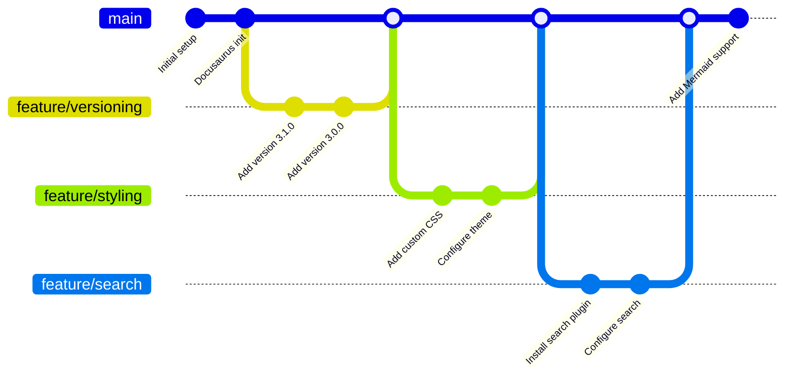
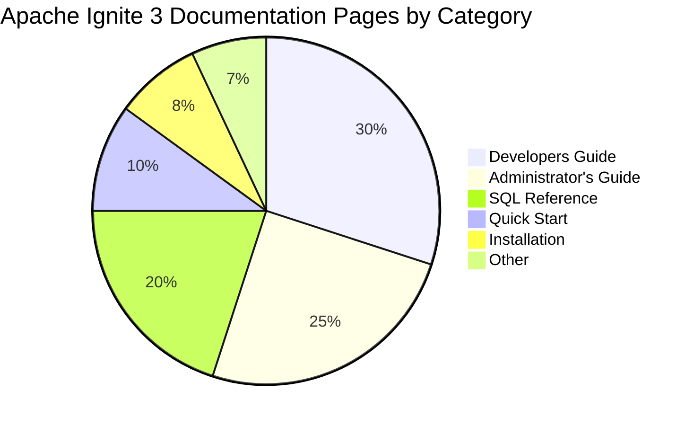
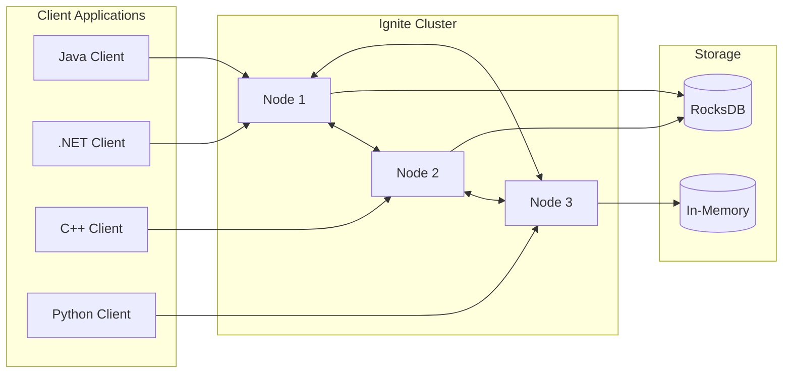

# Mermaid Diagram Test

This page tests Mermaid diagram rendering for Apache Ignite 3 documentation.

## Flowchart

## Sequence Diagram

## Class Diagram

## State Diagram

## Entity Relationship Diagram

## Gantt Chart

## Git Graph

## Pie Chart

## Architecture Diagram

