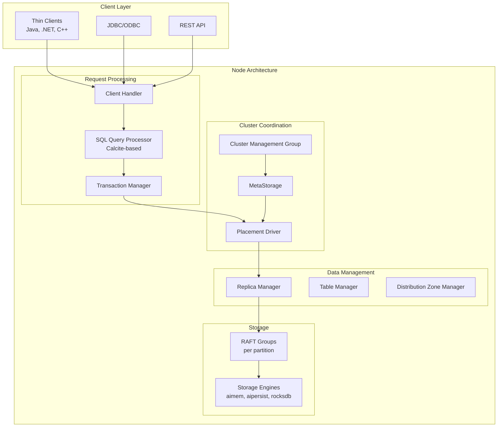
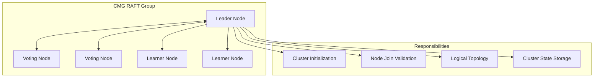
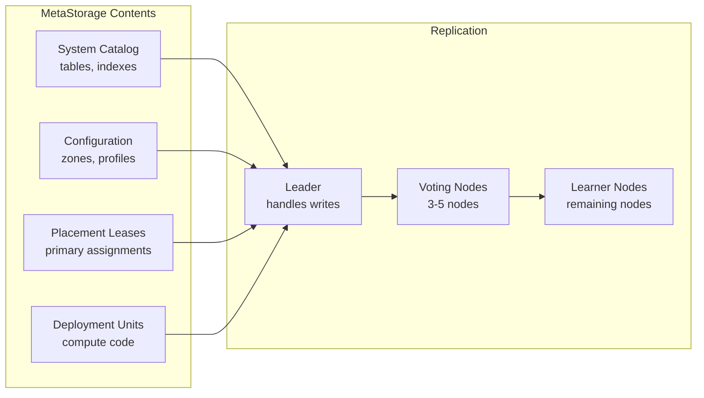
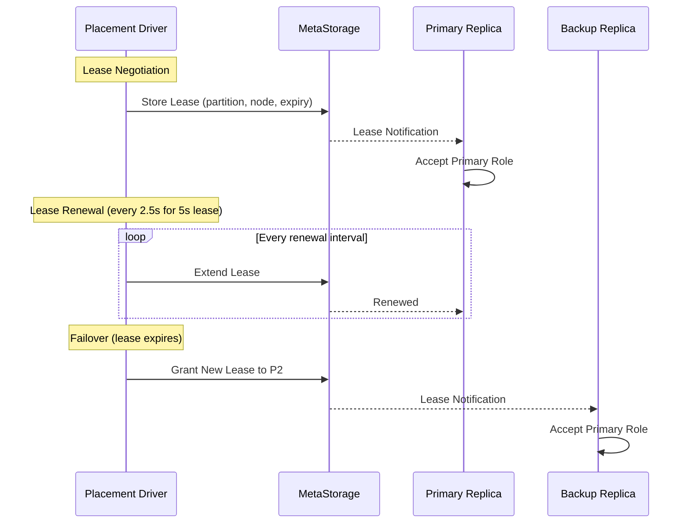
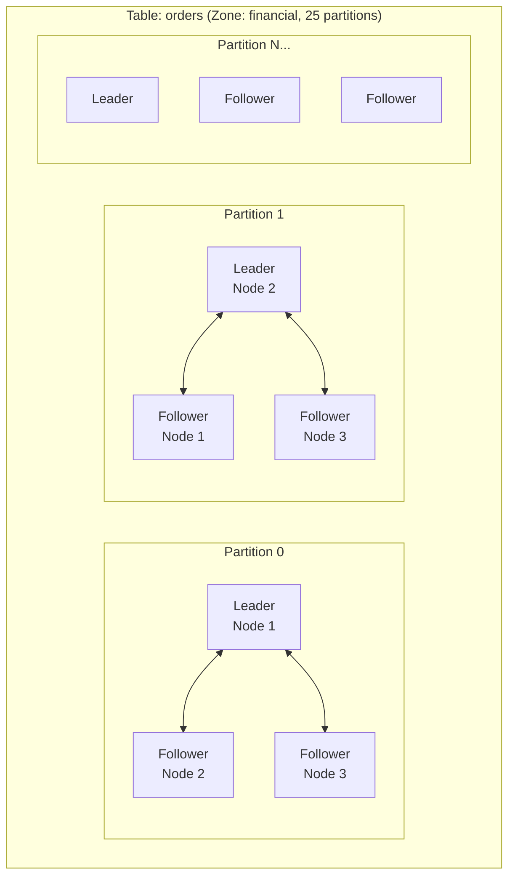
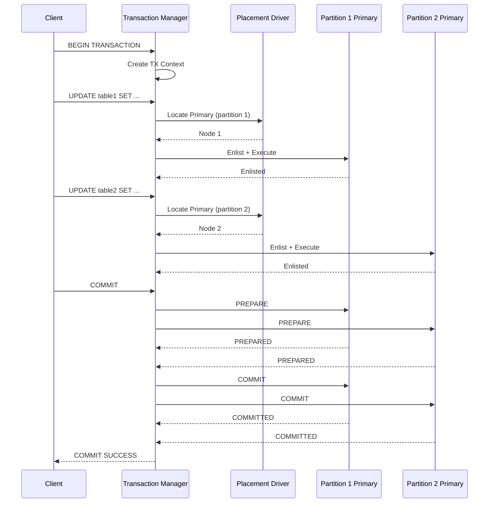
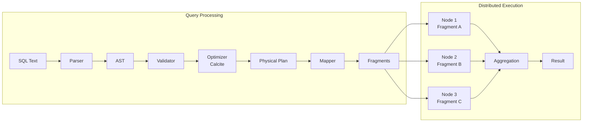
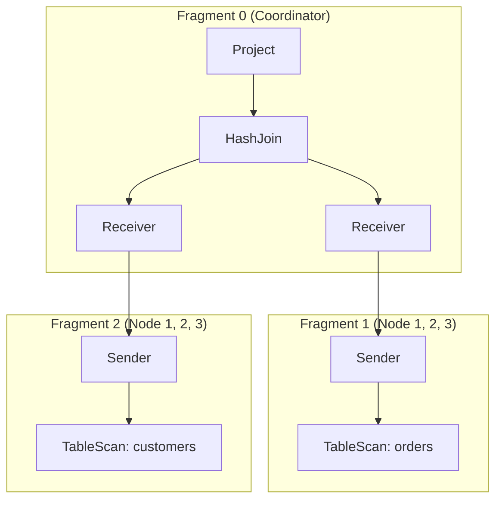
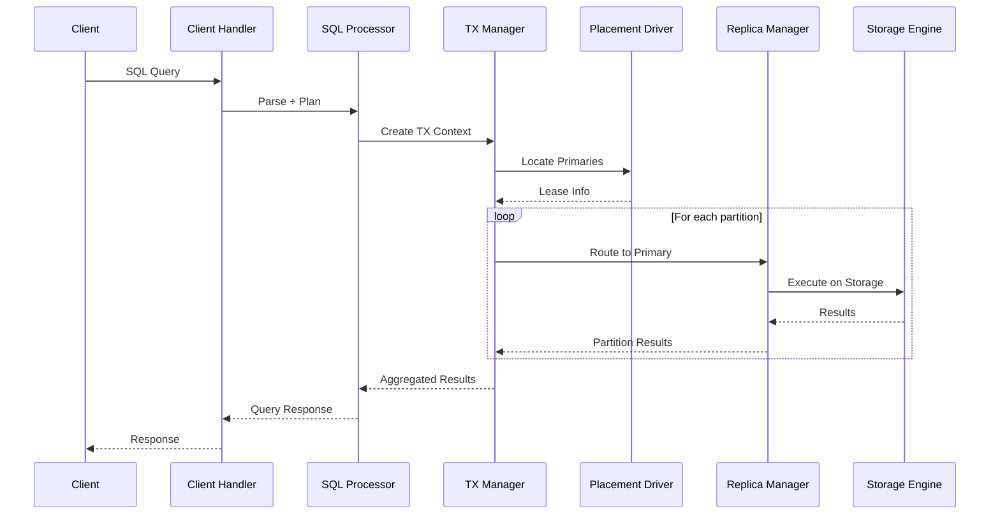

# Architecture Overview

Apache Ignite 3 is a distributed database built on a modular component architecture. Each node runs the same set of services, enabling any node to handle client requests and participate in data storage. This document provides a deeper look at the system architecture introduced in [What is Apache Ignite 3?](../core-concepts/what-is-ignite).

## System Architecture



## Node Components

Every Ignite node runs the same component set. There is no distinction between "server" and "coordinator" nodes at the software level. Node roles emerge from RAFT group membership and placement driver lease assignments.

### Core Services

| Component | Responsibility |
|-----------|---------------|
| **Cluster Service** | Network communication, node discovery, message routing |
| **Vault Manager** | Local persistent storage for node-specific data |
| **Hybrid Clock** | Distributed timestamp generation for MVCC |
| **Failure Manager** | Node failure detection and handling |

### Cluster Coordination

| Component | Responsibility |
|-----------|---------------|
| **Cluster Management Group (CMG)** | Cluster initialization, node admission, logical topology |
| **MetaStorage** | Distributed metadata (schemas, configurations, leases) |
| **Placement Driver** | Primary replica selection via time-bounded leases |

### Data Management

| Component | Responsibility |
|-----------|---------------|
| **Table Manager** | Table lifecycle and distributed operations |
| **Replica Manager** | Partition replica lifecycle and request routing |
| **Distribution Zone Manager** | Data placement policies and partition assignments |
| **Index Manager** | Index creation, maintenance, and async building |

### Query and Transaction Processing

| Component | Responsibility |
|-----------|---------------|
| **SQL Query Processor** | Query parsing, optimization, distributed execution |
| **Transaction Manager** | ACID transaction coordination, 2PC protocol |
| **Compute Component** | Distributed job execution |

## Cluster Coordination

### Cluster Management Group (CMG)

The CMG is a dedicated RAFT group responsible for cluster-wide coordination:



CMG membership is established during cluster initialization. Typically 3 to 5 nodes are selected as voting members; remaining nodes participate as learners. The CMG validates new nodes before admitting them to the cluster.

### MetaStorage

MetaStorage is a distributed key-value store replicated across all nodes via RAFT:



All cluster metadata changes flow through MetaStorage. Nodes maintain local replicas and receive updates via RAFT log replication. The watch mechanism enables real-time notification of metadata changes.

### Placement Driver

The Placement Driver manages primary replica selection through time-bounded leases:



Lease properties:

- **Duration**: Configurable, default 5 seconds
- **Renewal**: Automatic, every half of expiration interval
- **Selection priority**: Current holder, then RAFT leader, then stable assignments
- **Persistence**: Stored in MetaStorage for cluster-wide visibility

## RAFT Replication

Apache Ignite 3 uses multiple RAFT groups for different purposes:

| RAFT Group | Purpose | Members |
|------------|---------|---------|
| **CMG** | Cluster management | 3-5 voting nodes |
| **MetaStorage** | Cluster metadata | 3-5 voting + learner nodes |
| **Placement Driver** | Lease management | Placement driver nodes |
| **Partition Groups** | Data replication | Nodes in partition assignments |

### Partition RAFT Groups

Each table partition forms its own RAFT group:



Partition RAFT groups provide:

- **Write linearization**: All writes go through the leader
- **Replication**: Log entries replicated to followers
- **Automatic failover**: New leader elected on failure
- **State machine**: Multi-version storage with B+ trees

## Transaction Processing

### Transaction Coordination

The Transaction Manager coordinates distributed transactions using two-phase commit:



### Concurrency Control

Apache Ignite 3 uses a hybrid concurrency control model:

| Transaction Type | Concurrency Control | Isolation |
|-----------------|---------------------|-----------|
| **Read-Write** | Lock-based with MVCC | Serializable |
| **Read-Only** | Timestamp-based snapshot | Snapshot |

Read-write transactions acquire locks through the primary replica. Read-only transactions use timestamp-based reads against MVCC version chains without acquiring locks.

## Query Execution

### SQL Processing Pipeline



The SQL engine is built on Apache Calcite and executes queries in stages:

1. **Parsing**: SQL text converted to abstract syntax tree
2. **Validation**: Semantic validation against the system catalog
3. **Optimization**: Cost-based optimization using Calcite rules
4. **Physical Planning**: Conversion to physical operators (IgniteRel)
5. **Mapping**: Plan fragments assigned to cluster nodes
6. **Execution**: Distributed execution with inter-node data exchange

### Fragment Distribution

Query plans are split into fragments that execute on different nodes:



Exchange operators (Sender/Receiver) handle data movement between fragments. Colocation optimization reduces exchanges when joined data resides on the same nodes.

## Request Flow

A typical SQL query flows through these components:



## Component Initialization Order

Components start in dependency order:

```
VaultManager → ClusterService → CMG → MetaStorage → PlacementDriver →
ReplicaManager → TxManager → TableManager → SqlQueryProcessor
```

This ordering ensures each component's dependencies are available before it starts.

## Next Steps

- [Storage Architecture](./storage-architecture) for storage layer details
- [Data Partitioning](../core-concepts/data-partitioning) for partition distribution and replication
- [Transactions and MVCC](../core-concepts/transactions-and-mvcc) for transaction processing details
