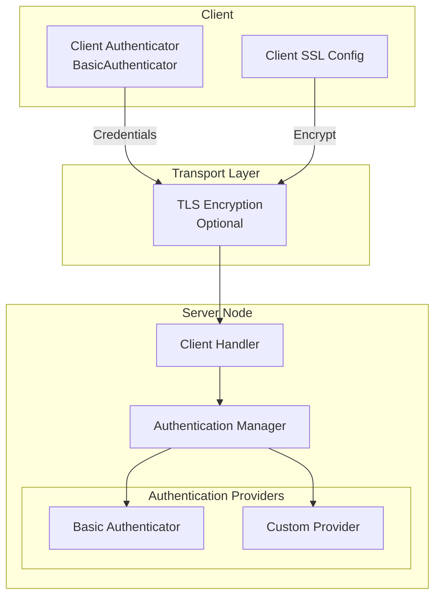
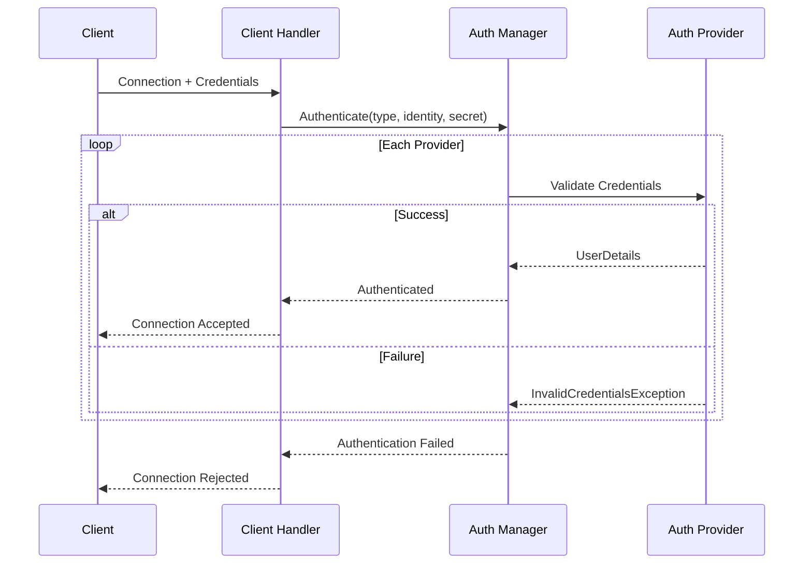
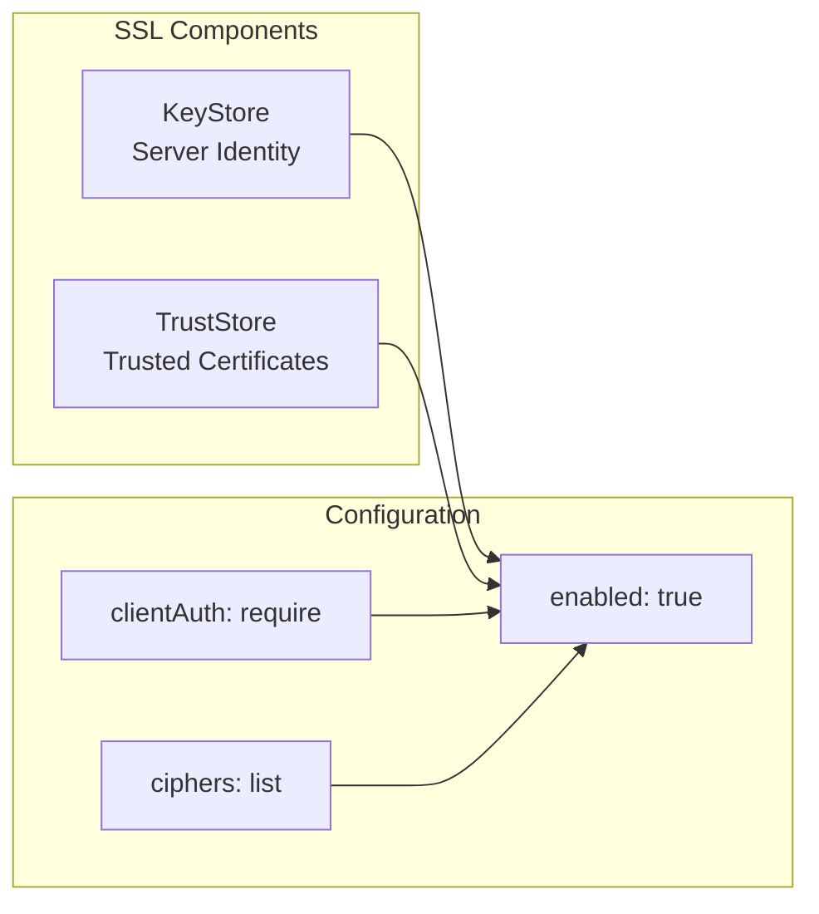

# Security Architecture

Apache Ignite 3 provides authentication and transport encryption to secure cluster access. Security is disabled by default and must be explicitly enabled in cluster configuration.

## Security Components



The security architecture consists of two independent layers:

- **Authentication**: Validates client identity through configured providers
- **Transport encryption**: SSL/TLS secures communication channels

These layers operate independently. You can enable authentication without SSL, though credentials would transmit in plain text. Production deployments should enable both.

## Authentication

Authentication validates client identity before allowing cluster access. The authentication manager coordinates multiple providers, attempting each in sequence until one succeeds.

### Authentication Flow



### Basic Authentication

Apache Ignite 3 includes a basic username/password authenticator. Configure users in the cluster security settings:

```json
{
  "ignite": {
    "security": {
      "enabled": true,
      "authentication": {
        "providers": [
          {
            "type": "basic",
            "name": "default",
            "users": [
              { "username": "admin", "password": "admin123" },
              { "username": "reader", "password": "reader123" }
            ]
          }
        ]
      }
    }
  }
}
```

Client connection with basic authentication:

```java
IgniteClient client = IgniteClient.builder()
    .addresses("localhost:10800")
    .authenticator(BasicAuthenticator.builder()
        .username("admin")
        .password("admin123")
        .build())
    .build();
```

:::warning
Basic authentication transmits credentials in plain text unless SSL/TLS is enabled. Always enable SSL for production deployments.
:::

### Custom Authentication Providers

The authentication framework supports custom providers through the `Authenticator` interface. Custom providers require:

1. Server-side `Authenticator` implementation
2. Configuration schema extending `AuthenticationProviderConfigurationSchema`
3. Client-side `IgniteClientAuthenticator` implementation

This enables integration with external identity providers, LDAP directories, or custom credential stores.

## Transport Encryption

SSL/TLS encrypts communication between clients and servers, and between cluster nodes. Three separate SSL configurations control different communication channels:

| Configuration Path | Purpose |
|-------------------|---------|
| `ignite.network.ssl` | Node-to-node cluster communication |
| `ignite.clientConnector.ssl` | Client-to-node connections |
| `ignite.rest.ssl` | REST API endpoints |

### SSL Configuration



SSL configuration properties:

| Property | Default | Description |
|----------|---------|-------------|
| `enabled` | false | Enable SSL for this channel |
| `clientAuth` | none | Client certificate requirement: none, optional, require |
| `ciphers` | (empty) | Comma-separated cipher list, empty uses JVM defaults |
| `keyStore.type` | PKCS12 | Keystore format |
| `keyStore.path` | (empty) | Path to keystore file |
| `keyStore.password` | (empty) | Keystore password |
| `trustStore.type` | PKCS12 | Truststore format |
| `trustStore.path` | (empty) | Path to truststore file |
| `trustStore.password` | (empty) | Truststore password |

### Node-to-Node SSL

Enable SSL for cluster communication:

```bash
node config update ignite.network.ssl.enabled=true
node config update ignite.network.ssl.keyStore.path=/path/to/keystore.p12
node config update ignite.network.ssl.keyStore.password=keystorepass
node config update ignite.network.ssl.trustStore.path=/path/to/truststore.p12
node config update ignite.network.ssl.trustStore.password=truststorepass
```

For mutual TLS (mTLS), set client authentication to required:

```bash
node config update ignite.network.ssl.clientAuth=require
```

### Client Connector SSL

Enable SSL for client connections:

```bash
node config update ignite.clientConnector.ssl.enabled=true
node config update ignite.clientConnector.ssl.keyStore.path=/path/to/keystore.p12
node config update ignite.clientConnector.ssl.keyStore.password=keystorepass
```

Client-side SSL configuration:

```java
SslConfiguration sslConfig = SslConfiguration.builder()
    .enabled(true)
    .trustStorePath("/path/to/truststore.p12")
    .trustStorePassword("truststorepass")
    .build();

IgniteClient client = IgniteClient.builder()
    .addresses("localhost:10800")
    .ssl(sslConfig)
    .authenticator(BasicAuthenticator.builder()
        .username("admin")
        .password("admin123")
        .build())
    .build();
```

### REST API SSL

Enable SSL for REST endpoints:

```bash
node config update ignite.rest.ssl.enabled=true
node config update ignite.rest.ssl.port=10400
node config update ignite.rest.ssl.keyStore.path=/path/to/keystore.p12
node config update ignite.rest.ssl.keyStore.password=keystorepass
```

## Security Events

Authentication attempts are logged through the event system. Monitor these events for security auditing:

- `USER_AUTHENTICATION_SUCCESS`: Successful authentication
- `USER_AUTHENTICATION_FAILURE`: Failed authentication attempt

## Configuration Summary

Minimum production security configuration:

```json
{
  "ignite": {
    "security": {
      "enabled": true,
      "authentication": {
        "providers": [
          {
            "type": "basic",
            "name": "default",
            "users": [
              { "username": "admin", "password": "secure_password" }
            ]
          }
        ]
      }
    },
    "clientConnector": {
      "ssl": {
        "enabled": true,
        "keyStore": {
          "path": "/path/to/keystore.p12",
          "password": "keystorepass"
        }
      }
    },
    "network": {
      "ssl": {
        "enabled": true,
        "clientAuth": "require",
        "keyStore": {
          "path": "/path/to/keystore.p12",
          "password": "keystorepass"
        },
        "trustStore": {
          "path": "/path/to/truststore.p12",
          "password": "truststorepass"
        }
      }
    }
  }
}
```

## Limitations

Apache Ignite 3 currently provides authentication only. Authorization features (role-based access control, permissions) are not yet implemented. All authenticated users have equivalent access to cluster resources.

## Next Steps

- [Configure Authentication](/3.1.0/configure-and-operate/configuration/config-authentication) - Step-by-step authentication setup
- [Configure SSL/TLS](/3.1.0/configure-and-operate/configuration/config-ssl-tls) - SSL configuration guide
- [Cluster Security](/3.1.0/configure-and-operate/configuration/config-cluster-security) - Additional security recommendations
