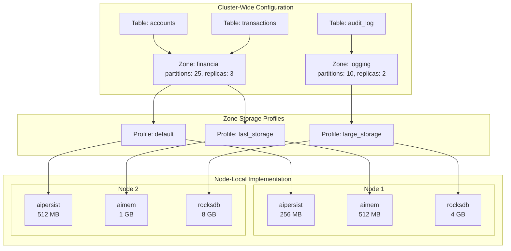
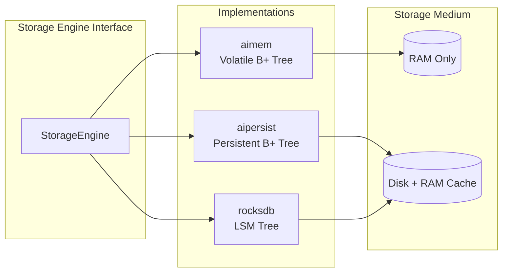
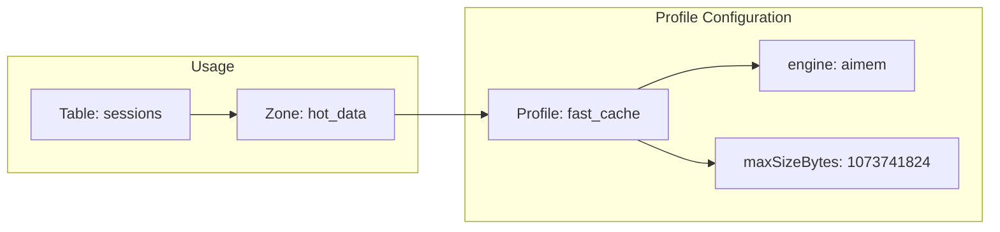

# Storage Architecture

Apache Ignite 3 separates logical data organization from physical storage implementation through a layered architecture. Tables define your data model, distribution zones control partitioning and replication, storage profiles configure engine parameters, and storage engines handle the physical read/write operations.



This architecture separates concerns across two scopes:

- **Cluster-wide**: Table schemas, distribution zone configurations, and storage profile names are consistent across all nodes
- **Node-local**: Storage profile implementations (memory sizes, file paths) are configured on each node independently

The separation allows heterogeneous clusters where nodes with different hardware capabilities can participate in the same distribution zone with appropriately sized storage allocations.

## Storage Engines

Storage engines implement the physical data operations: reading pages from storage, writing modified pages, and managing memory buffers. Each engine uses different data structures optimized for specific access patterns.



| Engine | Data Structure | Persistence | Use Case |
|--------|---------------|-------------|----------|
| `aimem` | B+ Tree | None (volatile) | Caching, temporary data, lowest latency |
| `aipersist` | B+ Tree | Checkpoint-based | General purpose, balanced read/write |
| `rocksdb` | LSM Tree | Write-ahead log | Write-heavy workloads |

### AIMemory (aimem)

Stores all data in off-heap memory using B+ tree structures. Data is lost on node shutdown. Memory is allocated in segments (up to 16 segments per region) with on-demand expansion.

See [AIMemory Storage Engine](./storage-engines/aimem) for configuration details.

### AIPersist (aipersist)

Stores data in partition files on disk with an in-memory page cache. Uses B+ trees for data and index storage. A checkpoint process periodically flushes dirty pages to disk for durability.

See [AIPersist Storage Engine](./storage-engines/aipersist) for configuration details.

### RocksDB (rocksdb)

:::warning
RocksDB support is experimental.
:::

Uses the RocksDB library with Log-Structured Merge (LSM) tree storage. Optimized for write-heavy workloads where sequential disk writes improve throughput.

See [RocksDB Storage Engine](./storage-engines/rocksdb) for configuration details.

## Engine Configuration

Engine-level configuration applies to all profiles using that engine. These settings control engine-wide behavior such as checkpoint intervals or flush delays.

```bash
# View current engine configuration
node config show ignite.storage.engines

# Configure checkpoint interval for aipersist (default: 180000ms)
node config update ignite.storage.engines.aipersist.checkpoint.intervalMillis=180000
```

Restart the node after updating engine configuration.

## Storage Profiles

A storage profile binds a storage engine to specific configuration parameters. Distribution zones reference profiles by name, and each table in a zone uses the zone's assigned profile.



Profile properties:

- **engine**: The storage engine name (`aimem`, `aipersist`, or `rocksdb`)
- **Engine-specific settings**: Memory sizes, buffer sizes, and other parameters

### Default Profile

Apache Ignite creates a `default` profile using `aipersist` on every node. Distribution zones use this profile unless configured otherwise.

```bash
# View configured profiles
node config show ignite.storage.profiles
```

### Creating Profiles

Create profiles through node configuration. Each node must have matching profile names with the same engine type, though sizes can differ.

```bash
# Create an in-memory profile
node config update "ignite.storage.profiles:{cache_profile{engine:aimem,maxSizeBytes:536870912}}"

# Create a RocksDB profile
node config update "ignite.storage.profiles:{rocks_profile{engine:rocksdb,sizeBytes:1073741824}}"
```

Restart the node after adding profiles.

## Using Profiles with Tables

Create distribution zones with one or more storage profiles, then assign tables to those zones.

```sql
-- Create a zone with multiple storage profiles
CREATE ZONE financial_zone
    WITH PARTITIONS=25, REPLICAS=3,
    STORAGE PROFILES ['default', 'fast_cache'];

-- Create a table using a specific profile
CREATE TABLE accounts (
    id INT PRIMARY KEY,
    balance DECIMAL(15,2)
) ZONE financial_zone STORAGE PROFILE 'default';

-- Create a table using the in-memory profile
CREATE TABLE rate_limits (
    client_id INT PRIMARY KEY,
    requests INT
) ZONE financial_zone STORAGE PROFILE 'fast_cache';
```

Tables cannot change their zone or storage profile after creation. If a node lacks the required profile, it will not store partitions for tables using that profile.
