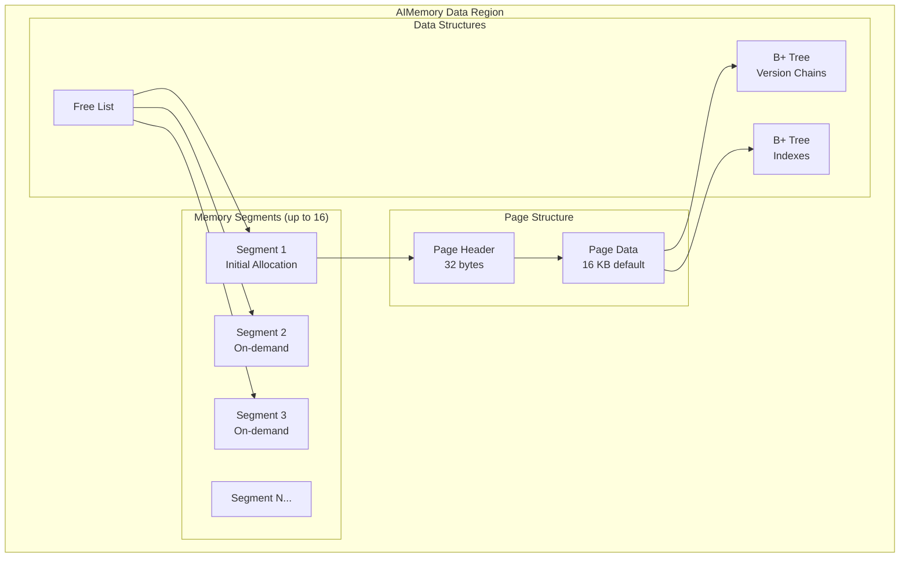

# AIMemory Storage Engine

The AIMemory engine (`aimem`) stores all data in off-heap memory using B+ tree structures. Data is volatile and lost on node shutdown. Use this engine for caching, temporary tables, or workloads where persistence is unnecessary.

## Memory Architecture



Key characteristics:

- Memory allocated in segments, starting with `initSizeBytes` and expanding on demand
- Up to 16 segments per data region, minimum 256 MB per segment expansion
- Default page size: 16 KB (configurable from 1 KB to 16 KB, must be power of 2)
- 32-byte overhead per page for header and locking structures

## Profile Configuration

| Property | Default | Description |
|----------|---------|-------------|
| `engine` | - | Must be `"aimem"` |
| `initSizeBytes` | Dynamic | Initial memory allocation. Defaults to `maxSizeBytes` value |
| `maxSizeBytes` | Dynamic | Maximum memory. Defaults to `max(256 MB, 20% of physical RAM)` |

## Engine Configuration

Page size is configured at the engine level and applies to all aimem profiles:

| Property | Default | Description |
|----------|---------|-------------|
| `pageSizeBytes` | 16384 | Page size in bytes (1024 to 16384, power of 2) |

```bash
# Configure engine-level page size
node config update ignite.storage.engines.aimem.pageSizeBytes=8192
```

## Configuration Example

```json
{
  "ignite": {
    "storage": {
      "profiles": [
        {
          "engine": "aimem",
          "name": "cache_profile",
          "initSizeBytes": 536870912,
          "maxSizeBytes": 1073741824
        }
      ]
    }
  }
}
```

```bash
# CLI equivalent
node config update "ignite.storage.profiles:{cache_profile{engine:aimem,maxSizeBytes:1073741824}}"
```

## Usage

```sql
-- Create a zone using the volatile profile
CREATE ZONE cache_zone
    WITH PARTITIONS=10, REPLICAS=2,
    STORAGE PROFILES ['cache_profile'];

-- Create a table for session data (acceptable to lose on restart)
CREATE TABLE sessions (
    session_id UUID PRIMARY KEY,
    user_id INT,
    data VARCHAR,
    expires_at TIMESTAMP
) ZONE cache_zone STORAGE PROFILE 'cache_profile';
```
