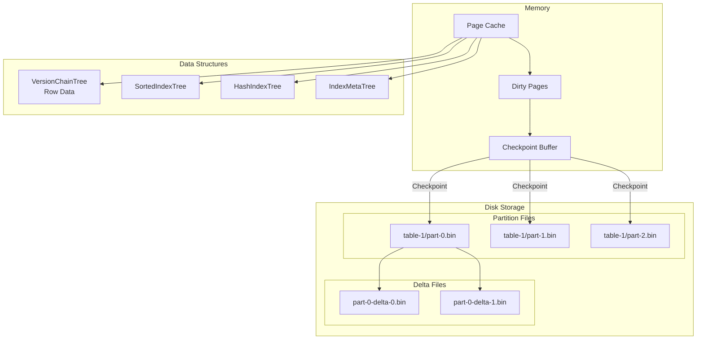
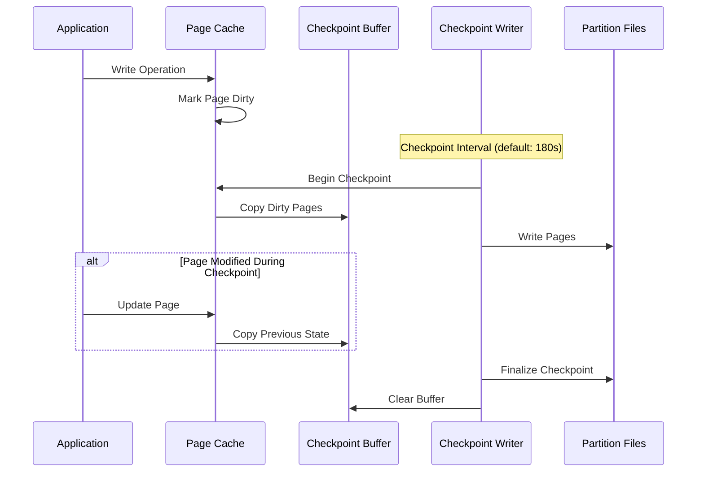
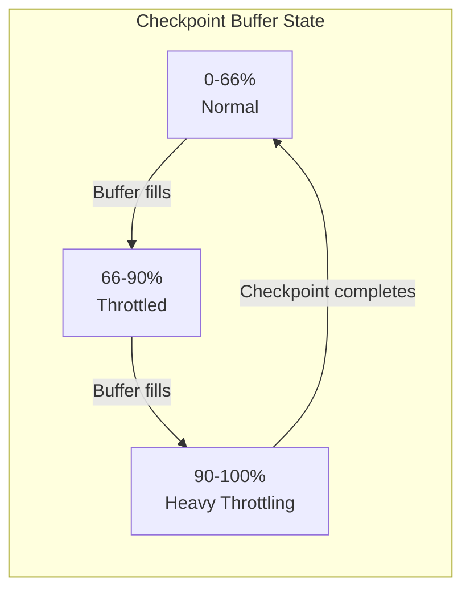

# AIPersist Storage Engine

The AIPersist engine (`aipersist`) provides durable storage using B+ tree data structures with checkpoint-based persistence. Data is stored in partition files on disk with an in-memory page cache for fast access. This is the default storage engine.

## Storage Architecture



Storage organization:

- Each partition stored in a separate file: `table-{tableId}/part-{partitionId}.bin`
- Delta files capture incremental changes between checkpoints
- B+ trees store version chains (row data), sorted indexes, hash indexes, and metadata
- Default page size: 16 KB

## Checkpointing

Checkpointing flushes dirty pages from memory to partition files on disk. This process ensures durability and enables crash recovery.



Checkpoint configuration:

| Property | Default | Description |
|----------|---------|-------------|
| `intervalMillis` | 180000 | Time between checkpoints (3 minutes) |
| `intervalDeviationPercent` | 40 | Random deviation to prevent synchronized checkpoints |
| `checkpointThreads` | - | Number of checkpoint writer threads |
| `compactionThreads` | - | Number of compaction threads |

```bash
# Configure checkpoint interval to 2 minutes
node config update ignite.storage.engines.aipersist.checkpoint.intervalMillis=120000
```

## Write Throttling

When the checkpoint buffer reaches two-thirds capacity (66.7%), write throttling activates to prevent buffer overflow.



Throttling behavior:

- Below 66%: Normal operation, no throttling
- 66% to 90%: Progressive throttling, checkpoint priority increases
- Above 90%: Heavy throttling, updates significantly delayed

Write throttling indicates either slow disk I/O or excessive write rate. Monitor throttling metrics to identify bottlenecks.

## Profile Configuration

| Property | Default | Description |
|----------|---------|-------------|
| `engine` | - | Must be `"aipersist"` |
| `sizeBytes` | Dynamic | Storage size. Defaults to `max(256 MB, 20% of physical RAM)` |

## Configuration Example

```json
{
  "ignite": {
    "storage": {
      "profiles": [
        {
          "engine": "aipersist",
          "name": "persistent_profile",
          "sizeBytes": 2147483648
        }
      ]
    }
  }
}
```

```bash
# CLI equivalent
node config update "ignite.storage.profiles:{persistent_profile{engine:aipersist,sizeBytes:2147483648}}"
```

## Usage

The `default` profile uses aipersist automatically. For custom profiles:

```sql
-- Create a zone with the persistent profile
CREATE ZONE transaction_zone
    WITH PARTITIONS=25, REPLICAS=3,
    STORAGE PROFILES ['persistent_profile'];

-- Create a durable table
CREATE TABLE orders (
    order_id BIGINT PRIMARY KEY,
    customer_id INT,
    total DECIMAL(15,2),
    created_at TIMESTAMP
) ZONE transaction_zone STORAGE PROFILE 'persistent_profile';
```
