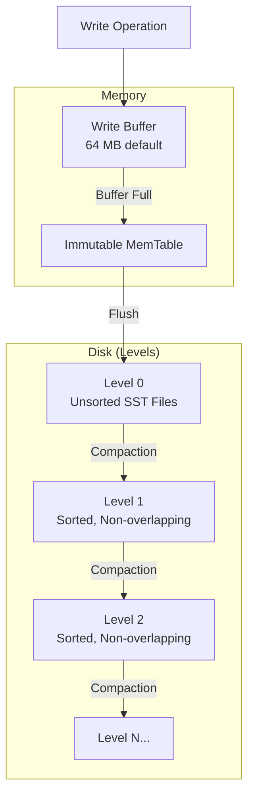

# RocksDB Storage Engine

:::warning
RocksDB support is experimental.
:::

The RocksDB engine (`rocksdb`) uses the RocksDB library with Log-Structured Merge (LSM) tree storage. LSM trees optimize for write throughput by buffering writes in memory and periodically flushing them to sorted disk files.

## LSM Tree Architecture



LSM tree characteristics:

- **Write path**: Writes go to an in-memory buffer, then flush to Level 0 as sorted string table (SST) files
- **Compaction**: Background process merges SST files and moves data to lower levels
- **Read path**: Reads check the write buffer, then search levels from L0 downward
- **Write amplification**: Data may be rewritten multiple times during compaction
- **Space amplification**: Multiple versions exist temporarily during compaction

## When to Use RocksDB

RocksDB is suited for:

- Write-heavy workloads where sequential disk writes improve throughput
- Time-series data with append-mostly patterns
- Workloads tolerant of read amplification (multiple disk reads per query)

Consider aipersist for:

- Read-heavy or balanced workloads
- Point lookups requiring consistent latency
- Workloads sensitive to write amplification

## Profile Configuration

| Property | Default | Description |
|----------|---------|-------------|
| `engine` | - | Must be `"rocksdb"` |
| `sizeBytes` | Dynamic | Storage allocation. Defaults to `max(256 MB, 20% of physical RAM)` |
| `writeBufferSizeBytes` | 67108864 | Write buffer size (64 MB) |

## Engine Configuration

| Property | Default | Description |
|----------|---------|-------------|
| `flushDelayMillis` | 100 | Delay before RAFT-triggered flush |

```bash
# Configure flush delay
node config update ignite.storage.engines.rocksdb.flushDelayMillis=50
```

## Configuration Example

```json
{
  "ignite": {
    "storage": {
      "profiles": [
        {
          "engine": "rocksdb",
          "name": "write_heavy_profile",
          "sizeBytes": 4294967296,
          "writeBufferSizeBytes": 134217728
        }
      ]
    }
  }
}
```

```bash
# CLI equivalent
node config update "ignite.storage.profiles:{write_heavy_profile{engine:rocksdb,sizeBytes:4294967296,writeBufferSizeBytes:134217728}}"
```

## Usage

```sql
-- Create a zone for write-heavy tables
CREATE ZONE logging_zone
    WITH PARTITIONS=10, REPLICAS=2,
    STORAGE PROFILES ['write_heavy_profile'];

-- Create a table for event logging
CREATE TABLE events (
    event_id BIGINT PRIMARY KEY,
    event_type VARCHAR,
    payload VARCHAR,
    created_at TIMESTAMP
) ZONE logging_zone STORAGE PROFILE 'write_heavy_profile';
```
