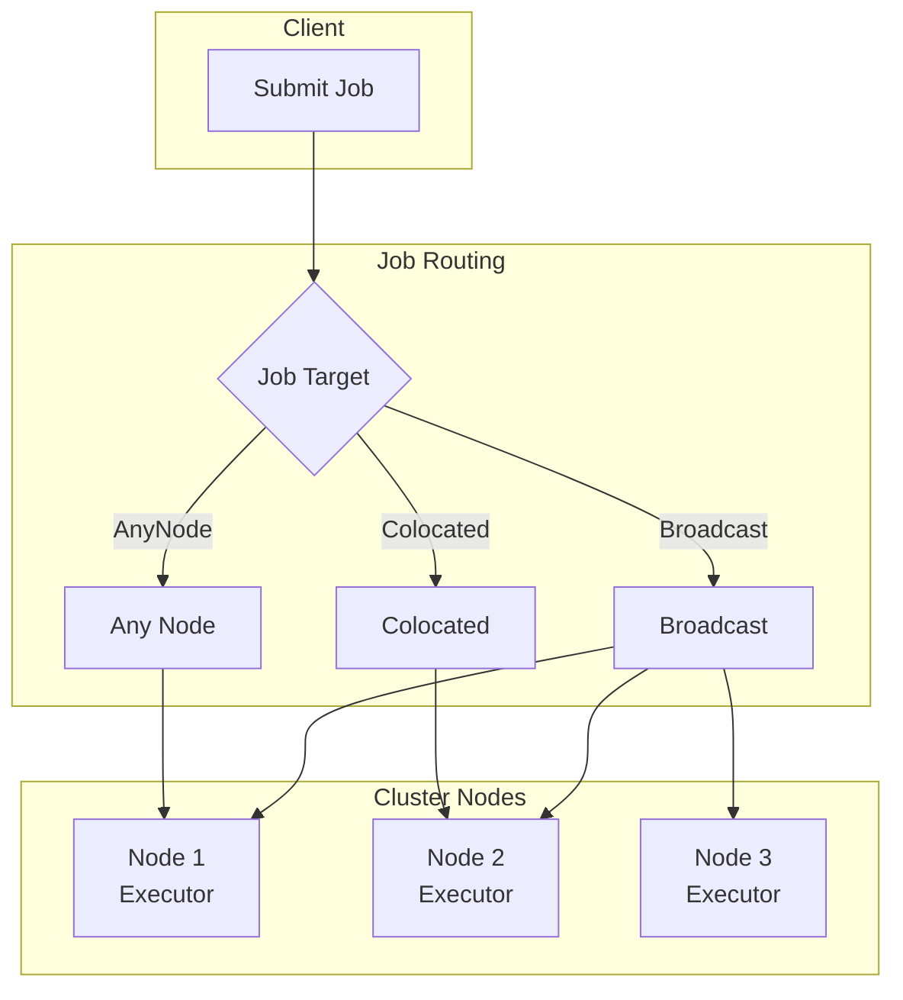
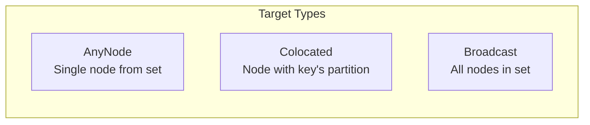
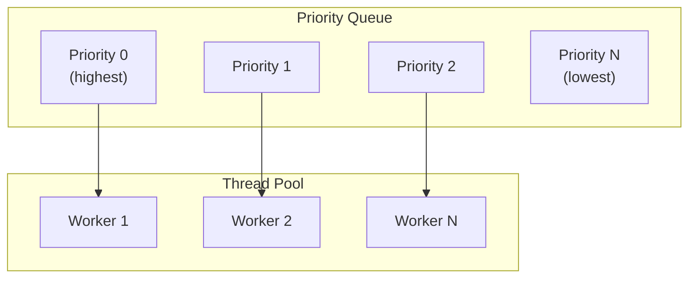
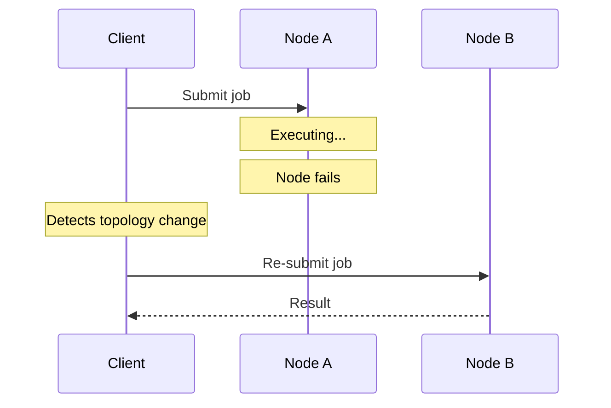
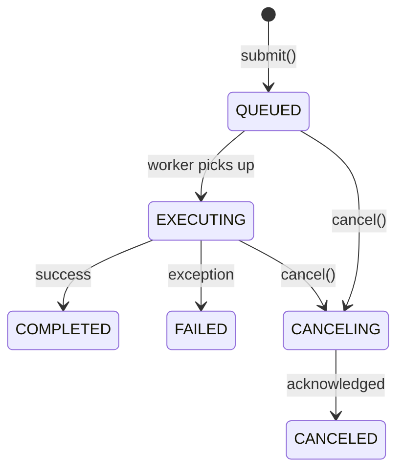
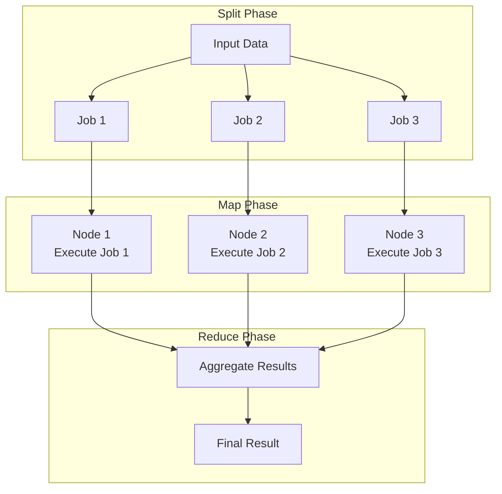
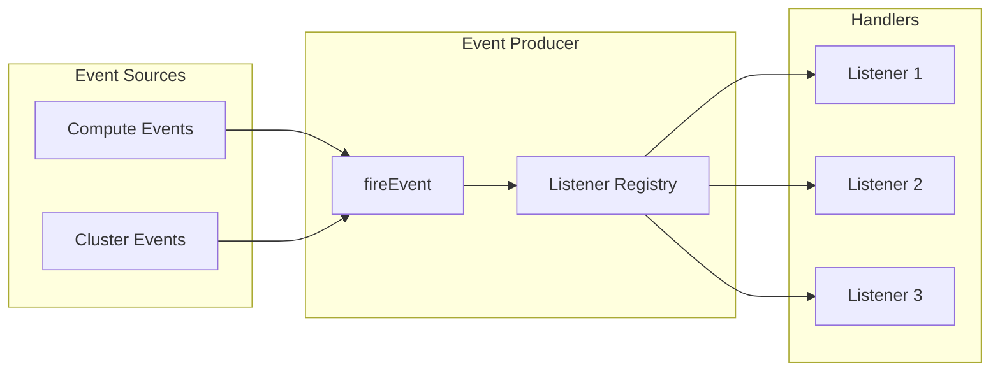

Ignite 3 provides distributed compute for executing jobs across cluster nodes and an event system for monitoring cluster activity. The compute API uses an asynchronous, priority-based execution model built on `CompletableFuture`.

## Distributed Compute Architecture



Key characteristics:

- Asynchronous execution returning `CompletableFuture<R>`
- Job placement based on target type (any node, colocated, broadcast)
- Priority-based queue with configurable thread pool
- Automatic failover on node departure
- Map-reduce support for split/aggregate patterns

## Job Execution Model

### ComputeJob Interface

Jobs implement the `ComputeJob<T, R>` interface:

```java
public interface ComputeJob<T, R> {
    CompletableFuture<R> executeAsync(
        JobExecutionContext context,
        T arg
    );
}
```

The `JobExecutionContext` provides:

| Property | Description |
|----------|-------------|
| `ignite()` | Ignite instance for cluster operations |
| `isCancelled()` | Check if cancellation requested |
| `partition()` | Partition info for colocated jobs |

Example job implementation:

```java
public class AccountBalanceJob implements ComputeJob<Long, Double> {
    @Override
    public CompletableFuture<Double> executeAsync(
            JobExecutionContext context,
            Long accountId) {

        Table accounts = context.ignite().tables().table("accounts");
        RecordView<Tuple> view = accounts.recordView();

        Tuple key = Tuple.create().set("id", accountId);
        Tuple record = view.get(null, key);

        return CompletableFuture.completedFuture(
            record.doubleValue("balance")
        );
    }
}
```

### Job Targets

Job targets determine where jobs execute:



| Target | Use Case | Return Type |
|--------|----------|-------------|
| **AnyNode** | Stateless computation | `JobExecution<R>` |
| **Colocated** | Data-local processing | `JobExecution<R>` |
| **Broadcast** | Cluster-wide operations | `BroadcastExecution<R>` |

#### Any Node Execution

Execute on any available node:

```java
JobDescriptor<Long, Double> descriptor = JobDescriptor
    .<Long, Double>builder(AccountBalanceJob.class)
    .build();

JobExecution<Double> execution = client.compute()
    .submit(JobTarget.anyNode(client.clusterNodes()), descriptor, accountId);

Double balance = execution.resultAsync().join();
```

#### Colocated Execution

Execute on the node holding specific data:

```java
// Execute where account 42's data lives
JobExecution<Double> execution = client.compute().submit(
    JobTarget.colocated("accounts", Tuple.create().set("id", 42L)),
    descriptor,
    42L
);
```

This eliminates network transfer for data-intensive operations.

#### Broadcast Execution

Execute on all specified nodes:

```java
BroadcastExecution<String> execution = client.compute().submitBroadcast(
    client.clusterNodes(),
    JobDescriptor.builder(NodeInfoJob.class).build(),
    null
);

// Get results from all nodes
Map<ClusterNode, String> results = execution.resultsAsync().join();
```

## Job Scheduling

Jobs execute through a priority-based queue system:



Configuration options:

| Setting | Default | Description |
|---------|---------|-------------|
| `threadPoolSize` | max(CPU cores, 8) | Worker thread count |
| `queueMaxSize` | Integer.MAX_VALUE | Maximum queued jobs |
| `statesLifetimeMillis` | 60,000 | Job state retention |

### Job Priority

Set priority when submitting:

```java
JobDescriptor<String, String> descriptor = JobDescriptor
    .<String, String>builder(MyJob.class)
    .priority(5)  // Higher number = lower priority
    .build();
```

Change priority during execution:

```java
JobExecution<String> execution = client.compute().submit(target, descriptor, arg);
execution.changePriorityAsync(1);  // Move to higher priority
```

Jobs with the same priority execute in FIFO order.

## Job Failover

Ignite automatically handles node failures during job execution:



Failover behavior:

- Triggered only on node departure (not job exceptions)
- Selects next worker from remaining candidates
- Continues until candidates exhausted
- Application exceptions propagate to caller without retry

For application-level retries:

```java
JobDescriptor<String, String> descriptor = JobDescriptor
    .<String, String>builder(MyJob.class)
    .maxRetries(3)  // Retry on job failure
    .build();
```

## Job State Management

Track job execution through states:



Query job state:

```java
JobExecution<String> execution = client.compute().submit(target, descriptor, arg);

JobState state = execution.stateAsync().join();
System.out.println("Status: " + state.status());
System.out.println("Created: " + state.createTime());
System.out.println("Started: " + state.startTime());
```

| State | Description |
|-------|-------------|
| QUEUED | Waiting in priority queue |
| EXECUTING | Running on worker thread |
| COMPLETED | Finished successfully |
| FAILED | Terminated with exception |
| CANCELING | Cancellation in progress |
| CANCELED | Cancelled by request |

## Map-Reduce Tasks

For split/aggregate computation patterns, use `MapReduceTask`:



Implement the task interface:

```java
public class WordCountTask implements MapReduceTask<String, String, Map<String, Long>, Map<String, Long>> {

    @Override
    public CompletableFuture<List<MapReduceJob<String, Map<String, Long>>>> splitAsync(
            TaskExecutionContext context,
            String input) {

        // Split input into chunks for parallel processing
        List<MapReduceJob<String, Map<String, Long>>> jobs = Arrays.stream(input.split("\n\n"))
            .map(chunk -> MapReduceJob.<String, Map<String, Long>>builder()
                .jobDescriptor(JobDescriptor.builder(CountWordsJob.class).build())
                .args(chunk)
                .build())
            .toList();

        return CompletableFuture.completedFuture(jobs);
    }

    @Override
    public CompletableFuture<Map<String, Long>> reduceAsync(
            TaskExecutionContext context,
            Map<UUID, Map<String, Long>> results) {

        // Aggregate word counts from all jobs
        Map<String, Long> totals = new HashMap<>();
        for (Map<String, Long> partial : results.values()) {
            partial.forEach((word, count) ->
                totals.merge(word, count, Long::sum));
        }
        return CompletableFuture.completedFuture(totals);
    }
}
```

Submit the task:

```java
TaskDescriptor<String, Map<String, Long>> descriptor = TaskDescriptor
    .<String, Map<String, Long>>builder(WordCountTask.class)
    .build();

TaskExecution<Map<String, Long>> execution = client.compute()
    .submitMapReduce(descriptor, document);

Map<String, Long> wordCounts = execution.resultAsync().join();
```

## Event System

Ignite provides an event system for monitoring cluster and compute activity.

### Event Architecture



### Compute Events

| Event | Trigger |
|-------|---------|
| COMPUTE_JOB_QUEUED | Job added to queue |
| COMPUTE_JOB_EXECUTING | Job started execution |
| COMPUTE_JOB_COMPLETED | Job finished successfully |
| COMPUTE_JOB_FAILED | Job terminated with error |
| COMPUTE_JOB_CANCELING | Cancellation requested |
| COMPUTE_JOB_CANCELED | Job cancelled |

### Event Listeners

Register listeners for specific events:

```java
EventListener<ComputeEventParameters> listener = params -> {
    System.out.println("Job " + params.jobId() + " status: " + params.status());
    return CompletableFuture.completedFuture(false);  // Keep listening
};

client.compute().listen(IgniteEventType.COMPUTE_JOB_COMPLETED, listener);
```

Listener return values:

| Return | Behavior |
|--------|----------|
| `false` | Keep listener active |
| `true` | Remove listener after this event |

For synchronous handlers:

```java
EventListener<ComputeEventParameters> listener = EventListener.fromConsumer(params -> {
    log.info("Job completed: {}", params.jobId());
});
```

## Code Deployment

Jobs require their classes to be available on executing nodes. Deploy code using deployment units:

```java
// Create deployment unit from JAR
DeploymentUnit unit = DeploymentUnit.fromPath(
    "my-jobs",
    "1.0.0",
    Path.of("my-jobs.jar")
);

// Deploy to cluster
client.deployment().deployAsync(unit).join();

// Reference in job descriptor
JobDescriptor<String, String> descriptor = JobDescriptor
    .<String, String>builder("com.example.MyJob")
    .deploymentUnits(List.of(new DeploymentUnit("my-jobs", "1.0.0")))
    .build();
```

## Design Constraints

1. **Stateless jobs**: Jobs should not maintain state between executions. Store state in tables if needed.

2. **Serializable arguments**: Job arguments and results must be serializable for network transfer.

3. **Failover scope**: Automatic failover handles infrastructure failures only. Application exceptions propagate without retry unless `maxRetries` is configured.

4. **Event ordering**: Listeners execute in registration order per event, but no global ordering across nodes.

5. **One-shot listeners**: Return `true` to auto-unsubscribe. Useful for waiting on specific events.

6. **Thread pool bounds**: The executor thread pool is bounded. Long-running jobs can block other jobs.

## Related Topics

- [Compute API](/docs/3.1.0/develop/work-with-data/compute) for detailed API usage
- [Code Deployment](/docs/3.1.0/develop/work-with-data/code-deployment) for deployment patterns
- [Events](/docs/3.1.0/develop/work-with-data/events) for event handling details
