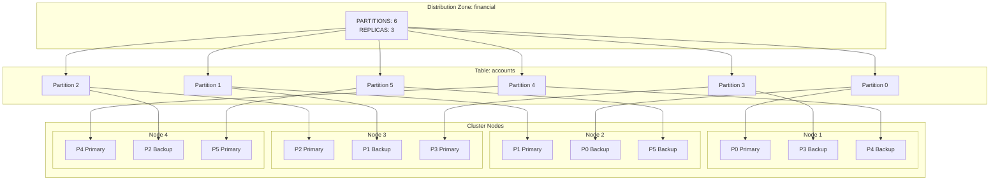
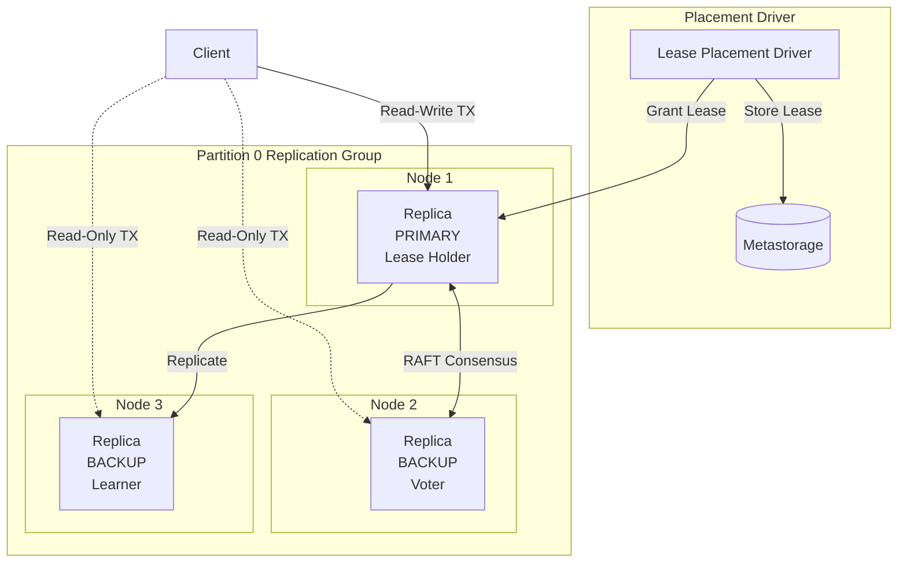
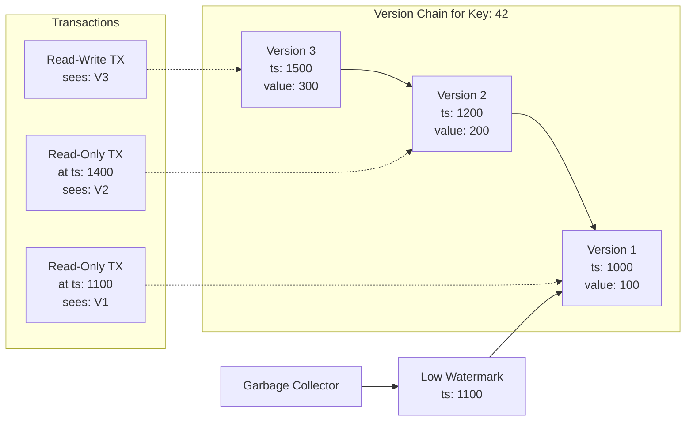

# Data Partitioning

Data partitioning divides table data into fixed-size chunks called partitions and distributes them across cluster nodes. This distribution enables horizontal scaling: adding nodes increases both storage capacity and query throughput.

## Partition Distribution

Tables belong to distribution zones, which define how data is partitioned and replicated. The zone's `PARTITIONS` parameter sets the number of partitions, and `REPLICAS` sets how many copies of each partition exist.



Key behaviors:

- Each partition is identified by a number (0 to PARTITIONS-1)
- Replicas of the same partition are placed on different nodes when possible
- Tables in the same zone share partition-to-node mappings (enabling colocation)
- The Fair distribution algorithm stores placement decisions in metastorage and reuses them for consistent assignment

You can configure the way node stores relevant information in the [node configuration](/docs/3.1.0/configure-and-operate/reference/node-configuration):

- `ignite.system.partitionsBasePath` defines the folder partitions are stored in. By default, partitions are stored in the `work/partitions` folder.
- `ignite.system.partitionsLogPath` defines the folder where partition-specific RAFT logs are stored. These logs contain information on RAFT elections and consensus.
- `ignite.system.metastoragePath` defines the folder where cluster metadata is stored. It is recommended to store metadata on a separate device from partitions.

### Partition Number

When creating a distribution zone, you have an option to manually set the number of partitions with the `PARTITIONS` parameter, for example:

```sql
CREATE ZONE IF NOT EXISTS exampleZone (PARTITIONS 10) STORAGE PROFILES ['default'];
```

As partitions will be spread across the cluster, we recommend to set the number of partitions depending on its size and the number of available cores.

In most cases, we recommend using 2, 3 or 4 times the number of total available cores, divided by the number of replicas as the number of partitions. For example:

- For a cluster with 3 nodes, 8 cores on each node, and 3 data replicas, we recommend using 16, 24 or 32 partitions.
- For a cluster with 7 nodes, 16 cores on each node, and 3 data replicas, we recommend using 75, 112 or 150 partitions.

It is not recommended to set a significantly larger number of partitions or replicas, as maintaining partitions and their distribution can cause a performance drain on the cluster.

Otherwise, Apache Ignite will automatically calculate the recommended number of partitions:

```text
dataNodesCount * coresOnNode * 2 / replicas
```

In this case, the `dataNodesCount` is the estimated number of nodes that will be in the distribution zone when it is created, according to its [filter](/docs/3.1.0/sql/reference/language-definition/distribution-zones) and [storage profiles](/docs/3.1.0/understand/architecture/storage-architecture). At least 1 partition is always created.

### Replica Number

When creating a distribution zone, you can configure the number of *replicas* (individual copies of data on the cluster) by setting the `REPLICAS` parameter. By default, no additional replicas of data are created. As more replicas are added, additional copies of data will be stored on the cluster, and automatically spread to ensure data availability in case of a node leaving the cluster.

Replicas of each partition form a RAFT group, and a [quorum](/docs/3.1.0/sql/reference/language-definition/distribution-zones) in that group is required to perform updates to the partition. The default quorum size depends on the number of replicas in the distribution zone: 3 replicas are required for quorum if the distribution zone has 5 or more replicas, 2 if there are between 2 and 4 replicas, or 1 if only one data replica exists.

Some replicas will be selected as part of a consensus group. These nodes will be voting members, confirming all data changes in the replication group, while other replicas will be *learners*, only passively receiving data from the group leader and not participating in elections.

Losing the majority of the consensus group leads the partition to enter the `Read-only` state. In this state, no data can be written and only explicit read-only transactions can be used to retrieve data. If the distribution zone [scales](/docs/3.1.0/sql/reference/language-definition/distribution-zones) up or down (typically, due to a node entering or leaving the cluster), new replicas will be selected as the consensus group.

The size of the consensus group is automatically calculated based on quorum size:

```text
quorumSize * 2 - 1
```

For example, with 5 replicas and quorum size of 2, 3 replicas will be part of consensus group, and 2 replicas will be learners. In this scenario, losing 2 nodes will lead to some partitions losing the majority of the consensus group and becoming unavailable. For this reason, it is recommended to have a quorum size of 3 for a 5-node cluster.

It is recommended to always have an odd number of replicas and at least 3 replicas of your data on the cluster. When only 2 data replicas exist, losing one will always lead to losing majority, while having 3 or 5 data replicas will allow the cluster to stay functional in [network segmentation](/docs/3.1.0/configure-and-operate/operations/lifecycle) scenarios.

You can also store data replicas on every node in cluster by creating a zone with `REPLICAS ALL` parameter to ensure data is always available to the cluster.

## Primary Replicas and Leases

Once partitions are distributed, Apache Ignite forms replication groups for each partition. Each group elects a leader through RAFT consensus, and the placement driver grants a lease to designate one replica as primary.



The lease mechanism provides:

- **Write linearization**: Only the primary replica handles read-write transactions
- **Lease renewal**: Leases are extended periodically to maintain continuity
- **Automatic failover**: When a lease expires, the placement driver negotiates a new primary

Only the primary replica can handle operations of read-write transactions. Other replicas of the partition can be read from by using read-only transactions.

If a new replica is chosen to receive the lease, it first makes sure it is up-to-date with its replication group based on the stored data. In scenarios where replication group is no longer operable (for example, a node unexpectedly leaves the cluster and the group loses majority), it follows the [disaster recovery](/docs/3.1.0/configure-and-operate/operations/disaster-recovery-partitions) procedure, and you may need to reset the partitions manually.

### Reading Data From Replicas

Reading data as part of a read-write [transaction](/docs/3.1.0/develop/work-with-data/transactions) is always handled by the primary data replica.

Read-only transactions can be handled by either backup or primary replicas, depending on the specifics of the transaction.

## Version Storage

Apache Ignite maintains multiple versions of each row to support MVCC (Multi-Version Concurrency Control). When a row is updated, the old version is preserved in a version chain rather than being deleted immediately.



Version visibility:

- Read-write transactions see the latest version
- Read-only transactions see the version valid at their start timestamp
- Versions older than the low watermark are eligible for garbage collection

The low watermark defaults to 600000 ms (10 minutes). Versions beyond this threshold are cleaned up by the garbage collector, though cleanup is deferred if any active transaction still requires the data.

In a similar manner, [dropped tables](/docs/3.1.0/sql/reference/language-definition/ddl#drop-table) are also not removed from disk until the low watermark point, however you can no longer write to these tables. Read-only transactions that try to get data from these tables will succeed if they read data at timestamp before the table was dropped, and will delay the low watermark point if it is necessary to complete the transaction.

Once the low watermark is reached, old versions of data are considered garbage and will be cleaned up by garbage collector during the next cleanup. This data may or may not be available, as garbage collection is not an immediate process. If a transaction was already started before the low watermark was reached, the required data will be kept available until the end of transaction even if the garbage collection happens. Additionally, Apache Ignite checks that old data is not required anywhere on the cluster before cleaning up the data.

## Distribution Reset

The SQL query performance can deteriorate in a cluster where tables had been created over a long period, alongside topology changes, due to sub-optimum data colocation. To resolve this issue, you can reset (recalculate) partition distribution using [CLI](/docs/3.1.0/tools/cli-commands) or [REST API](/docs/3.1.0/tools/rest-api).

:::note
Reset is likely to result in Partition Rebalance, which may take a long time.
:::

## Partition Rebalance

When the [cluster size changes](/docs/3.1.0/sql/reference/language-definition/distribution-zones), Apache Ignite waits for the timeout specified in the `AUTO SCALE UP` or `AUTO SCALE DOWN` distribution zone properties, and then redistributes partitions according to partition distribution algorithm and transfers data to make it up-to-date with the replication group. This process is called *data rebalance*.
