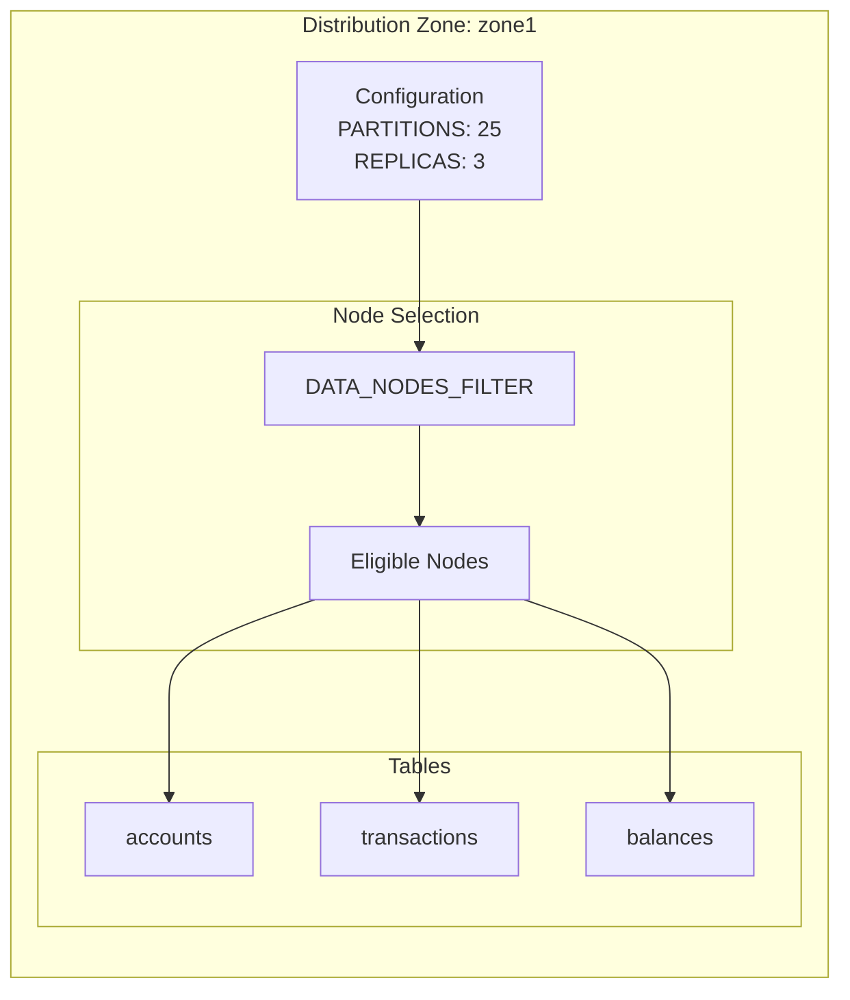
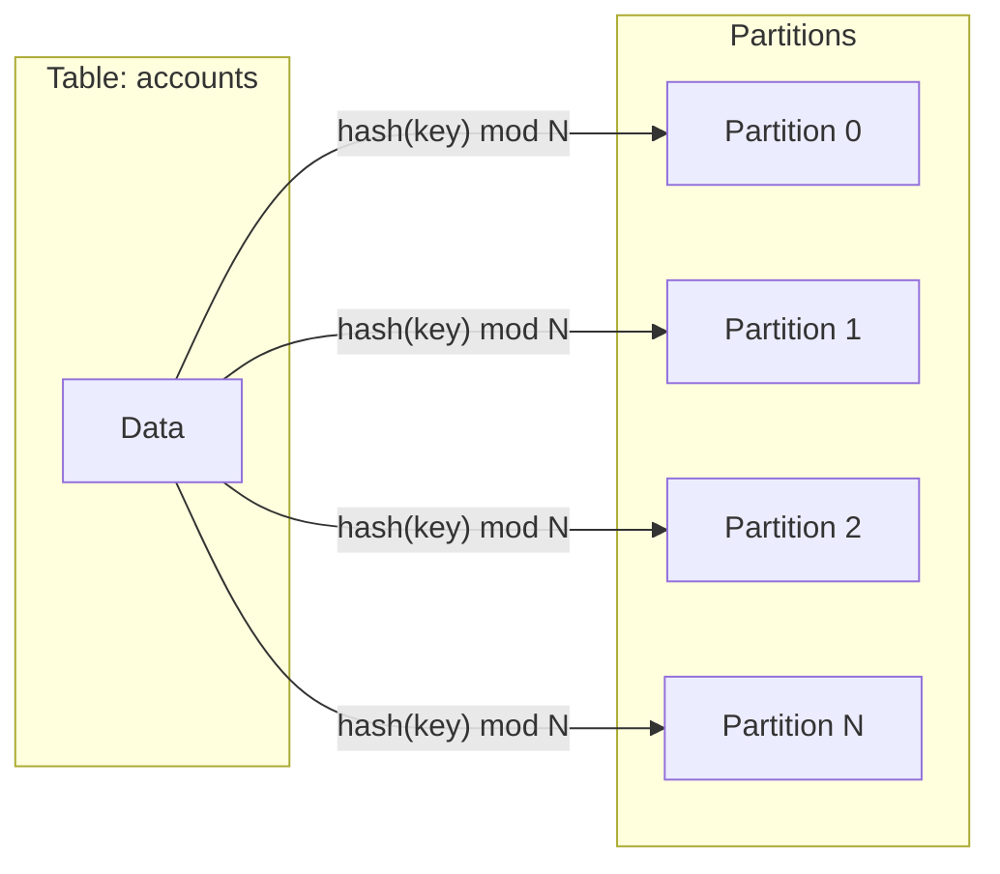
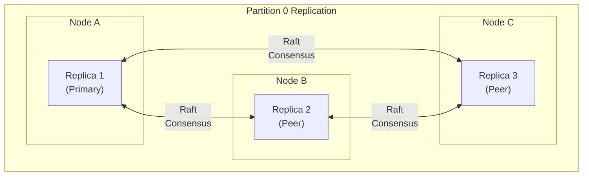
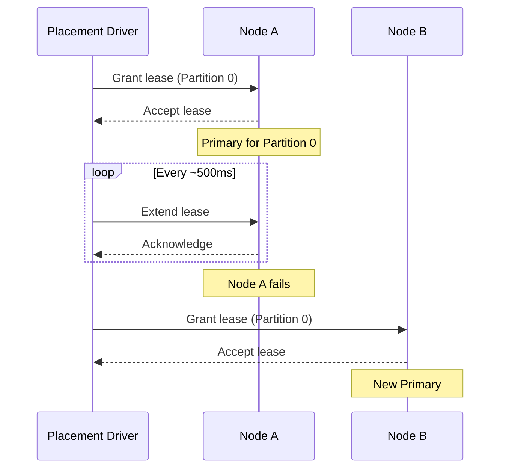
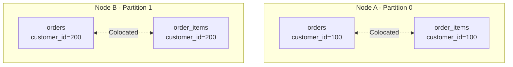
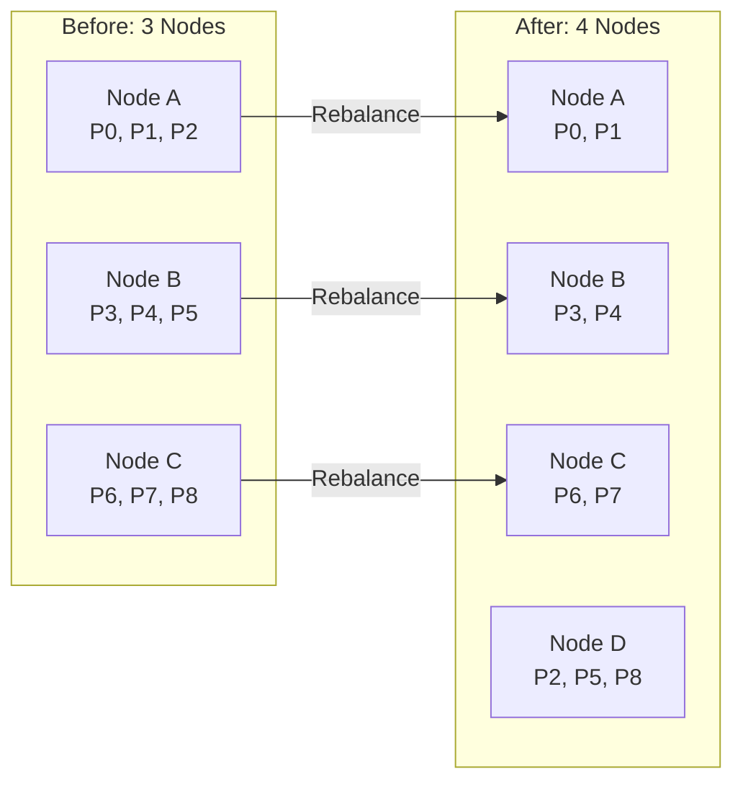

Data distribution determines how Ignite spreads data across cluster nodes. Colocation ensures related data resides on the same nodes, enabling efficient joins and transactions without cross-node data movement.

## Distribution Zones

A distribution zone defines the rules for data placement across the cluster. Each table belongs to exactly one distribution zone that controls:

- Number of partitions
- Replication factor
- Which nodes can store data
- Scale-up and scale-down behavior



Create a distribution zone:

```sql
CREATE ZONE my_zone WITH
    PARTITIONS = 25,
    REPLICAS = 3,
    DATA_NODES_FILTER = '$[?(@.region == "us-east")]',
    DATA_NODES_AUTO_ADJUST_SCALE_UP = 300,
    DATA_NODES_AUTO_ADJUST_SCALE_DOWN = 600
    STORAGE_PROFILES = 'default';
```

## Partitioning

When a table is created, its data is divided into partitions based on the zone configuration. Each partition is identified by a number from 0 to `PARTITIONS - 1`.



### Rendezvous Hashing

Ignite uses rendezvous hashing (Highest Random Weight) to assign partitions to nodes. For each partition, the algorithm:

1. Computes a hash combining each node's ID with the partition number
2. Sorts nodes by their hash value in descending order
3. Assigns the partition to nodes with the highest scores

This approach provides:

- **Deterministic placement**: The same partition always maps to the same nodes given the same cluster topology
- **Minimal rebalancing**: Adding or removing nodes affects only partitions that must move
- **Stable ordering**: Consistent replica orderings across all nodes

### Partition Count Guidelines

Set partition count based on cluster size and available cores:

```text
recommended_partitions = (node_count * cores_per_node * 2) / replica_count
```

Examples:

- 3 nodes, 8 cores each, 3 replicas: 16 to 32 partitions
- 7 nodes, 16 cores each, 3 replicas: 75 to 150 partitions

The maximum partition count is 65,000 per table. Using significantly more partitions than recommended creates overhead from partition management and distribution tracking.

## Replication

Each partition is replicated across multiple nodes for fault tolerance. The `REPLICAS` parameter controls how many copies exist.



### Consensus Groups

Replicas form a Raft consensus group. The group has two member types:

| Type | Role |
|------|------|
| **Peers** | Vote on writes, contribute to quorum, can become primary |
| **Learners** | Receive data asynchronously, cannot vote, used for read scaling |

The consensus group size determines how many peers participate in voting:

```text
consensus_group_size = (quorum_size * 2) - 1
```

For 5 replicas with quorum size 2: 3 peers and 2 learners.

### Quorum Requirements

Writes require acknowledgment from a quorum of peers before completion. Losing the majority of the consensus group puts the partition in read-only state.

| Replicas | Default Quorum | Consensus Peers |
|----------|----------------|-----------------|
| 1 | 1 | 1 |
| 2-4 | 2 | 3 |
| 5+ | 3 | 5 |

For high availability, use an odd number of replicas (3 or 5) to handle node failures without losing quorum.

## Primary Replicas and Leases

Each partition has one primary replica that handles all read-write transactions. The primary is determined through a lease mechanism managed by the placement driver.



Lease properties:

- **Short-lived**: Leases expire after a few seconds if not renewed
- **Non-revocable**: A lease cannot be revoked before expiration
- **Single holder**: Only one node holds the lease for a partition at any time
- **Negotiated**: The candidate must accept the lease before becoming primary

## Data Colocation

Colocation ensures that related data from different tables is stored on the same partition. This enables:

- Joins without cross-node data transfer
- Transactions touching related data without distributed coordination
- Colocated compute jobs that access all needed data locally

### Colocation Keys

Tables colocate when they share the same:

- Distribution zone
- Colocation key column(s) with matching values



Define colocation when creating tables:

```sql
-- Parent table
CREATE TABLE customers (
    customer_id INT PRIMARY KEY,
    name VARCHAR(100)
) WITH PRIMARY_ZONE = 'my_zone';

-- Child table colocated by customer_id
CREATE TABLE orders (
    order_id INT,
    customer_id INT,
    total DECIMAL(10,2),
    PRIMARY KEY (order_id, customer_id)
) COLOCATE BY (customer_id)
  WITH PRIMARY_ZONE = 'my_zone';

-- Another colocated table
CREATE TABLE order_items (
    item_id INT,
    order_id INT,
    customer_id INT,
    product_id INT,
    quantity INT,
    PRIMARY KEY (item_id, customer_id)
) COLOCATE BY (customer_id)
  WITH PRIMARY_ZONE = 'my_zone';
```

### Colocation Requirements

For colocation to work:

1. **Same zone**: Tables must use the same distribution zone
2. **Matching columns**: Colocation key columns must have compatible types
3. **Primary key inclusion**: Colocation columns must be part of the primary key
4. **Consistent hashing**: All colocated tables use the same hash function on colocation keys

### Query Optimization

The SQL engine detects colocated tables and optimizes join execution:

```sql
-- This join executes locally on each node without data shuffling
SELECT o.order_id, c.name, o.total
FROM orders o
JOIN customers c ON o.customer_id = c.customer_id
WHERE o.customer_id = 100;
```

Without colocation, the same query would require transferring data between nodes.

## Partition Rebalancing

When cluster topology changes, Ignite redistributes partitions to maintain balanced data distribution.



Rebalancing is controlled by scale timers:

- `DATA_NODES_AUTO_ADJUST_SCALE_UP`: Delay before adding new node to data distribution (default: immediate)
- `DATA_NODES_AUTO_ADJUST_SCALE_DOWN`: Delay before removing departed node from distribution (default: immediate)

Setting delays prevents unnecessary rebalancing during rolling restarts or brief network issues.

## Node Filtering

The `DATA_NODES_FILTER` parameter selects which nodes participate in the zone using JSONPath expressions against node attributes:

```sql
-- Only nodes in us-east region
CREATE ZONE us_east_zone WITH
    DATA_NODES_FILTER = '$[?(@.region == "us-east")]',
    STORAGE_PROFILES = 'default';

-- Nodes with SSD storage and at least 32GB RAM
CREATE ZONE high_performance WITH
    DATA_NODES_FILTER = '$[?(@.storage == "ssd" && @.memory >= 32)]',
    STORAGE_PROFILES = 'default';
```

Node attributes are configured in each node's configuration file.

## Design Constraints

1. **Zone immutability**: Once a table is assigned to a zone, it cannot be moved to a different zone
2. **Partition count fixed**: The number of partitions cannot be changed after zone creation
3. **Colocation at creation**: Colocation must be specified when creating the table
4. **Single leaseholder**: Only one node can be the primary for a partition at any time
5. **Consensus majority**: Losing the majority of consensus peers makes the partition read-only

## Related Topics

- [Distribution Zones SQL Reference](/docs/3.1.0/sql/reference/language-definition/distribution-zones) for zone DDL syntax
- [Data Partitioning](/docs/3.1.0/understand/core-concepts/data-partitioning) for partition internals
- [Disaster Recovery](/docs/3.1.0/configure-and-operate/operations/disaster-recovery-partitions) for handling partition failures
