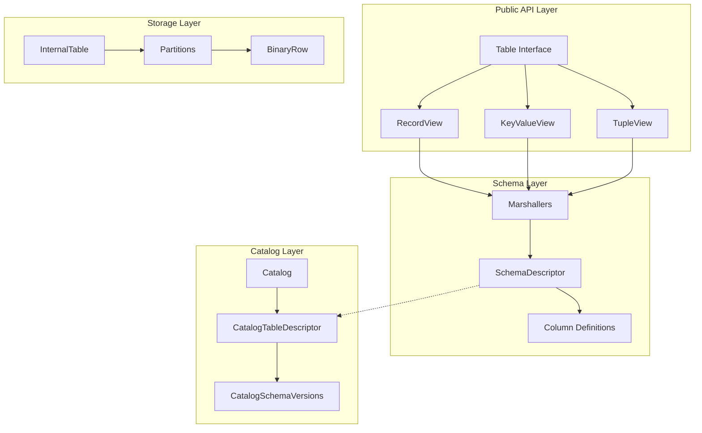
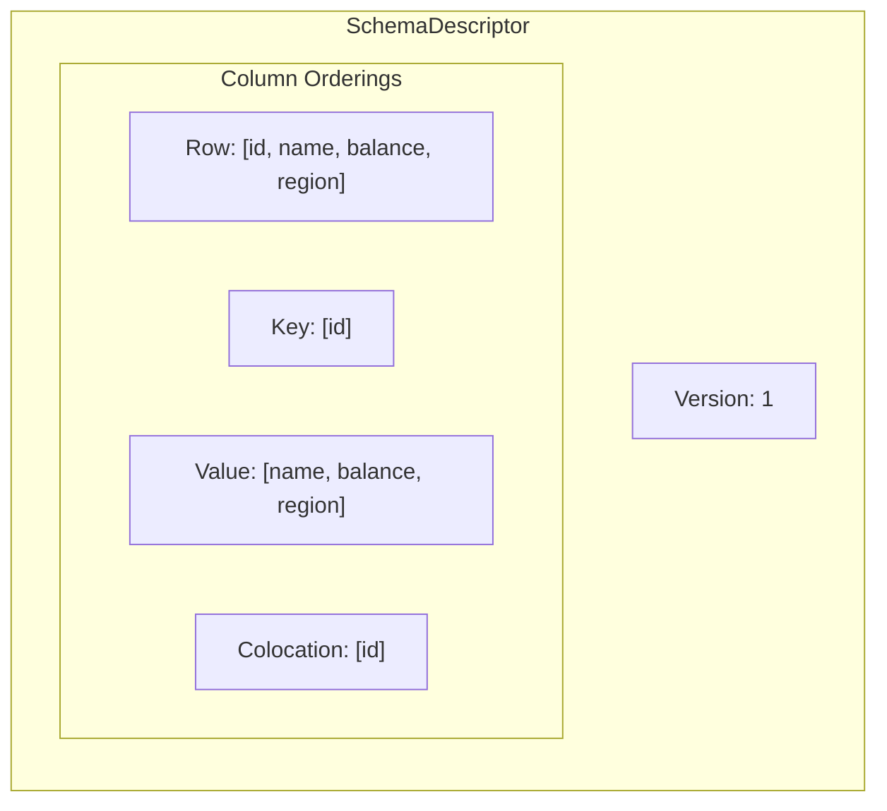
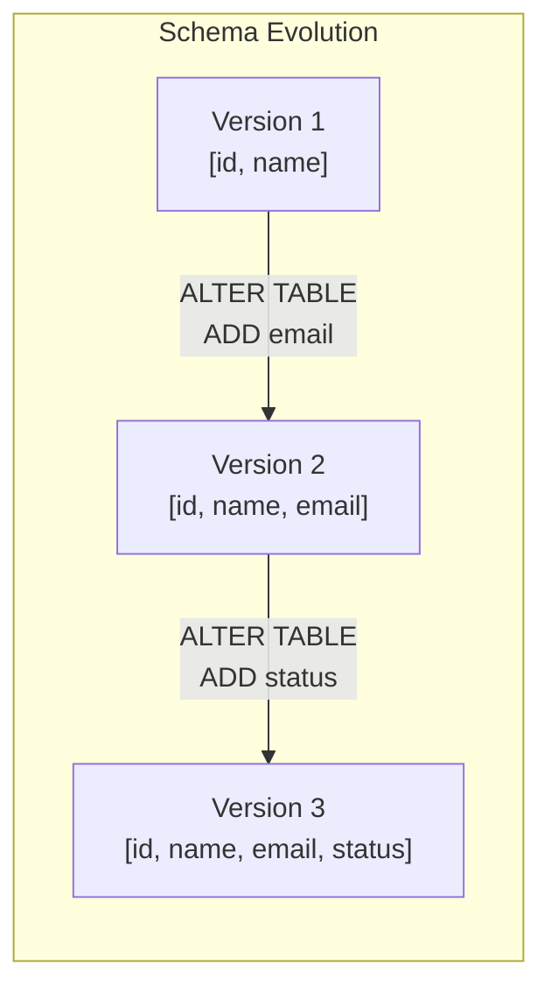
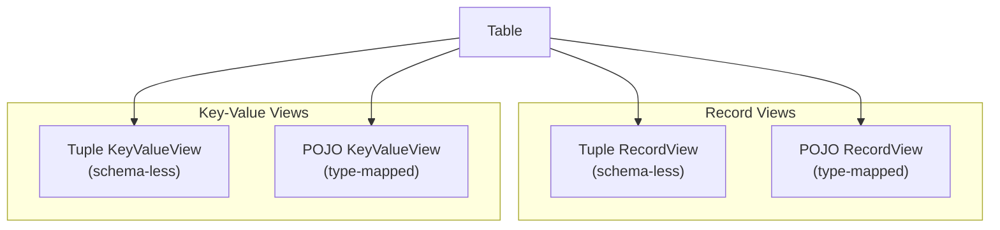
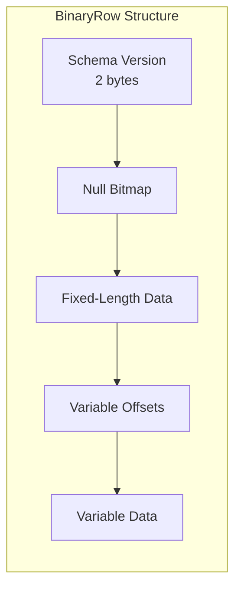

Tables are the primary data structure in Ignite 3. Unlike Ignite 2's cache-based model with Binary Objects, Ignite 3 stores data in tables with SQL-compatible schemas. This unifies the SQL and Key-Value APIs under a single data model.

## Architecture Overview

The table system consists of three layers:



- **Catalog Layer**: Maintains versioned metadata for schemas, tables, indexes, and distribution zones
- **Schema Layer**: Defines column types, handles binary serialization, and manages schema evolution
- **Storage Layer**: Manages partitioned data storage using binary row format

## Schema Structure

Each table has a `SchemaDescriptor` that defines its structure. The descriptor maintains multiple column orderings:

| Ordering | Purpose |
|----------|---------|
| Row position | Full row serialization order |
| Key position | Primary key columns only |
| Value position | Non-key columns only |
| Colocation position | Columns used for partition assignment |



The schema tracks column positions across these orderings. A column absent from a specific ordering has position `-1`.

## Column Types

Ignite 3 supports two categories of native types:

### Fixed-Length Types

| Type | Size (bytes) | Java Mapping |
|------|--------------|--------------|
| BOOLEAN | 1 | `boolean` |
| INT8 | 1 | `byte` |
| INT16 | 2 | `short` |
| INT32 | 4 | `int` |
| INT64 | 8 | `long` |
| FLOAT | 4 | `float` |
| DOUBLE | 8 | `double` |
| UUID | 16 | `java.util.UUID` |
| DATE | 3 | `java.time.LocalDate` |

### Variable-Length Types

| Type | Max Size | Java Mapping |
|------|----------|--------------|
| STRING | 65536 (default) | `String` |
| BYTES | 65536 (default) | `byte[]` |
| DECIMAL | precision/scale | `BigDecimal` |
| TIME | precision (0-9) | `java.time.LocalTime` |
| DATETIME | precision (0-9) | `java.time.LocalDateTime` |
| TIMESTAMP | precision (0-9) | `java.time.Instant` |

:::note
Ignite 3 requires JavaTime API for temporal types. Legacy types like `java.util.Date`, `java.sql.Date`, `java.sql.Time`, and `java.sql.Timestamp` are not supported.
:::

## Primary Keys

Every table requires a primary key. Ignite 3 supports two primary key types:

- **Hash Primary Key**: Uses hash-based partitioning for data distribution
- **Sorted Primary Key**: Uses range-based partitioning with collation ordering

Primary key constraints:

- All primary key columns must be non-nullable
- No duplicate columns allowed in key definition
- All key columns must exist in the table schema
- A primary key index is automatically created

```sql
CREATE TABLE accounts (
    account_id INT PRIMARY KEY,
    name VARCHAR(100),
    balance DECIMAL(10, 2)
);
```

For composite keys:

```sql
CREATE TABLE order_items (
    order_id INT,
    item_id INT,
    quantity INT,
    PRIMARY KEY (order_id, item_id)
);
```

## Schema Versioning

Ignite 3 uses append-only schema versioning. Each `ALTER TABLE` operation increments the catalog version and creates a new schema version for the table.



Key versioning behaviors:

- **Immutable versions**: Schema versions are never modified after creation
- **Consecutive numbering**: Versions increment by 1 with no gaps
- **Column mapper**: Tracks transformations between versions for automatic data migration
- **Binary row versioning**: Each stored row carries its schema version

When reading data written with an older schema version, Ignite automatically upgrades the row using the `ColumnMapper`. New columns receive their default values.

## Table Views

Tables expose multiple view abstractions for different access patterns:



### RecordView

Works with complete row records containing all fields including the primary key:

```java
RecordView<Account> accounts = table.recordView(Account.class);

Account account = new Account(123, "John Doe", 1000.00);
accounts.insert(null, account);

Account retrieved = accounts.get(null, new Account(123));
```

### KeyValueView

Separates keys from values. Use this when the primary key is not logically part of the domain object:

```java
KeyValueView<Long, Account> accounts = table.keyValueView(
    Mapper.of(Long.class),
    Mapper.of(Account.class)
);

accounts.put(null, 123L, new Account("John Doe", 1000.00));
Account account = accounts.get(null, 123L);
```

### Tuple Views

For schema-less access without predefined classes:

```java
RecordView<Tuple> view = table.recordView();

Tuple record = Tuple.create()
    .set("id", 123)
    .set("name", "John Doe")
    .set("balance", 1000.00);

view.insert(null, record);
```

## Binary Row Format

Data is stored in a compact binary format optimized for zero-copy reads:



The format supports:

- **Null tracking**: Bitmap indicates null columns without storing placeholder data
- **Direct access**: Fixed-length columns accessed by offset without deserialization
- **Variable-length efficiency**: Offset table enables direct access to variable columns

## Catalog Management

The `Catalog` maintains an immutable snapshot of the distributed schema at a specific version:

```java
// Tables are created via SQL
client.sql().execute(null,
    "CREATE TABLE accounts (" +
    "  id INT PRIMARY KEY," +
    "  name VARCHAR(100)," +
    "  balance DECIMAL(10,2)" +
    ") WITH PRIMARY_ZONE='default'"
);

// Access table via API
Table accounts = client.tables().table("accounts");
```

Schema operations use `CatalogCommand` implementations:

- `CreateTableCommand`: Creates new table with schema
- `AlterTableAddColumnCommand`: Adds columns to existing table
- `AlterTableDropColumnCommand`: Removes columns
- `DropTableCommand`: Removes table

All catalog operations are atomic and version-tracked.

## Design Constraints

When working with tables:

1. **Table creation requires SQL**: The Table API only provides read and write operations. Use SQL DDL to create, alter, or drop tables.

2. **Schema version continuity**: Schema versions must increment consecutively. Early versions may be pruned but intermediate versions cannot be skipped.

3. **Primary key immutability**: Primary key columns cannot be modified after table creation.

4. **Nullable inference**: Primary key columns are automatically non-nullable. Including nullable columns in a primary key raises a validation error.

5. **Type constraints**: Variable-length types have maximum length constraints. DECIMAL requires explicit precision and scale.

## Related Topics

- [Table API](/docs/3.1.0/develop/work-with-data/table-api) for working with table views
- [Distribution Zones](/docs/3.1.0/sql/reference/language-definition/distribution-zones) for partition configuration
- [Data Types](/docs/3.1.0/sql/reference/data-types-and-functions/data-types) for SQL type mappings
