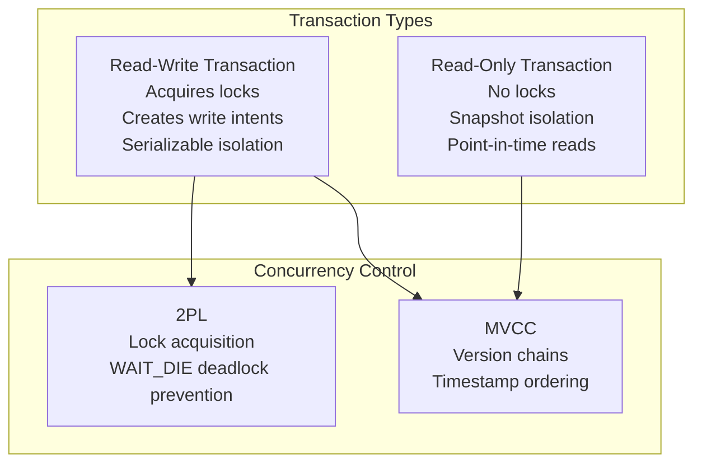
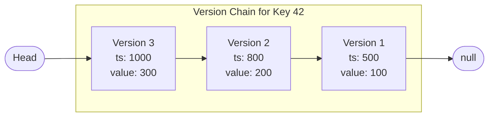
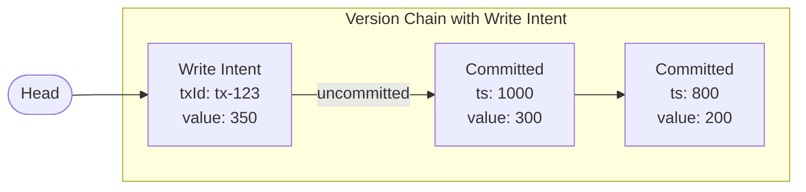
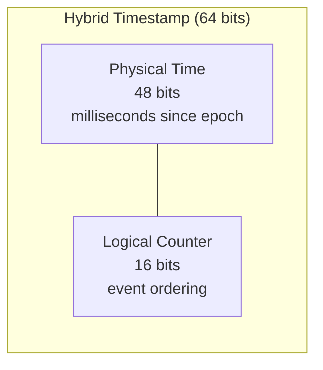
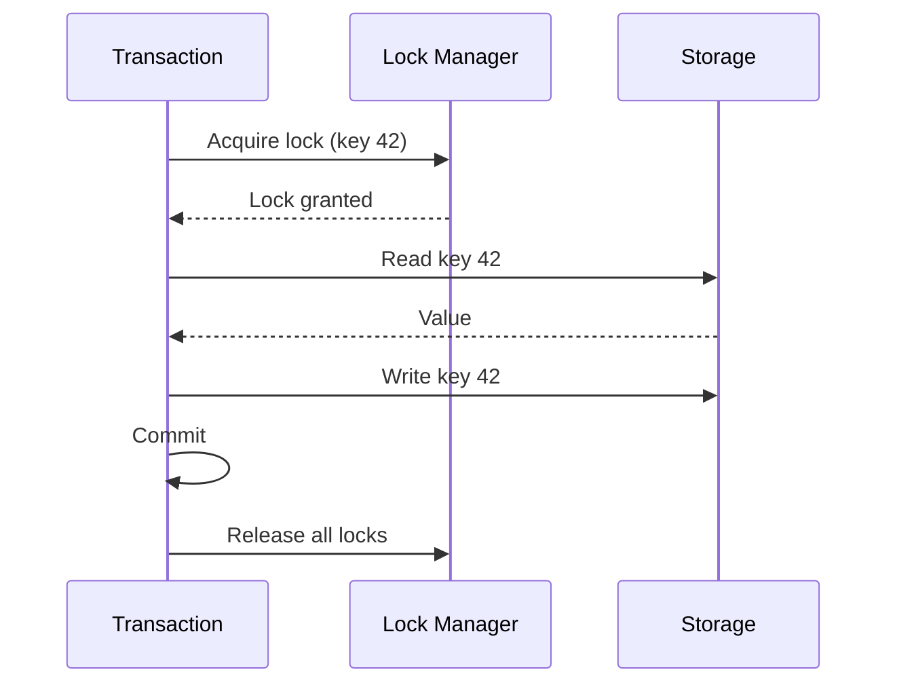
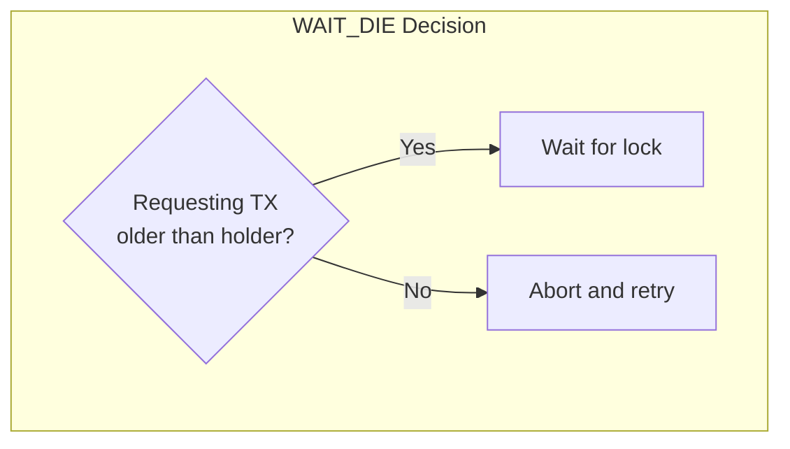
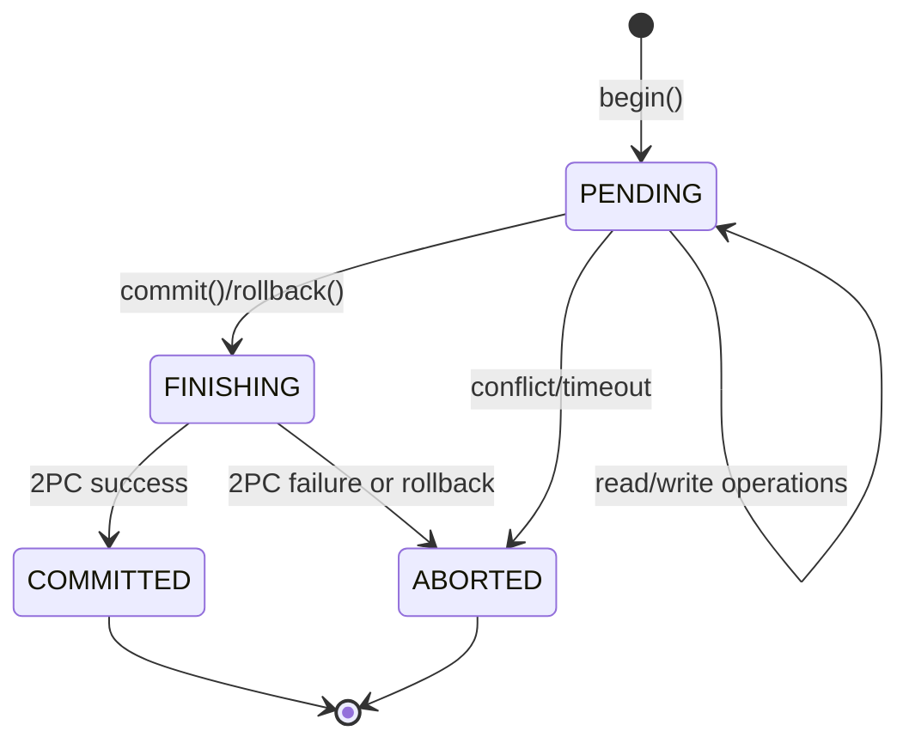
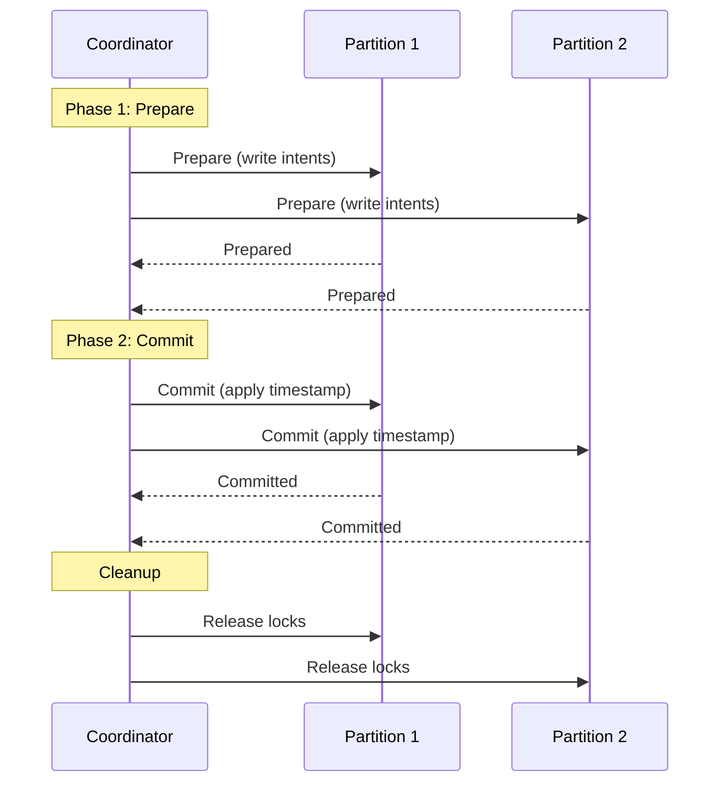
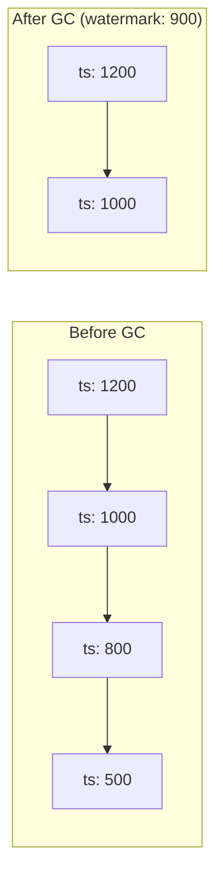

Ignite 3 provides ACID transactions using Multi-Version Concurrency Control (MVCC) combined with Two-Phase Locking (2PL). All tables are transactional by default with serializable isolation.

## Transaction Model Overview



Key characteristics:

- All transactions are serializable for read-write operations
- Read-only transactions use snapshot isolation without locking
- WAIT_DIE algorithm prevents deadlocks
- Two-phase commit (2PC) coordinates distributed transactions

## Multi-Version Concurrency Control

MVCC maintains multiple versions of each row, allowing concurrent readers and writers without blocking.

### Version Chains

Each row has a version chain storing all versions from newest to oldest:



Each version contains:

| Field | Description |
|-------|-------------|
| Timestamp | Hybrid timestamp when committed (null if uncommitted) |
| Transaction ID | ID of owning transaction (for uncommitted versions) |
| Value | Binary row data (empty for tombstones/deletions) |
| Next link | Pointer to previous version |

### Write Intents

Uncommitted changes are stored as write intents at the head of the version chain:



Write intents track:

- Transaction ID of the writer
- Commit partition ID for transaction state lookup
- The uncommitted value

On commit, the write intent receives a timestamp and becomes a regular committed version. On abort, the write intent is removed.

### Visibility Rules

When reading a row, transactions see different versions based on their type and timestamp:

| Scenario | Read-Write Transaction | Read-Only Transaction |
|----------|----------------------|---------------------|
| Only write intent exists | Sees write intent (if own tx) | Blocks or sees nothing |
| Write intent + older commit | Sees write intent (if own tx) or waits | Sees older commit |
| Committed version newer than read timestamp | Sees it | Sees older version |
| All commits older than read timestamp | Sees newest | Sees version at timestamp |

Read-only transactions always read at their creation timestamp, providing a consistent snapshot.

## Hybrid Timestamps

Ignite uses hybrid logical clocks combining physical time with logical counters:



Hybrid timestamps provide:

- **Causality**: Events on the same node are ordered correctly
- **Approximate wall-clock**: Physical component enables time-based queries
- **Coordination-free generation**: Nodes generate timestamps locally

The epoch starts at January 1, 2021. The logical counter ensures ordering when multiple events occur within the same millisecond.

## Transaction Isolation

### Read-Write Transactions

Read-write transactions use serializable isolation through Two-Phase Locking:

1. **Growing phase**: Acquire locks before accessing data
2. **Shrinking phase**: Release all locks at commit/abort



Lock modes form a compatibility matrix:

| Lock | IS | IX | S | SIX | X |
|------|----|----|---|-----|---|
| **IS** | Yes | Yes | Yes | Yes | No |
| **IX** | Yes | Yes | No | No | No |
| **S** | Yes | No | Yes | No | No |
| **SIX** | Yes | No | No | No | No |
| **X** | No | No | No | No | No |

- **IS** (Intention Shared): Intent to read descendants
- **IX** (Intention Exclusive): Intent to write descendants
- **S** (Shared): Read lock
- **SIX** (Shared Intention Exclusive): Read lock with intent to write descendants
- **X** (Exclusive): Write lock

### Read-Only Transactions

Read-only transactions bypass locking entirely:

- Fixed read timestamp assigned at creation
- Read from any replica (not just primary)
- No partition enlistment or coordination
- Cannot modify data

```java
var tx = client.transactions().begin(
    new TransactionOptions().readOnly(true)
);

// Reads see consistent snapshot at transaction start time
Account account = accounts.get(tx, 42);

tx.commit(); // No-op for read-only
```

## Deadlock Prevention

Ignite uses the WAIT_DIE algorithm to prevent deadlocks without detection cycles:



When a transaction requests a lock held by another:

| Requester Age | Action |
|---------------|--------|
| Older than holder | Wait for lock release |
| Younger than holder | Abort immediately, retry with same timestamp |

This prevents circular waits because younger transactions always yield to older ones. Retrying with the same timestamp ensures the transaction eventually becomes the oldest and succeeds.

## Transaction Lifecycle

### Read-Write Transaction Flow



State descriptions:

| State | Description |
|-------|-------------|
| PENDING | Active transaction, operations in progress |
| FINISHING | Coordinator initiated commit/rollback |
| COMMITTED | Successfully committed, changes visible |
| ABORTED | Rolled back, changes discarded |
| ABANDONED | Coordinator lost, awaiting recovery |

### Two-Phase Commit Protocol

Distributed transactions use 2PC for atomic commitment:



If any partition fails to prepare, the coordinator aborts all participants.

### Transaction Coordinator

The node that begins the transaction becomes its coordinator, responsible for:

- Tracking enlisted partitions
- Assigning a commit partition for state storage
- Orchestrating 2PC protocol
- Handling failures and timeouts

If the coordinator fails:

1. Transaction enters ABANDONED state
2. Orphan detection triggers after timeout
3. Write intents are resolved based on commit partition state
4. Locks are released

## Version Garbage Collection

Old versions accumulate in version chains. The garbage collector removes versions older than the low watermark:



Low watermark considerations:

- Default: 600,000 ms (10 minutes)
- Increasing allows longer-running read-only transactions
- Higher values require more storage for old versions
- Active transactions prevent GC of versions they might need

## Transaction Options

Configure transactions at creation:

```java
// Read-write with timeout
var rwTx = client.transactions().begin(
    new TransactionOptions()
        .timeoutMillis(30000)  // 30 second timeout
);

// Read-only
var roTx = client.transactions().begin(
    new TransactionOptions()
        .readOnly(true)
);
```

| Option | Default | Description |
|--------|---------|-------------|
| `readOnly` | false | Enable read-only mode |
| `timeoutMillis` | 0 (none) | Auto-rollback after timeout |

## Design Constraints

1. **Primary replica writes**: All read-write operations go through the partition's primary replica

2. **Lock granularity**: Locks are per-key, not per-row or per-table

3. **No savepoints**: Partial rollback within a transaction is not supported

4. **Clock synchronization**: Nodes must have synchronized clocks (within `schemaSync.maxClockSkewMillis`)

5. **Single commit partition**: Each transaction uses one partition for state, creating a coordination point

6. **Write intent resolution**: Encountering another transaction's write intent may require waiting or aborting

## Related Topics

- [Performing Transactions](/3.1.0/develop/work-with-data/transactions) for API usage
- [Data Partitioning](/3.1.0/understand/core-concepts/data-partitioning) for version storage details
