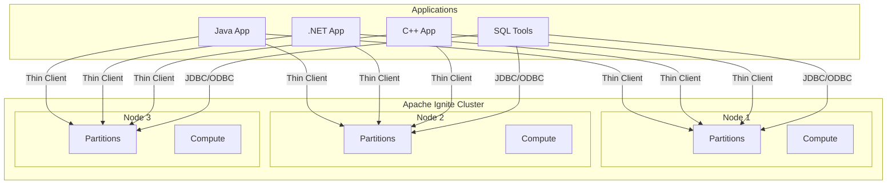
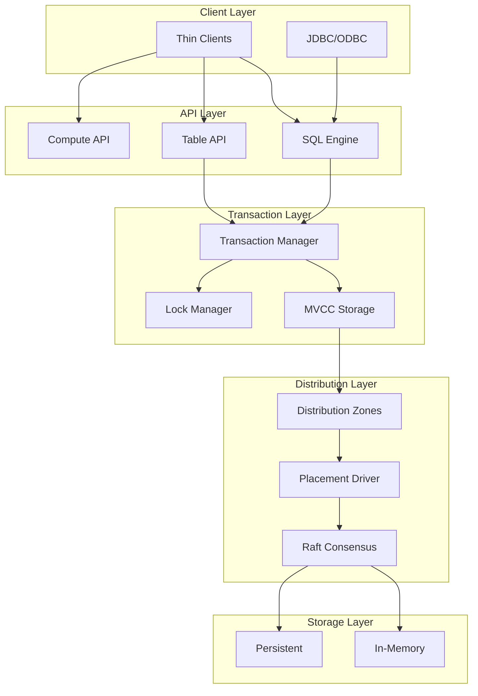
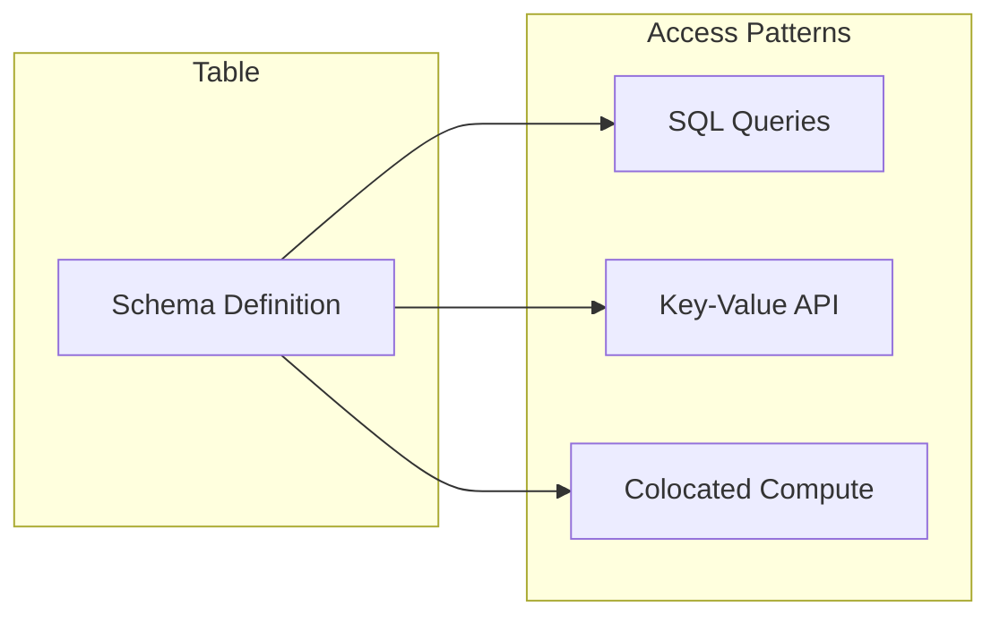
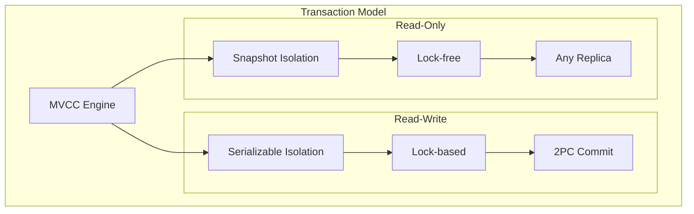
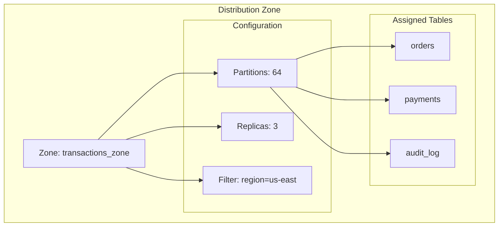
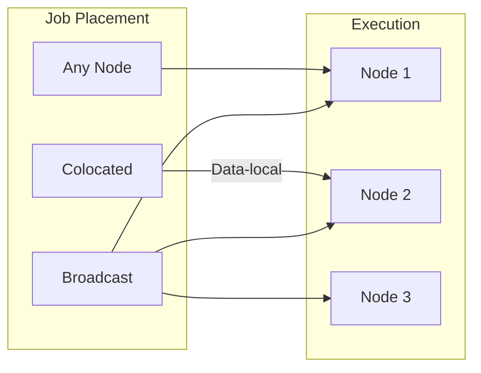
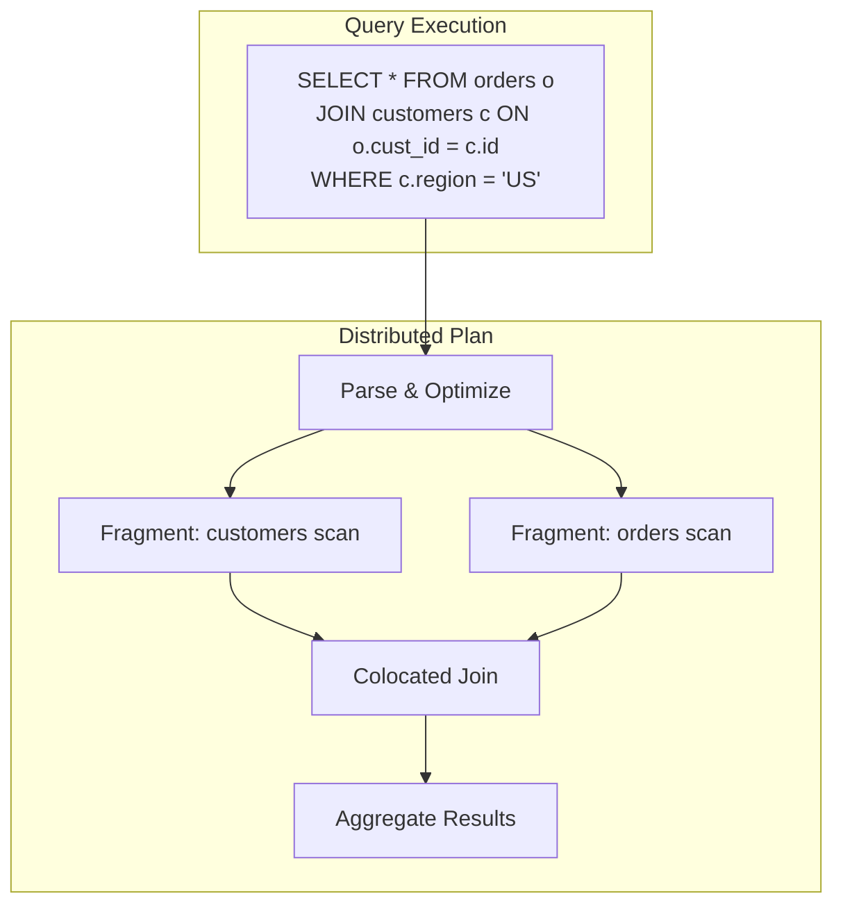
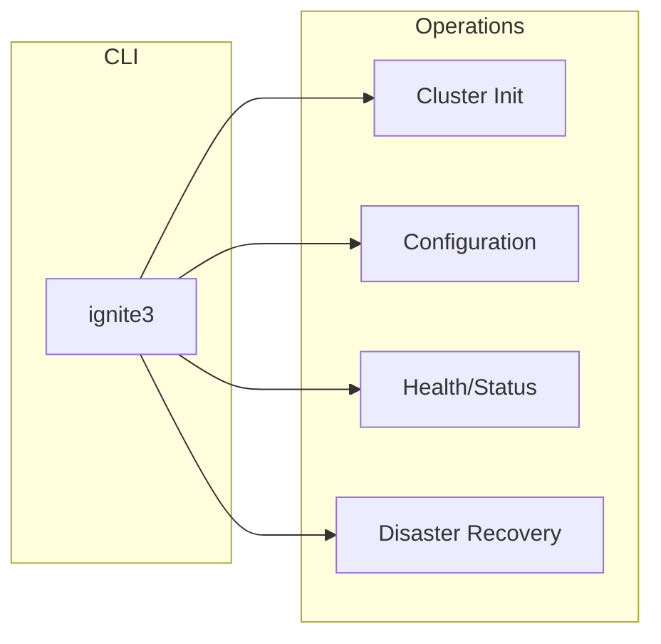
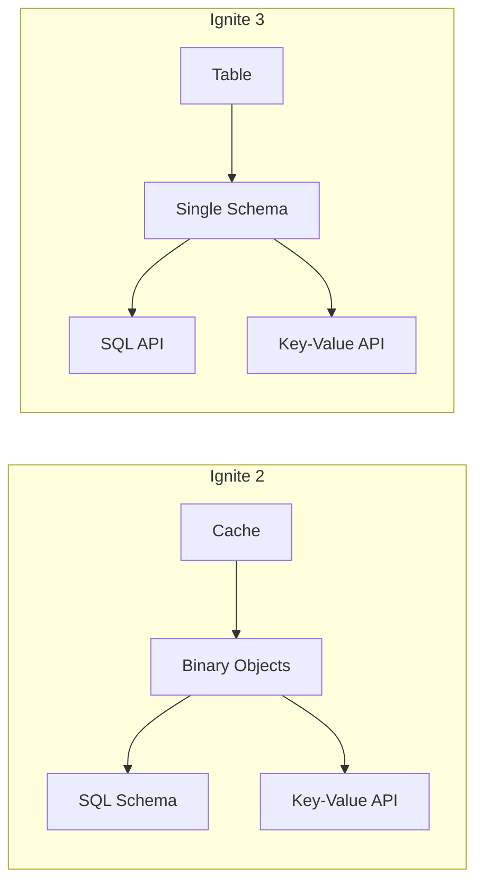

Apache Ignite is a distributed database designed for high-performance transactional and analytical workloads. It combines in-memory speed with disk persistence, providing both SQL and key-value access to the same data with full ACID transaction support.

## When to Use Ignite

Ignite fits workloads that require low-latency data access at scale:

| Workload | How Ignite Helps |
|----------|------------------|
| **High-throughput OLTP** | In-memory processing with persistent storage handles millions of transactions per second |
| **Real-time analytics** | Distributed SQL queries execute across partitioned data without ETL |
| **Caching layer** | Replace external caches with a transactional, SQL-queryable data layer |
| **Microservices data** | Shared distributed state with strong consistency guarantees |
| **Event processing** | Colocated compute executes business logic where data resides |

## Architecture

Ignite clusters consist of server nodes that store partitioned data and execute distributed queries and compute jobs. Clients connect through a lightweight protocol without joining the cluster topology.



### Component Layers



## Core Features

### Unified Data Model

Tables provide a single data structure for both SQL and key-value operations. The same schema serves distributed queries and low-latency key lookups.



Create tables with SQL, then access them through any API:

```sql
CREATE TABLE accounts (
    id INT PRIMARY KEY,
    name VARCHAR(100),
    balance DECIMAL(10,2)
) WITH PRIMARY_ZONE = 'default';
```

```java
// Key-value access to the same table
KeyValueView<Long, Account> kv = table.keyValueView(
    Mapper.of(Long.class), Mapper.of(Account.class));
Account account = kv.get(null, 42L);

// SQL access
ResultSet rs = client.sql().execute(null,
    "SELECT * FROM accounts WHERE balance > ?", 1000);
```

### ACID Transactions

All tables support transactions by default using Multi-Version Concurrency Control (MVCC). Read-write transactions execute with serializable isolation. Read-only transactions provide snapshot isolation without acquiring locks.



Transactions work across SQL and key-value operations:

```java
var tx = client.transactions().begin();
try {
    // Mix SQL and key-value in same transaction
    client.sql().execute(tx, "UPDATE accounts SET balance = balance - 100 WHERE id = ?", 1);
    kv.put(tx, 2L, new Account("Jane", 100.00));
    tx.commit();
} catch (Exception e) {
    tx.rollback();
}
```

### Distribution Zones

Distribution zones control how data is partitioned and replicated across the cluster. Each zone defines partition count, replication factor, and node placement rules.



Tables in the same zone with matching colocation keys store related data on the same partitions, enabling efficient joins without network transfers.

### Distributed Compute

Execute code where data resides to minimize network overhead. Jobs can target specific nodes, colocate with data partitions, or broadcast across the cluster.



Colocated execution processes data without network transfer:

```java
// Execute on node holding account 42's partition
JobExecution<Double> execution = client.compute().submit(
    JobTarget.colocated("accounts", Tuple.create().set("id", 42L)),
    JobDescriptor.builder(CalculateInterestJob.class).build(),
    42L
);
Double interest = execution.resultAsync().join();
```

### Distributed SQL

The SQL engine executes ANSI SQL queries across partitioned data. Query plans push predicates to partitions, aggregate results, and handle distributed joins.



Standard JDBC connectivity works with existing SQL tools:

```java
try (Connection conn = DriverManager.getConnection("jdbc:ignite:thin://localhost:10800")) {
    PreparedStatement stmt = conn.prepareStatement(
        "SELECT region, SUM(amount) FROM orders GROUP BY region");
    ResultSet rs = stmt.executeQuery();
}
```

### Storage Options

Ignite supports multiple storage engines optimized for different workloads:

| Engine | Characteristics | Use Case |
|--------|----------------|----------|
| **aimem** | In-memory only, volatile | Caching, session data |
| **aipersist** | In-memory with disk persistence | Primary data storage |
| **rocksdb** | Disk-based with memory cache | Large datasets exceeding RAM |

Storage profiles assign engines to distribution zones:

```sql
CREATE ZONE large_data WITH
    STORAGE_PROFILES = 'rocksdb_profile',
    PARTITIONS = 128,
    REPLICAS = 3;
```

## Clients and Connectivity

Ignite provides native thin clients and standard database connectivity:

| Client | Language | Protocol |
|--------|----------|----------|
| Java Client | Java 11+ | Binary |
| .NET Client | .NET 6+ | Binary |
| C++ Client | C++17 | Binary |
| JDBC Driver | Any JVM | JDBC |
| ODBC Driver | Any | ODBC |

Thin clients connect directly to cluster nodes without joining the topology:

```java
IgniteClient client = IgniteClient.builder()
    .addresses("node1:10800", "node2:10800", "node3:10800")
    .build();
```

## Management

The `ignite3` CLI provides cluster administration, configuration, and disaster recovery operations. Configuration uses HOCON format split between cluster-wide and node-specific settings.



## Changes from Ignite 2

For teams migrating from Ignite 2, the following section summarizes architectural changes.

### Data Model

Ignite 2 stored data in caches using Binary Object format. SQL and key-value APIs operated on different representations. Ignite 3 replaces caches with tables that provide a unified schema for all access patterns.



### Transactions

Ignite 2 transactions required cache atomicity configuration and had performance implications. Ignite 3 makes all tables transactional by default with MVCC-based concurrency control. The WAIT_DIE algorithm prevents deadlocks without detection overhead.

### Distribution Configuration

Ignite 2 spread distribution settings across affinity functions, backup configuration, and baseline topology. Ignite 3 consolidates these into distribution zones with explicit partition counts, replica factors, and node filters. Custom affinity functions are replaced by deterministic rendezvous hashing.

### Client Model

Ignite 2 thick clients joined the cluster as nodes, requiring full protocol participation. Ignite 3 uses thin clients exclusively for standard operations. Embedded mode remains available for specialized use cases.

### Compute API

Ignite 3 extends Ignite 2's compute capabilities with job state tracking, priority-based queuing, and automatic failover on node departure. All compute operations return `CompletableFuture` for non-blocking execution.

### Management Tools

Ignite 2 used multiple CLI scripts with overlapping functionality. Ignite 3 provides a single `ignite3` CLI with interactive mode and command autocomplete. Configuration moved from XML to HOCON format.

## Next Steps

- [Tables and Schemas](./tables-and-schemas) for data modeling
- [Distribution and Colocation](./distribution-and-colocation) for partitioning
- [Transactions and MVCC](./transactions-and-mvcc) for concurrency control
- [Compute and Events](./compute-and-events) for distributed processing
- [Getting Started](/3.1.0/getting-started/) to deploy your first cluster
