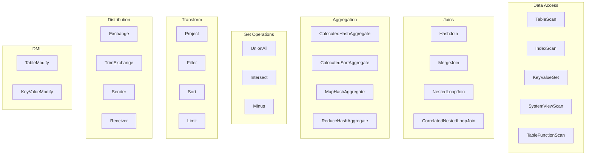

# EXPLAIN Operators Reference

This reference documents all operators that appear in `EXPLAIN` output. Operators are organized by category based on their function in query execution.

## Quick Reference

| Operator | Category | Description |
|----------|----------|-------------|
| TableScan | Access | Full table scan |
| IndexScan | Access | Index-based scan with optional bounds |
| KeyValueGet | Access | Direct key lookup |
| HashJoin | Join | Hash-based join |
| MergeJoin | Join | Sorted merge join |
| NestedLoopJoin | Join | Nested iteration join |
| ColocatedHashAggregate | Aggregate | Single-pass hash aggregation |
| MapHashAggregate | Aggregate | First phase of distributed aggregation |
| ReduceHashAggregate | Aggregate | Final phase of distributed aggregation |
| Project | Transform | Column projection |
| Filter | Transform | Row filtering |
| Sort | Transform | Row ordering |
| Exchange | Distribution | Data redistribution between nodes |
| Sender/Receiver | Distribution | Inter-fragment communication |

## ColocatedHashAggregate

The aggregate operation groups input data on one or more sets of grouping keys, calculating each aggregation function for each combination of grouping key. Colocated aggregate assumes that the data is already distributed according to grouping keys, therefore aggregation can be completed locally in a single pass. The hash aggregate operation maintains a hash table for each grouping set to coalesce equivalent tuples. The output rows are composed as follows: first come columns participating in grouping keys in the order they enumerated in `group` attribute, then come results of accumulators in the order they enumerated in `aggregation` attribute.

**Attributes:**

- `group`: Set of grouping columns.
- `aggregation`: List of accumulators.
- `est`: Estimated number of output rows.
- `groupSets`: List of group key definitions for advanced grouping, like CUBE or ROLLUP. Optional.
- `fieldNames`: List of names of columns in produced rows. Optional.

## ColocatedSortAggregate

The aggregate operation groups input data on one or more sets of grouping keys, calculating each aggregation function for each combination of grouping key. Colocated aggregate assumes that the data is already distributed according to grouping keys, therefore aggregation can be completed locally in a single pass. The sort aggregate operation leverages data ordered by the grouping expressions to calculate data each grouping set tuple-by-tuple in streaming fashion. The output rows are composed as follows: first come columns participating in grouping keys in the order they enumerated in `group` attribute, then come results of accumulators in the order they enumerated in `aggregation` attribute.

**Attributes:**

- `group`: Set of grouping columns.
- `aggregation`: List of accumulators.
- `collation`: List of columns and expected order of sorting this operator is rely on.
- `est`: Estimated number of output rows.
- `groupSets`: List of group key definitions for advanced grouping, like CUBE or ROLLUP. Optional.
- `fieldNames`: List of names of columns in produced rows. Optional.

## MapHashAggregate

The aggregate operation groups input data on one or more sets of grouping keys, calculating each aggregation function for each combination of grouping key. Map aggregate is a first phase of 2-phase aggregation. During first phase, data is pre-aggregated, and result is sent to the where REDUCE is executed. The hash aggregate operation maintains a hash table for each grouping set to coalesce equivalent tuples. The output rows are composed as follows: first come columns participating in grouping keys in the order they enumerated in `group` attribute, then come results of accumulators in the order they enumerated in `aggregation` attribute.

**Attributes:**

- `group`: Set of grouping columns.
- `aggregation`: List of accumulators.
- `est`: Estimated number of output rows.
- `groupSets`: List of group key definitions for advanced grouping, like CUBE or ROLLUP. Optional.
- `fieldNames`: List of names of columns in produced rows. Optional.

## ReduceHashAggregate

The aggregate operation groups input data on one or more sets of grouping keys, calculating each aggregation function for each combination of grouping key. Reduce aggregate is a second phase of 2-phase aggregation. During second phase, all pre-aggregated data is merged together, and final result is returned. The hash aggregate operation maintains a hash table for each grouping set to coalesce equivalent tuples. The output rows are composed as follows: first come columns participating in grouping keys in the order they enumerated in `group` attribute, then come results of accumulators in the order they enumerated in `aggregation` attribute.

**Attributes:**

- `group`: Set of grouping columns.
- `aggregation`: List of accumulators.
- `est`: Estimated number of output rows.
- `groupSets`: List of group key definitions for advanced grouping, like CUBE or ROLLUP. Optional.
- `fieldNames`: List of names of columns in produced rows. Optional.

## MapSortAggregate

The aggregate operation groups input data on one or more sets of grouping keys, calculating each aggregation function for each combination of grouping key. Map aggregate is a first phase of 2-phase aggregation. During first phase, data is pre-aggregated, and result is sent to the where REDUCE is executed. The sort aggregate operation leverages data ordered by the grouping expressions to calculate data each grouping set tuple-by-tuple in streaming fashion. The output rows are composed as follows: first come columns participating in grouping keys in the order they enumerated in `group` attribute, then come results of accumulators in the order they enumerated in `aggregation` attribute.

**Attributes:**

- `group`: Set of grouping columns.
- `aggregation`: List of accumulators.
- `collation`: List of columns and expected order of sorting this operator is rely on.
- `est`: Estimated number of output rows.
- `groupSets`: List of group key definitions for advanced grouping, like CUBE or ROLLUP. Optional.
- `fieldNames`: List of names of columns in produced rows. Optional.

## ReduceSortAggregate

The aggregate operation groups input data on one or more sets of grouping keys, calculating each aggregation function for each combination of grouping key. Reduce aggregate is a second phase of 2-phase aggregation. During second phase, all pre-aggregated data is merged together, and final result is returned. The sort aggregate operation leverages data ordered by the grouping expressions to calculate data each grouping set tuple-by-tuple in streaming fashion. The output rows are composed as follows: first come columns participating in grouping keys in the order they enumerated in `group` attribute, then come results of accumulators in the order they enumerated in `aggregation` attribute.

**Attributes:**

- `group`: Set of grouping columns.
- `aggregation`: List of accumulators.
- `collation`: List of columns and expected order of sorting this operator is rely on.
- `est`: Estimated number of output rows.
- `groupSets`: List of group key definitions for advanced grouping, like CUBE or ROLLUP. Optional.
- `fieldNames`: List of names of columns in produced rows. Optional.

## ColocatedIntersect

Returns all records from the primary input that are present in every secondary input. If `all` is `true`, then for each specific record returned, the output contains min(m, n1, n2, …, n) copies. Otherwise duplicates are eliminated.

**Attributes:**

- `all`: If `true`, then output may contains duplicates.
- `est`: Estimated number of output rows.
- `fieldNames`: List of names of columns in produced rows. Optional.

## ColocatedMinus

Returns all records from the primary input excluding any matching records from secondary inputs. If `all` is `true`, then for each specific record returned, the output contains max(0, m - sum(n1, n2, …, n)) copies. Otherwise duplicates are eliminated.

**Attributes:**

- `all`: If `true`, then output may contain duplicates.
- `est`: Estimated number of output rows.
- `fieldNames`: List of names of columns in produced rows. Optional.

## MapIntersect

Returns all records from the primary input that are present in every secondary input. Map intersect is a first phase of 2-phase computation. During first phase, data is pre-aggregated, and result is sent to the where REDUCE is executed.

**Attributes:**

- `all`: If `true`, then output may contain duplicates.
- `est`: Estimated number of output rows.
- `fieldNames`: List of names of columns in produced rows. Optional.

## ReduceIntersect

Returns all records from the primary input that are present in every secondary input. Reduce intersect is a second phase of 2-phase computation. During second phase, all pre-aggregated data is merged together, and final result is returned. If `all` is `true`, then for each specific record returned, the output contains min(m, n1, n2, …, n) copies. Otherwise duplicates are eliminated.

**Attributes:**

- `all`: If `true`, then output may contain duplicates.
- `est`: Estimated number of output rows.
- `fieldNames`: List of names of columns in produced rows. Optional.

## MapMinus

Returns all records from the primary input excluding any matching records from secondary inputs. Map minus is a first phase of 2-phase computation. During first phase, data is pre-aggregated, and result is sent to the where REDUCE is executed.

**Attributes:**

- `all`: If `true`, then output may contain duplicates.
- `est`: Estimated number of output rows.
- `fieldNames`: List of names of columns in produced rows. Optional.

## ReduceMinus

Returns all records from the primary input excluding any matching records from secondary inputs. Reduce minus is a second phase of 2-phase computation. During second phase, all pre-aggregated data is merged together, and final result is returned. If `all` is `true`, then for each specific record returned, the output contains max(0, m - sum(n1, n2, …, n)) copies. Otherwise duplicates are eliminated.

**Attributes:**

- `all`: If `true`, then output may contain duplicates.
- `est`: Estimated number of output rows.
- `fieldNames`: List of names of columns in produced rows. Optional.

## UnionAll

Concatenates results from multiple inputs without removing duplicates.

**Attributes:**

- `est`: Estimated number of output rows.
- `fieldNames`: List of names of columns in produced rows. Optional.

## Exchange

Redistribute rows according to specified distribution.

**Attributes:**

- `distribution`: A distribution strategy that describes how the rows are distributed across nodes. Possible values are:
  - `single`: a single copy of data is available at single node.
  - `broadcast`: every participating node has the its own copy of all the data.
  - `random`: single copy of data is partitioned and spread randomly across all participating nodes.
  - `hash`: single copy of data is partitioned and spread across nodes based on system-defined hash function of specified columns.
  - `table`: single copy of data is partitioned and spread across nodes with regard of distribution of specified table.
  - `identity`: data is distributed with regard to value of specified column.
- `est`: Estimated number of output rows.

## TrimExchange

Filters rows according to specified distribution. This operator accept input that is broadcasted, i.e. every participating node has the its own copy of all the data, and applies a predicate such that output rows satisfy specified distribution.

**Attributes:**

- `distribution`: A distribution strategy that describes how the rows are distributed across nodes. Possible values are:
  - `random`: single copy of data is partitioned and spread randomly across all participating nodes.
  - `hash`: single copy of data is partitioned and spread across nodes based on system-defined hash function of specified columns.
  - `table`: single copy of data is partitioned and spread across nodes with regard of distribution of specified table.
- `est`: Estimated number of output rows.

## Filter

Filters rows according to specified predicate conditions.

**Attributes:**

- `predicate`: Filtering condition.
- `est`: Estimated number of output rows.

## HashJoin

The join operation will combine two separate inputs into a single output, based on a join expression. The hash join operator will build a hash table out of right input based on a set of join keys. It will then probe that hash table for the left input, finding matches.

**Attributes:**

- `predicate`: A boolean condition that describes whether each row from the left set "match" the row from the right set.
- `type`: Type of the join (like INNER, LEFT, SEMI, etc).
- `est`: Estimated number of output rows.
- `fieldNames`: List of names of columns in produced rows. Optional.

## MergeJoin

The join operation will combine two separate inputs into a single output, based on a join expression. The merge join does a join by taking advantage of two sets that are sorted on the join keys. This allows the join operation to be done in a streaming fashion.

**Attributes:**

- `predicate`: A boolean condition that describes whether each row from the left set "match" the row from the right set.
- `type`: Type of the join (like INNER, LEFT, SEMI, etc).
- `est`: Estimated number of output rows.
- `fieldNames`: List of names of columns in produced rows. Optional.

## NestedLoopJoin

The join operation will combine two separate inputs into a single output, based on a join expression. The nested loop join operator does a join by holding the entire right input and then iterating over it using the left input, evaluating the join expression on the Cartesian product of all rows, only outputting rows where the expression is true.

**Attributes:**

- `predicate`: A boolean condition that describes whether each row from the left set "match" the row from the right set.
- `type`: Type of the join (like INNER, LEFT, SEMI, etc).
- `est`: Estimated number of output rows.
- `fieldNames`: List of names of columns in produced rows. Optional.

## CorrelatedNestedLoopJoin

The join operation will combine two separate inputs into a single output, based on a join expression. The correlated nested loop join operator does a join by setting correlated variables to a context based on a row from left input, and reevaluating the right input with updated context.

**Attributes:**

- `correlates`: Set of correlated variables which are set by current relational operator.
- `predicate`: A boolean condition that describes whether each row from the left set "match" the row from the right set.
- `type`: Type of the join (like INNER, LEFT, SEMI, etc).
- `est`: Estimated number of output rows.
- `fieldNames`: List of names of columns in produced rows. Optional.

## IndexScan

Scans rows using a specified index. A `searchBounds` is used to specify boundaries of index scan or look up. Hence, if it is not specified, all rows will be read. A `predicate` is applied before `projection`. If `projection` is not specified, then `fieldNames` enumerates columns returned from table.

**Attributes:**

- `table`: Table being accessed.
- `searchBounds`: List of bounds representing boundaries of the range scan or point look up Optional.
- `est`: Estimated number of output rows.
- `predicate`: Filtering condition. Optional.
- `projection`: List of expressions to evaluate. Optional.
- `fieldNames`: List of names of columns in produced rows. Optional.

## TableScan

Scans all rows from a table. A `predicate` is applied before `projection`. If `projection` is not specified, then `fieldNames` enumerates columns returned from table.

**Attributes:**

- `table`: Table being accessed.
- `est`: Estimated number of output rows.
- `predicate`: Filtering condition. Optional.
- `projection`: List of expressions to evaluate. Optional.
- `fieldNames`: List of names of columns in produced rows. Optional.

## KeyValueGet

Optimized operator which leverages Key-Value API in get-by-key queries.

**Attributes:**

- `table`: Table being accessed.
- `key`: Key expression to do look up.
- `est`: Estimated number of output rows.
- `predicate`: Filtering condition. Optional.
- `projection`: List of expressions to evaluate. Optional.
- `fieldNames`: List of names of columns in produced rows. Optional.

## KeyValueModify

Optimized operator which leverages Key-Value API in DML queries.

**Attributes:**

- `table`: Table being accessed.
- `type`: Type of data modification operation (e.g., INSERT, UPDATE, DELETE).
- `est`: Estimated number of output rows.
- `sourceExpression`: Source expressions used for row computations for INSERT operation. Optional.
- `key`: Source expressions used for row computations for DELETE operation. Optional.
- `fieldNames`: List of names of columns in produced rows. Optional.

## Limit

Limits the number of returned rows, with optional offset.

**Attributes:**

- `est`: Estimated number of output rows.
- `fetch`: Maximum number of rows to return. Optional.
- `offset`: Number of rows to skip. Optional.

## Project

Projects specified expressions or columns from the input.

**Attributes:**

- `projection`: List of expressions to evaluate.
- `est`: Estimated number of output rows.
- `fieldNames`: List of names of columns in produced rows. Optional.

## Receiver

Receives data sent by a `Sender` during distributed query execution.

**Attributes:**

- `sourceFragmentId`: An identifier of source fragment, indicating the origin of a data flow edge between fragments.
- `est`: Estimated number of output rows.
- `fieldNames`: List of names of columns in produced rows. Optional.

## Sender

Sends data to a `Receiver` during distributed query execution.

**Attributes:**

- `targetFragmentId`: An identifier of target fragment, indicating the origin of a data flow edge between fragments.
- `distribution`: A distribution strategy that describes how the rows are distributed across nodes. Possible values are:
  - `single`: a single copy of data is available at single node.
  - `broadcast`: every participating node has the its own copy of all the data.
  - `random`: single copy of data is partitioned and spread randomly across all participating nodes.
  - `hash`: single copy of data is partitioned and spread across nodes based on system-defined hash function of specified columns.
  - `table`: single copy of data is partitioned and spread across nodes with regard of distribution of specified table.
  - `identity`: data is distributed with regard to value of specified column.
- `est`: Estimated number of output rows.

## SelectCount

Optimized operator for various non-transactional `SELECT COUNT(*)` variations of queries.

**Attributes:**

- `table`: Table being accessed.
- `projection`: List of expressions to evaluate.
- `est`: Estimated number of output rows.
- `fieldNames`: List of names of columns in produced rows. Optional.

## Sort

Sorts rows based on specified collation. If `fetch` attribute is provided, then `Sort` node implements Top-N semantic, implying that only `fetch` + `offset` rows will be stored in memory during sorting phase.

**Attributes:**

- `collation`: List of one or more fields to sort by.
- `est`: Estimated number of output rows.
- `fetch`: Maximum number of rows to return. Optional.
- `offset`: Number of rows to skip. Optional.

## SystemViewScan

Scans all rows from a system view. A `predicate` is applied before `projection`. If `projection` is not specified, then `fieldNames` enumerates columns returned from system view.

**Attributes:**

- `table`: System view being accessed.
- `est`: Estimated number of output rows.
- `predicate`: Filtering condition. Optional.
- `projection`: List of expressions to evaluate. Optional.
- `fieldNames`: List of names of columns in produced rows. Optional.

## TableFunctionScan

Scans over a function producing result set.

**Attributes:**

- `invocation`: Name of the function producing source result set.
- `est`: Estimated number of output rows.
- `fieldNames`: List of names of columns in produced rows. Optional.

## TableModify

Applies DML operations on a table (INSERT, UPDATE, DELETE).

**Attributes:**

- `table`: Table being accessed.
- `type`: Type of data modification operation (e.g., INSERT, UPDATE, DELETE).
- `est`: Estimated number of output rows.
- `fieldNames`: List of names of columns in produced rows. Optional.

## Values

Produces literal in-memory rows as input (e.g., `VALUES (1), (2)`).

**Attributes:**

- `tuples`: List of literal tuples to return.
- `est`: Estimated number of output rows.
- `fieldNames`: List of names of columns in produced rows. Optional.
