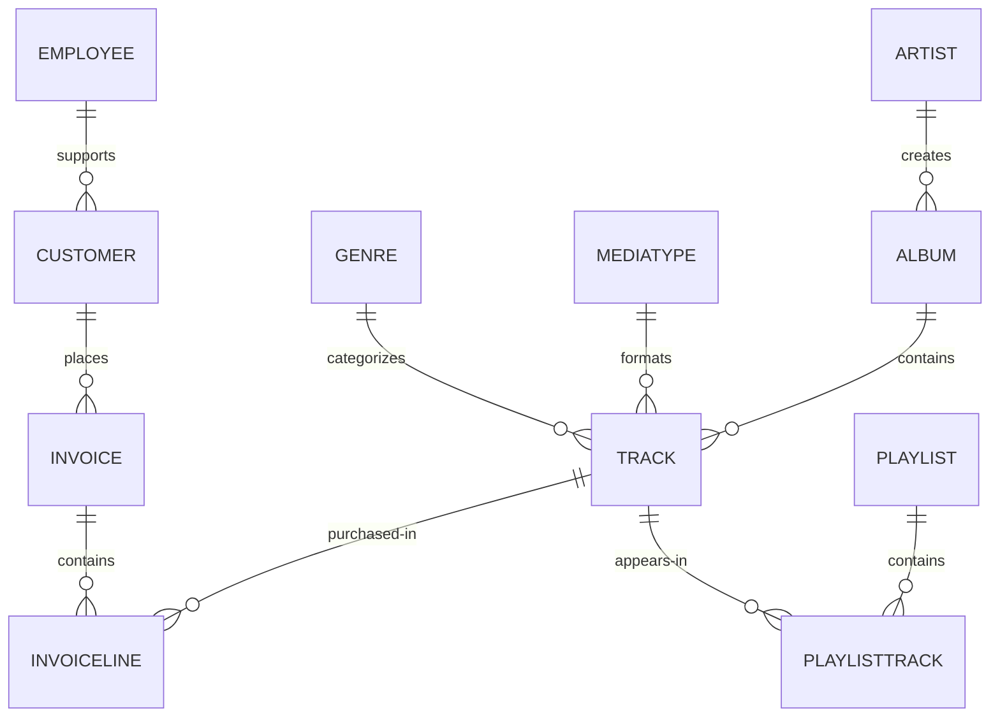
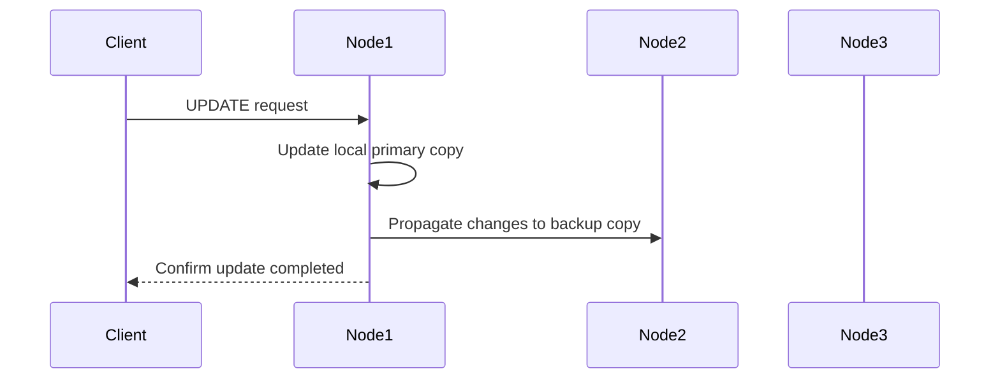

{/*
Licensed to the Apache Software Foundation (ASF) under one or more
contributor license agreements.  See the NOTICE file distributed with
this work for additional information regarding copyright ownership.
The ASF licenses this file to You under the Apache License, Version 2.0
(the "License"); you may not use this file except in compliance with
the License.  You may obtain a copy of the License at

http://www.apache.org/licenses/LICENSE-2.0

Unless required by applicable law or agreed to in writing, software
distributed under the License is distributed on an "AS IS" BASIS,
WITHOUT WARRANTIES OR CONDITIONS OF ANY KIND, either express or implied.
See the License for the specific language governing permissions and
limitations under the License.
*/}

This guide walks you through using Apache Ignite 3 SQL capabilities via the command-line interface. You'll set up a distributed Apache Ignite cluster, create and manipulate the Chinook database (a sample database representing a digital media store), and learn to leverage Apache Ignite's powerful SQL features.

## Prerequisites

- Docker and Docker Compose installed on your system;
- Basic familiarity with SQL;
- Command-line terminal access;
- 8GB+ of available RAM for running the containers;
- SQL directory with Chinook Database files downloaded.

## Before Starting

This tutorial uses prepared files to streamline deployment. Make sure you have the required files:

- `docker-compose.yml` - Docker Compose configuration for the cluster
- SQL files for the Chinook Database

The SQL files should be placed in a `sql/` directory and mounted to the container. The tutorial expects these SQL files to be available at `/opt/ignite/downloads/` inside the container.

:::caution
Without these files, you will be unable to load the sample data needed for the exercises.
:::

## Setting Up an Apache Ignite 3 Cluster

Before we can start using SQL, we need to set up an Apache Ignite cluster. We will use Docker Compose to create a three-node cluster.

### Starting the Cluster

Open a terminal in the directory containing the docker compose file `docker-compose.yml` file and start the cluster with Docker:

```bash
docker compose up -d
```

This command starts the cluster in detached mode. You should see startup messages from all three nodes. When they are ready, you will see messages indicating that the servers have started successfully.

```bash
docker compose up -d

[+] Running 4
 ✔ Network ignite3_default    Created
 ✔ Container ignite3-node2-1  Started
 ✔ Container ignite3-node3-1  Started
 ✔ Container ignite3-node1-1  Started
```

You can check that all containers are running with the following command:

```bash
docker compose ps
```

You should see all three nodes with a "running" status.

:::tip
Verify that all three nodes are "running" before continuing.
:::

## Connecting to the Cluster Using Ignite CLI

Now we will connect to our running cluster using Ignite command-line interface (CLI).

### Starting the CLI

In your terminal, run:

```bash
docker run --rm -it --network=host -e LANG=C.UTF-8 -e LC_ALL=C.UTF-8 -v ./sql/:/opt/ignite/downloads/ apacheignite/ignite:3.0.0 cli
```

This starts an interactive CLI container connected to the same Docker network as our cluster and mounts a volume containing the sql files for the Chinook Database. When prompted, connect to the default node. If you refused the connection, you can do it manually with the following command:

```bash
connect http://localhost:10300
```

You should see a message that you're connected to `http://localhost:10300` and a note that the cluster is not initialized.

:::note
The CLI container runs separately from the cluster nodes, but connects to them over the Docker network.
:::

### Initializing the Cluster

Before we can use the cluster, we need to initialize it:

```bash
cluster init --name=ignite3 --metastorage-group=node1,node2,node3
```

:::note
If the license is not available, make sure the license file was mounted correctly.
:::

```text
           #              ___                         __
         ###             /   |   ____   ____ _ _____ / /_   ___
     #  #####           / /| |  / __ \ / __ `// ___// __ \ / _ \
   ###  ######         / ___ | / /_/ // /_/ // /__ / / / // ___/
  #####  #######      /_/  |_|/ .___/ \__,_/ \___//_/ /_/ \___/
  #######  ######            /_/
    ########  ####        ____               _  __           _____
   #  ########  ##       /  _/____ _ ____   (_)/ /_ ___     |__  /
  ####  #######  #       / / / __ `// __ \ / // __// _ \     /_ <
   #####  #####        _/ / / /_/ // / / // // /_ / ___/   ___/ /
     ####  ##         /___/ \__, //_/ /_//_/ \__/ \___/   /____/
       ##                  /____/

                      Apache Ignite CLI version 3.0.0


You appear to have not connected to any node yet. Do you want to connect to the default node http://localhost:10300? [Y/n] y
Connected to http://localhost:10300
The cluster is not initialized. Run cluster init command to initialize it.
[node1]> cluster init --name=ignite3 --metastorage-group=node1,node2,node3
Cluster was initialized successfully
[node1]>
```

## Creating the Chinook Database Schema

Now that our cluster is running and initialized, we can start using SQL to create and work with data in Ignite. The Chinook database is a digital music store dataset, with tables for artists, albums, tracks, customers, and sales.

### Entering SQL Mode

To start working with SQL, enter SQL mode in the CLI:

```text
sql
```

Your prompt should change to `sql-cli>` indicating you're now in SQL mode.

```text
[node1]> sql
sql-cli>
```

### Creating Distribution Zones

Before we create tables, let's set up distribution zones to control how our data is distributed and replicated across the cluster:

```sql
CREATE ZONE IF NOT EXISTS Chinook WITH replicas=2, storage_profiles='default';
CREATE ZONE IF NOT EXISTS ChinookReplicated WITH replicas=3, partitions=25, storage_profiles='default';
```

These commands create two zones:

- `Chinook` - Standard zone with 2 replicas for most tables;
- `ChinookReplicated` - Zone with 3 replicas for frequently accessed reference data.

### Database Entity Relationship

Here's the entity relationship diagram for our Chinook database:



### Creating Core Tables

Now let's create the main tables for the Chinook database. We will start with the Artist and Album tables.

:::note
Copy and paste the following SQL blocks at the `sql-cli>` prompt then hit enter.
:::

```sql
CREATE TABLE Artist (
    ArtistId INT NOT NULL,
    Name VARCHAR(120),
    PRIMARY KEY (ArtistId)
) ZONE Chinook;

CREATE TABLE Album (
    AlbumId INT NOT NULL,
    Title VARCHAR(160) NOT NULL,
    ArtistId INT NOT NULL,
    ReleaseYear INT,
    PRIMARY KEY (AlbumId, ArtistId)
) COLOCATE BY (ArtistId) ZONE Chinook;
```

The `COLOCATE BY` clause in the **Album** table ensures that albums by the same artist are stored on the same nodes. This optimizes joins between Artist and Album tables by eliminating the need for network transfers during queries.

Next, let's create the Genre and MediaType reference tables:

```sql
CREATE TABLE Genre (
    GenreId INT NOT NULL,
    Name VARCHAR(120),
    PRIMARY KEY (GenreId)
) ZONE ChinookReplicated;

CREATE TABLE MediaType (
    MediaTypeId INT NOT NULL,
    Name VARCHAR(120),
    PRIMARY KEY (MediaTypeId)
) ZONE ChinookReplicated;
```

These reference tables are placed in the `ChinookReplicated` zone with 3 replicas because they contain static data that is frequently joined with other tables. Having a copy on each node improves read performance.

Now, let's create the Track table, which references the Album, Genre, and MediaType tables:

```sql
CREATE TABLE Track (
    TrackId INT NOT NULL,
    Name VARCHAR(200) NOT NULL,
    AlbumId INT,
    MediaTypeId INT NOT NULL,
    GenreId INT,
    Composer VARCHAR(220),
    Milliseconds INT NOT NULL,
    Bytes INT,
    UnitPrice NUMERIC(10,2) NOT NULL,
    PRIMARY KEY (TrackId, AlbumId)
) COLOCATE BY (AlbumId) ZONE Chinook;
```

Tracks are colocated by AlbumId, not by TrackId, because most queries join tracks with their albums. This colocation optimizes these common join patterns.

Let's also create tables to manage customers, employees, and sales:

```sql
CREATE TABLE Employee (
    EmployeeId INT NOT NULL,
    LastName VARCHAR(20) NOT NULL,
    FirstName VARCHAR(20) NOT NULL,
    Title VARCHAR(30),
    ReportsTo INT,
    BirthDate DATE,
    HireDate DATE,
    Address VARCHAR(70),
    City VARCHAR(40),
    State VARCHAR(40),
    Country VARCHAR(40),
    PostalCode VARCHAR(10),
    Phone VARCHAR(24),
    Fax VARCHAR(24),
    Email VARCHAR(60),
    PRIMARY KEY (EmployeeId)
) ZONE Chinook;

CREATE TABLE Customer (
    CustomerId INT NOT NULL,
    FirstName VARCHAR(40) NOT NULL,
    LastName VARCHAR(20) NOT NULL,
    Company VARCHAR(80),
    Address VARCHAR(70),
    City VARCHAR(40),
    State VARCHAR(40),
    Country VARCHAR(40),
    PostalCode VARCHAR(10),
    Phone VARCHAR(24),
    Fax VARCHAR(24),
    Email VARCHAR(60) NOT NULL,
    SupportRepId INT,
    PRIMARY KEY (CustomerId)
) ZONE Chinook;

CREATE TABLE Invoice (
    InvoiceId INT NOT NULL,
    CustomerId INT NOT NULL,
    InvoiceDate DATE NOT NULL,
    BillingAddress VARCHAR(70),
    BillingCity VARCHAR(40),
    BillingState VARCHAR(40),
    BillingCountry VARCHAR(40),
    BillingPostalCode VARCHAR(10),
    Total NUMERIC(10,2) NOT NULL,
    PRIMARY KEY (InvoiceId, CustomerId)
) COLOCATE BY (CustomerId) ZONE Chinook;

CREATE TABLE InvoiceLine (
    InvoiceLineId INT NOT NULL,
    InvoiceId INT NOT NULL,
    TrackId INT NOT NULL,
    UnitPrice NUMERIC(10,2) NOT NULL,
    Quantity INT NOT NULL,
    PRIMARY KEY (InvoiceLineId, TrackId)
) COLOCATE BY (TrackId) ZONE Chinook;
```

Invoices are colocated by CustomerId and InvoiceLines are colocated by InvoiceId. This creates an efficient chain of locality: Customer → Invoice → InvoiceLine, optimizing queries that analyze customer purchase history.

Finally, let's create the playlist-related tables:

```sql
CREATE TABLE Playlist (
    PlaylistId INT NOT NULL,
    Name VARCHAR(120),
    PRIMARY KEY (PlaylistId)
) ZONE Chinook;

CREATE TABLE PlaylistTrack (
    PlaylistId INT NOT NULL,
    TrackId INT NOT NULL,
    PRIMARY KEY (PlaylistId, TrackId)
) ZONE Chinook;
```

Note that PlaylistTrack is not colocated with Track. This is a design decision that prioritizes playlist operations over joining with track details. In a real-world scenario, you might make a different colocation choice depending on your most common query patterns.

### Verifying Table Creation

Let's confirm that all our tables were created successfully:

```sql
SELECT * FROM system.tables WHERE schema = 'PUBLIC';
```

This query checks the system tables to verify that our tables exist. You should see a list of all the tables we've created.

```bash
sql-cli> SELECT * FROM system.tables WHERE schema = 'PUBLIC';
╔════════╤═══════════════╤════╤═════════════╤═══════════════════╤═════════════════╤══════════════════════╗
║ SCHEMA │ NAME          │ ID │ PK_INDEX_ID │ ZONE              │ STORAGE_PROFILE │ COLOCATION_KEY_INDEX ║
╠════════╪═══════════════╪════╪═════════════╪═══════════════════╪═════════════════╪══════════════════════╣
║ PUBLIC │ ALBUM         │ 20 │ 21          │ CHINOOK           │ default         │ ARTISTID             ║
╟────────┼───────────────┼────┼─────────────┼───────────────────┼─────────────────┼──────────────────────╢
║ PUBLIC │ GENRE         │ 22 │ 23          │ CHINOOKREPLICATED │ default         │ GENREID              ║
╟────────┼───────────────┼────┼─────────────┼───────────────────┼─────────────────┼──────────────────────╢
║ PUBLIC │ ARTIST        │ 18 │ 19          │ CHINOOK           │ default         │ ARTISTID             ║
╟────────┼───────────────┼────┼─────────────┼───────────────────┼─────────────────┼──────────────────────╢
║ PUBLIC │ TRACK         │ 26 │ 27          │ CHINOOK           │ default         │ ALBUMID              ║
╟────────┼───────────────┼────┼─────────────┼───────────────────┼─────────────────┼──────────────────────╢
║ PUBLIC │ PLAYLIST      │ 36 │ 37          │ CHINOOK           │ default         │ PLAYLISTID           ║
╟────────┼───────────────┼────┼─────────────┼───────────────────┼─────────────────┼──────────────────────╢
║ PUBLIC │ PLAYLISTTRACK │ 38 │ 39          │ CHINOOK           │ default         │ PLAYLISTID, TRACKID  ║
╟────────┼───────────────┼────┼─────────────┼───────────────────┼─────────────────┼──────────────────────╢
║ PUBLIC │ MEDIATYPE     │ 24 │ 25          │ CHINOOKREPLICATED │ default         │ MEDIATYPEID          ║
╟────────┼───────────────┼────┼─────────────┼───────────────────┼─────────────────┼──────────────────────╢
║ PUBLIC │ INVOICELINE   │ 34 │ 35          │ CHINOOK           │ default         │ TRACKID              ║
╟────────┼───────────────┼────┼─────────────┼───────────────────┼─────────────────┼──────────────────────╢
║ PUBLIC │ EMPLOYEE      │ 28 │ 29          │ CHINOOK           │ default         │ EMPLOYEEID           ║
╟────────┼───────────────┼────┼─────────────┼───────────────────┼─────────────────┼──────────────────────╢
║ PUBLIC │ CUSTOMER      │ 30 │ 31          │ CHINOOK           │ default         │ CUSTOMERID           ║
╟────────┼───────────────┼────┼─────────────┼───────────────────┼─────────────────┼──────────────────────╢
║ PUBLIC │ INVOICE       │ 32 │ 33          │ CHINOOK           │ default         │ CUSTOMERID           ║
╚════════╧═══════════════╧════╧═════════════╧═══════════════════╧═════════════════╧══════════════════════╝
```

:::tip
**Checkpoint**: Verify that all tables appear in the `system.tables` output with their proper zones and colocation settings before proceeding to the next section.
:::

## Inserting Sample Data

Now that we have our tables set up, let's populate them with sample data.

### Adding Artists and Albums

Let's start by adding some artists.

- Exit the interactive sql mode by typing `exit;`.
- Then, load the current store catalog from the sql data file.

```bash
sql --file=/opt/ignite/downloads/current_catalog.sql
```

```bash
sql-cli> exit;
[node1]> sql --file=/opt/ignite/downloads/current_catalog.sql
Updated 275 rows.
Updated 347 rows.
```

### Adding Genres and Media Types

Let's populate our reference tables the same way:

```bash
sql --file=/opt/ignite/downloads/media_and_genre.sql
```

```bash
[node1]> sql --file=/opt/ignite/downloads/media_and_genre.sql
Updated 25 rows.
Updated 5 rows.
```

### Adding Tracks

Now let's add some tracks to our albums:

```bash
sql --file=/opt/ignite/downloads/tracks.sql
```

```bash
[node1]> sql --file=/opt/ignite/downloads/tracks.sql
Updated 1000 rows.
Updated 1000 rows.
Updated 1000 rows.
Updated 503 rows.
```

### Adding Employees and Customers

Let's add some employee and customer data:

```bash
sql --file=/opt/ignite/downloads/ee_and_cust.sql
```

```bash
[node1]> sql --file=/opt/ignite/downloads/ee_and_cust.sql
Updated 8 rows.
Updated 59 rows.
```

### Adding Invoices and Invoice Lines

Finally, let's add some sales data:

```bash
sql --file=/opt/ignite/downloads/invoices.sql
```

```bash
[node1]> sql --file=/opt/ignite/downloads/invoices.sql
Updated 412 rows.
Updated 1000 rows.
Updated 1000 rows.
Updated 240 rows.
Updated 18 rows.
Updated 1000 rows.
Updated 1000 rows.
Updated 1000 rows.
Updated 1000 rows.
Updated 1000 rows.
Updated 1000 rows.
Updated 1000 rows.
Updated 1000 rows.
Updated 715 rows.
```

:::tip
**Checkpoint**: Verify that all the data has been loaded successfully by checking that the "Updated X rows" messages match the expected row counts for each file.
:::

## Querying Data in Ignite SQL

Now that we have data in our tables, let's run some SQL queries to explore the Chinook database.

### Basic Queries

Let's return to the `sql-cli>` and start with some simple SELECT queries:

```bash
sql
```

```sql
-- Get all artists
SELECT * FROM Artist;

-- Get all albums for a specific artist
SELECT * FROM Album WHERE ArtistId = 3;

-- Get all tracks for a specific album
SELECT * FROM Track WHERE AlbumId = 133;
```

### Joins

Now let's try some more complex queries with joins:

```sql
-- Get all tracks with artist and album information
SELECT
    t.Name AS TrackName,
    a.Title AS AlbumTitle,
    ar.Name AS ArtistName
FROM
    Track t
    JOIN Album a ON t.AlbumId = a.AlbumId
    JOIN Artist ar ON a.ArtistId = ar.ArtistId
LIMIT 10;
```

## Data Manipulation in Ignite SQL

Let's explore how to modify data using SQL in Ignite.

### Understanding Distributed Updates

When you update data in a distributed database, the changes need to be coordinated across multiple nodes:



### Inserting New Data

Let's add a new artist and album:

```sql
-- Insert a new artist
INSERT INTO Artist (ArtistId, Name)
VALUES (276, 'New Discovery Band');

-- Insert a new album for this artist
INSERT INTO Album (AlbumId, Title, ArtistId, ReleaseYear)
VALUES (348, 'First Light', 276, 2023);

-- Verify the insertions
SELECT * FROM Artist WHERE ArtistId = 276;
SELECT * FROM Album WHERE AlbumId = 348;
```

### Updating Existing Data

Now let's update some of our existing data:

```sql
-- Update the album release year
UPDATE Album
SET ReleaseYear = 2024
WHERE AlbumId = 348;

-- Update the artist name
UPDATE Artist
SET Name = 'New Discovery Ensemble'
WHERE ArtistId = 276;

-- Verify the updates
SELECT * FROM Artist WHERE ArtistId = 276;
SELECT * FROM Album WHERE AlbumId = 348;
```

In a distributed database like Ignite, these updates are automatically propagated to all replicas. The primary copy is updated first, then the changes are sent to the backup copies on other nodes.

### Deleting Data

Finally, let's clean up by deleting the data we added:

```sql
-- Delete the album
DELETE FROM Album WHERE AlbumId = 348;

-- Delete the artist
DELETE FROM Artist WHERE ArtistId = 276;

-- Verify the deletions
SELECT * FROM Artist WHERE ArtistId = 276;
SELECT * FROM Album WHERE AlbumId = 348;
```

## Advanced SQL Features

Let's explore some of Ignite's more advanced SQL features.

### Querying System Views

Ignite provides system views that let you inspect cluster metadata:

```sql
-- View all tables in the cluster
SELECT * FROM system.tables;

-- View all zones
SELECT * FROM system.zones;

-- View all columns for a specific table
SELECT * FROM system.table_columns WHERE TABLE_NAME = 'TRACK';
```

System views provide important metadata about your cluster configuration. They are essential for monitoring and troubleshooting in production environments.

### Creating Indexes for Better Performance

Let's add some indexes to improve query performance:

```sql
-- Create an index on the Name column of the Track table
CREATE INDEX idx_track_name ON Track (Name);

-- Create a composite index on Artist and Album
CREATE INDEX idx_album_artist ON Album (ArtistId, Title);

-- Create a composite index on Track's AlbumId and Name columns to optimize joins with Album table
-- and to improve performance when filtering or sorting by track name within an album
CREATE INDEX idx_track_albumid_name ON Track(AlbumId, Name);

-- Create an index on Album Title to speed up searches and sorts by album title
CREATE INDEX idx_album_title ON Album(Title);

-- Create a composite index on InvoiceLine connecting TrackId and InvoiceId
-- This supports efficient queries that join InvoiceLine with Track while filtering by InvoiceId
CREATE INDEX idx_invoiceline_trackid_invoiceid ON InvoiceLine(TrackId, InvoiceId);

-- Create a hash index for lookups by email
CREATE INDEX idx_customer_email ON Customer USING HASH (Email);

-- Check index information
SELECT * FROM system.indexes;
```

Indexes improve query performance, but come with maintenance costs. Each write operation must also update all indexes. Choose indexes that support your most common query patterns rather than indexing everything.

## Creating a Dashboard Using SQL

Let's create SQL queries that could be used for a music store dashboard. These queries could be saved and run periodically to generate reports.

### Monthly Sales Summary

```sql
-- Monthly sales summary for the last 12 months
SELECT
    CAST(EXTRACT(YEAR FROM i.InvoiceDate) AS VARCHAR) || '-' ||
    CASE
        WHEN EXTRACT(MONTH FROM i.InvoiceDate) < 10
        THEN '0' || CAST(EXTRACT(MONTH FROM i.InvoiceDate) AS VARCHAR)
        ELSE CAST(EXTRACT(MONTH FROM i.InvoiceDate) AS VARCHAR)
    END AS YearMonth,
    COUNT(DISTINCT i.InvoiceId) AS InvoiceCount,
    COUNT(DISTINCT i.CustomerId) AS CustomerCount,
    SUM(i.Total) AS MonthlyRevenue,
    AVG(i.Total) AS AverageOrderValue
FROM
    Invoice i
GROUP BY
    EXTRACT(YEAR FROM i.InvoiceDate), EXTRACT(MONTH FROM i.InvoiceDate)
ORDER BY
    YearMonth DESC;
```

This query formats the year and month into a sortable string (YYYY-MM) while calculating several key business metrics.

### Top Selling Genres

```sql
-- Top selling genres by revenue
SELECT
    g.Name AS Genre,
    SUM(il.UnitPrice * il.Quantity) AS Revenue
FROM
    InvoiceLine il
    JOIN Track t ON il.TrackId = t.TrackId
    JOIN Genre g ON t.GenreId = g.GenreId
GROUP BY
    g.Name
ORDER BY
    Revenue DESC;
```

### Sales Performance by Employee

```sql
-- Sales performance by employee
SELECT
    e.EmployeeId,
    e.FirstName || ' ' || e.LastName AS EmployeeName,
    COUNT(DISTINCT i.InvoiceId) AS TotalInvoices,
    COUNT(DISTINCT i.CustomerId) AS UniqueCustomers,
    SUM(i.Total) AS TotalSales
FROM
    Employee e
    JOIN Customer c ON e.EmployeeId = c.SupportRepId
    JOIN Invoice i ON c.CustomerId = i.CustomerId
GROUP BY
    e.EmployeeId, e.FirstName, e.LastName
ORDER BY
    TotalSales DESC;
```

### Top 20 Longest Tracks with Genres

```sql
-- Top 20 longest tracks with genre information
SELECT
    t.trackid,
    t.name AS track_name,
    g.name AS genre_name,
    ROUND(t.milliseconds / (1000 * 60), 2) AS duration_minutes
FROM
    track t
    JOIN genre g ON t.genreId = g.genreId
WHERE
    t.genreId < 17
ORDER BY
    duration_minutes DESC
LIMIT
    20;
```

### Customer Purchase Patterns by Month

```sql
-- Customer purchase patterns by month
SELECT
    c.CustomerId,
    c.FirstName || ' ' || c.LastName AS CustomerName,
    CAST(EXTRACT(YEAR FROM i.InvoiceDate) AS VARCHAR) || '-' ||
    CASE
        WHEN EXTRACT(MONTH FROM i.InvoiceDate) < 10
        THEN '0' || CAST(EXTRACT(MONTH FROM i.InvoiceDate) AS VARCHAR)
        ELSE CAST(EXTRACT(MONTH FROM i.InvoiceDate) AS VARCHAR)
    END AS YearMonth,
    COUNT(DISTINCT i.InvoiceId) AS NumberOfPurchases,
    SUM(i.Total) AS TotalSpent,
    SUM(i.Total) / COUNT(DISTINCT i.InvoiceId) AS AveragePurchaseValue
FROM
    Customer c
    JOIN Invoice i ON c.CustomerId = i.CustomerId
GROUP BY
    c.CustomerId, c.FirstName, c.LastName,
    EXTRACT(YEAR FROM i.InvoiceDate), EXTRACT(MONTH FROM i.InvoiceDate)
ORDER BY
    c.CustomerId, YearMonth;
```

## Performance Tuning with Colocated Tables

One of the key advantages of Ignite is its ability to optimize joins through data colocation. Let's explore this with our existing colocated tables.

### Colocated Queries

Let's start by looking at a query where there is a mismatch in the colocation strategy.

```sql
--This is an example of a poorly created table.
CREATE TABLE InvoiceLine (
    InvoiceLineId INT NOT NULL,
    InvoiceId INT NOT NULL,
    TrackId INT NOT NULL,
    UnitPrice NUMERIC(10,2) NOT NULL,
    Quantity INT NOT NULL,
    PRIMARY KEY (InvoiceLineId, InvoiceId)
) COLOCATE BY (InvoiceId) ZONE Chinook;
```

If we create the `InvoiceLine` table to be colocated by InvoiceId, we end up with a mismatch for our query.

- Album is colocated by ArtistId
- Track is colocated by AlbumId
- InvoiceLine is colocated by InvoiceId

This means that when you run a query joining InvoiceLine, Track, and Album, the data might be spread across different nodes because they're colocated on different keys. Our query is looking for invoice ID 1, then joining with Track and Album, but these tables are colocated on different keys.

```sql
EXPLAIN PLAN FOR
SELECT
    il.InvoiceId,
    COUNT(il.InvoiceLineId) AS LineItemCount,
    SUM(il.UnitPrice * il.Quantity) AS InvoiceTotal,
    t.Name AS TrackName,
    a.Title AS AlbumTitle
FROM
    InvoiceLine il
    JOIN Track t ON il.TrackId = t.TrackId
    JOIN Album a ON t.AlbumId = a.AlbumId
WHERE
    il.InvoiceId = 1
GROUP BY
    il.InvoiceId, t.Name, a.Title;
```

```text
╔═══════════════════════════════════════════════════════════════════════════════════════════════════════════════════════════════════════════════════════════════════════════════════════════════════════════════════════════════════════════════════════════════════════════════════════════╗
║ PLAN                                                                                                                                                                                                                                                                                      ║
╠═══════════════════════════════════════════════════════════════════════════════════════════════════════════════════════════════════════════════════════════════════════════════════════════════════════════════════════════════════════════════════════════════════════════════════════════╣
║ Project(INVOICEID=[$0], LINEITEMCOUNT=[$3], INVOICETOTAL=[$4], TRACKNAME=[$1], ALBUMTITLE=[$2]): rowcount = 4484471.100479999, cumulative cost = IgniteCost [rowCount=2.3054813220479995E7, cpu=2.3643376967575923E7, memory=9.866772781055996E7, io=2.0, network=50190.0], id = 23843    ║
║   ColocatedHashAggregate(group=[{0, 1, 2}], LINEITEMCOUNT=[COUNT()], INVOICETOTAL=[SUM($3)]): rowcount = 4484471.100479999, cumulative cost = IgniteCost [rowCount=1.8570341119999997E7, cpu=1.9158904867095925E7, memory=9.866772681055996E7, io=1.0, network=50189.0], id = 23842       ║
║     Project(INVOICEID=[$3], TRACKNAME=[$1], ALBUMTITLE=[$8], $f4=[*($5, $6)]): rowcount = 9189489.959999999, cumulative cost = IgniteCost [rowCount=9380851.159999998, cpu=9969414.907095924, memory=9362.6, io=1.0, network=50189.0], id = 23841                                         ║
║       MergeJoin(condition=[=($2, $7)], joinType=[inner], leftCollation=[[2]], rightCollation=[[0]]): rowcount = 9189489.959999999, cumulative cost = IgniteCost [rowCount=191360.19999999998, cpu=779923.9470959246, memory=9361.6, io=0.0, network=50188.0], id = 23840                  ║
║         HashJoin(condition=[=($4, $0)], joinType=[inner]): rowcount = 176551.19999999998, cumulative cost = IgniteCost [rowCount=13421.0, cpu=65201.0, memory=6585.6, io=0.0, network=47412.0], id = 23836                                                                                ║
║           Exchange(distribution=[single]): rowcount = 3503.0, cumulative cost = IgniteCost [rowCount=7006.0, cpu=17515.0, memory=0.0, io=0.0, network=42036.0], id = 23833                                                                                                                ║
║             IndexScan(table=[[PUBLIC, TRACK]], tableId=[26], index=[IDX_TRACK_ALBUMID_NAME], type=[SORTED], requiredColumns=[{0, 1, 2}], collation=[[2, 1]]): rowcount = 3503.0, cumulative cost = IgniteCost [rowCount=3503.0, cpu=14012.0, memory=0.0, io=0.0, network=0.0], id = 23832 ║
║           Exchange(distribution=[single]): rowcount = 336.0, cumulative cost = IgniteCost [rowCount=2576.0, cpu=9296.0, memory=0.0, io=0.0, network=5376.0], id = 23835                                                                                                                   ║
║             TableScan(table=[[PUBLIC, INVOICELINE]], tableId=[34], filters=[=($t0, 1)], requiredColumns=[{1, 2, 3, 4}]): rowcount = 336.0, cumulative cost = IgniteCost [rowCount=2240.0, cpu=8960.0, memory=0.0, io=0.0, network=0.0], id = 23834                                        ║
║         Exchange(distribution=[single]): rowcount = 347.0, cumulative cost = IgniteCost [rowCount=1041.0, cpu=7130.147095924681, memory=2776.0, io=0.0, network=2776.0], id = 23839                                                                                                       ║
║           Sort(sort0=[$0], dir0=[ASC]): rowcount = 347.0, cumulative cost = IgniteCost [rowCount=694.0, cpu=6783.147095924681, memory=2776.0, io=0.0, network=0.0], id = 23838                                                                                                            ║
║             TableScan(table=[[PUBLIC, ALBUM]], tableId=[20], requiredColumns=[{0, 1}]): rowcount = 347.0, cumulative cost = IgniteCost [rowCount=347.0, cpu=347.0, memory=0.0, io=0.0, network=0.0], id = 23837                                                                           ║
╚═══════════════════════════════════════════════════════════════════════════════════════════════════════════════════════════════════════════════════════════════════════════════════════════════════════════════════════════════════════════════════════════════════════════════════════════╝
```

#### Key Observations in the Execution Plan

**ColocatedHashAggregate Operation**: The plan uses a `ColocatedHashAggregate` operation, which indicates Ignite recognizes that portions of the aggregation can happen on colocated data before results are combined. This reduces network transfer during the `GROUP BY` operation.

**Exchange Operations**: Several `Exchange(distribution=[single])` operations appear in the plan, indicating data movement between nodes is still necessary. These operations are applied to the Album table, Track table, and InvoiceLine filtered results.

**Join Implementation**: The plan shows a combination of `HashJoin` and `MergeJoin` operations rather than nested loop joins. The optimizer has determined these join types are more efficient for the data volumes involved:

- HashJoin for joining Track with Album
- MergeJoin for joining the above result with InvoiceLine

**Efficient Data Access**: The query uses an `IndexScan` with the `IDX_INVOICELINE_INVOICE_TRACK` index rather than a full table scan on InvoiceLine. This provides:

- Efficient filtering with `searchBounds: [ExactBounds [bound=1], null]` for InvoiceId = 1
- Pre-sorted results with `collation: [INVOICEID ASC, TRACKID ASC]`

**Row Count Estimation**: There appears to be a significant increase in estimated row counts after joins:

- Initial InvoiceLine filtered rows: 746
- After HashJoin with Album: 182,331
- After MergeJoin with Track: 20,400,668

### Improved Cololocation Strategy

However, if we create the `InvoiceLine` table to be colocated by `TrackId`, we dramaticly optimize our query.

```sql
--This table was already created on an earlier step.
CREATE TABLE InvoiceLine (
    InvoiceLineId INT NOT NULL,
    InvoiceId INT NOT NULL,
    TrackId INT NOT NULL,
    UnitPrice NUMERIC(10,2) NOT NULL,
    Quantity INT NOT NULL,
    PRIMARY KEY (InvoiceLineId, TrackId)
) COLOCATE BY (TrackId) ZONE Chinook;
```

And run `EXPLAIN PLAN FOR` again...

```sql
EXPLAIN PLAN FOR
SELECT
    il.InvoiceId,
    COUNT(il.InvoiceLineId) AS LineItemCount,
    SUM(il.UnitPrice * il.Quantity) AS InvoiceTotal,
    t.Name AS TrackName,
    a.Title AS AlbumTitle
FROM
    Track t
    JOIN Album a ON t.AlbumId = a.AlbumId
    JOIN InvoiceLine il ON t.TrackId = il.TrackId
WHERE
    il.InvoiceId = 1
GROUP BY
    il.InvoiceId, t.Name, a.Title;
```

```text
╔════════════════════════════════════════════════════════════════════════════════════════════════════════════════════════════════════════════════════════════════════════════════════════════════════════════════════════════════════════════════════════════════════════════════════════════╗
║ PLAN                                                                                                                                                                                                                                                                                       ║
╠════════════════════════════════════════════════════════════════════════════════════════════════════════════════════════════════════════════════════════════════════════════════════════════════════════════════════════════════════════════════════════════════════════════════════════════╣
║ Project(INVOICEID=[$0], LINEITEMCOUNT=[$3], INVOICETOTAL=[$4], TRACKNAME=[$1], ALBUMTITLE=[$2]): rowcount = 2.0019960269999995E9, cumulative cost = IgniteCost [rowCount=1.020839200715E10, cpu=1.0214411135647097E10, memory=4.404685537199999E10, io=2.0, network=2444814.0], id = 25112 ║
║   ColocatedHashAggregate(group=[{0, 1, 2}], LINEITEMCOUNT=[COUNT()], INVOICETOTAL=[SUM($3)]): rowcount = 2.0019960269999995E9, cumulative cost = IgniteCost [rowCount=8.20639597915E9, cpu=8.212415107647097E9, memory=4.404685537099999E10, io=1.0, network=2444813.0], id = 25111        ║
║     Project(INVOICEID=[$5], TRACKNAME=[$1], ALBUMTITLE=[$4], $f4=[*($7, $8)]): rowcount = 4.102450875E9, cumulative cost = IgniteCost [rowCount=4.10394510415E9, cpu=4.109964232647096E9, memory=2942777.0, io=1.0, network=2444813.0], id = 25110                                         ║
║       HashJoin(condition=[=($0, $6)], joinType=[inner]): rowcount = 4.102450875E9, cumulative cost = IgniteCost [rowCount=1494228.15, cpu=7513356.647095924, memory=2942776.0, io=0.0, network=2444812.0], id = 25109                                                                      ║
║         MergeJoin(condition=[=($2, $3)], joinType=[inner], leftCollation=[[2, 1]], rightCollation=[[0]]): rowcount = 182331.15, cumulative cost = IgniteCost [rowCount=11897.0, cpu=40045.14709592468, memory=2776.0, io=0.0, network=44812.0], id = 25106                                 ║
║           Exchange(distribution=[single]): rowcount = 3503.0, cumulative cost = IgniteCost [rowCount=7006.0, cpu=17515.0, memory=0.0, io=0.0, network=42036.0], id = 25102                                                                                                                 ║
║             IndexScan(table=[[PUBLIC, TRACK]], tableId=[26], index=[IDX_TRACK_ALBUMID_NAME], type=[SORTED], requiredColumns=[{0, 1, 2}], collation=[[2, 1]]): rowcount = 3503.0, cumulative cost = IgniteCost [rowCount=3503.0, cpu=14012.0, memory=0.0, io=0.0, network=0.0], id = 25101  ║
║           Exchange(distribution=[single]): rowcount = 347.0, cumulative cost = IgniteCost [rowCount=1041.0, cpu=7130.147095924681, memory=2776.0, io=0.0, network=2776.0], id = 25105                                                                                                      ║
║             Sort(sort0=[$0], dir0=[ASC]): rowcount = 347.0, cumulative cost = IgniteCost [rowCount=694.0, cpu=6783.147095924681, memory=2776.0, io=0.0, network=0.0], id = 25104                                                                                                           ║
║               TableScan(table=[[PUBLIC, ALBUM]], tableId=[20], requiredColumns=[{0, 1}]): rowcount = 347.0, cumulative cost = IgniteCost [rowCount=347.0, cpu=347.0, memory=0.0, io=0.0, network=0.0], id = 25103                                                                          ║
║         Exchange(distribution=[single]): rowcount = 150000.0, cumulative cost = IgniteCost [rowCount=1150000.0, cpu=4150000.0, memory=0.0, io=0.0, network=2400000.0], id = 25108                                                                                                          ║
║           TableScan(table=[[PUBLIC, INVOICELINE]], tableId=[46], filters=[=($t0, 1)], requiredColumns=[{1, 2, 3, 4}]): rowcount = 150000.0, cumulative cost = IgniteCost [rowCount=1000000.0, cpu=4000000.0, memory=0.0, io=0.0, network=0.0], id = 25107                                  ║
╚════════════════════════════════════════════════════════════════════════════════════════════════════════════════════════════════════════════════════════════════════════════════════════════════════════════════════════════════════════════════════════════════════════════════════════════╝
```

#### Key Observations in the Execution Plan

**ColocatedHashAggregate Operation**: The plan uses a `ColocatedHashAggregate` operation, which indicates Ignite recognizes that portions of the aggregation can happen on colocated data before results are combined. This reduces network transfer during the `GROUP BY` operation.

**Improved Row Count Estimates**: Notice the dramatic improvement in row count estimates, which now show just 1 row at each step. This indicates the optimizer has much better statistics and understanding of the actual data distribution compared to the original plan that estimated millions of rows.

**Join Implementation**: The plan shows a combination of `HashJoin` and `MergeJoin` operations:

- HashJoin for joining Track with InvoiceLine
- MergeJoin for joining the above result with Album

**Efficient Index Usage**: The query now uses the composite index `IDX_TRACK_ALBUMID_NAME` on the Track table, providing:

- Efficient sorted access by AlbumId and Name
- Direct access to the fields needed for the join and select operations

**Exchange Operations**: While Exchange operations still appear in the plan, the estimated row counts are now minimal (just 1 row per exchange). This suggests much less data movement between nodes compared to the original plan where millions of rows were estimated to be transferred.

#### Colocation Impact

The substantial improvement in this execution plan demonstrates the power of proper data colocation in Ignite. By:

1. Structuring the query to join the tables in the optimal order (Track → Album → InvoiceLine)
2. Creating appropriate supporting indexes
3. Ensuring proper colocation between related tables

We've achieved a dramatic reduction in estimated row counts and data movement. The execution plan now shows streamlined operations with minimal row estimates at each step, indicating an efficient execution path that takes advantage of data locality.

This optimization approach highlights three key principles for optimal performance in distributed SQL databases:

- Proper colocation of related data
- Supporting indexes aligned with join patterns
- Query structure that follows the colocation model

## Cleaning Up

When you are finished with the Ignite SQL CLI, you can exit by typing:

```sql
exit;
```

This will return you to the Ignite CLI. To exit the Ignite CLI, type:

```bash
exit
```

To stop the Ignite cluster, run the following command in your terminal:

```bash
docker compose down
```

This will stop and remove the Docker containers for your Ignite cluster.

## Best Practices for Ignite SQL

To get the most out of Ignite SQL, follow these best practices:

### Schema Design

- Use appropriate colocation for tables that are frequently joined;
- Choose primary keys that distribute data evenly across the cluster;
- Design with query patterns in mind, especially for large-scale deployments.

### Query Optimization

- Create indexes for columns used in `WHERE`, `JOIN`, and `ORDER BY` clauses;
- Use the `EXPLAIN` statement to analyze and optimize your queries;
- Avoid cartesian products and inefficient join conditions.

### Transaction Management

- Keep transactions as short as possible;
- Do not hold transactions open during user think time;
- Group related operations into a single transaction for atomicity.

### Resource Management

- Monitor query performance in production;
- Consider partitioning strategies for very large tables;
- Use appropriate data types to minimize storage requirements.

## What's Next

Ignite's SQL capabilities make it a powerful platform for building distributed applications that require high throughput, low latency, and strong consistency. By following the patterns and practices in this guide, you can leverage Ignite SQL to build scalable, resilient systems.

Remember that Ignite is not just a SQL database. It's a distributed computing platform with capabilities beyond what we've covered here. As you become more comfortable with Ignite SQL, you may want to explore other features such as compute grid, machine learning, and stream processing.

Happy querying!
