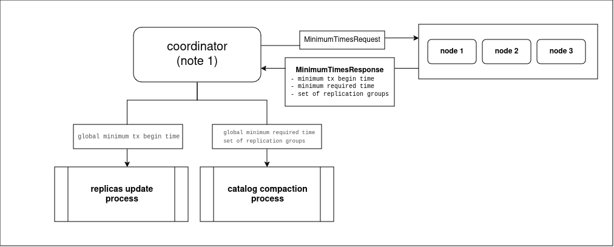

# Catalog compaction module

**NOTE** Compaction has been moved to a separate module to eliminate circular dependencies,
as it requires some components that may themselves depend on the catalog module.
Please refer to the catalog's module readme to see more details about catalog service and update log.

## Overview

During schema changes, the catalog update log stores incremental updates (each update changes the catalog version).
Over time, the log may grow to a humongous size. To address this, snapshotting was introduced to UpdateLog.
Snapshotting involves replacing incremental updates with a snapshot.

But the different components may refer to a certain version of catalog.
Until all components finish their work with particular version, this version must not be truncated.

This module introduces `CatalogCompactionRunner` component, which is responsible
to periodically perform catalog compaction (snapshotting of the update log), ensuring
that dropped versions of the catalog are no longer needed by any component in the cluster.

## Compaction restrictions

1. Catalog must not be compacted by version which activation time is greater than or equal to earliest active transaction in the cluster.
2. Catalog must not be compacted by version which can be required to replay the raft log during recovery.
3. Index backfilling is stick with particular version of catalog, compaction should not begin while any index is being built.
4. Rebalance depends on the specific version of the catalog. This version must not be truncated.

## Coordinator

Compaction is performed from single node called compaction coordinator.
To simplify the selection of the coordinator, it was decided to consider it to be the same node 
as the leader of the metastore group.
Therefore, when the metastorage group leader changes the compaction coordinator also changes.

The `ElectionListener` interface was introduced to listen for metastore leader elections.

## Triggering factors

The process is initiated by one of the following events

1. Compaction coordinator has been changed
2. Low watermark has been changed

## Overall process description

When compaction is triggered it starts two independent processes:

- The first process (let's call it "**replicas update**") updates all replication groups
  with determined minimum begin time among all active RW transactions in the cluster.
  This time will be used by compaction process (see below) to comply with the restriction
  about raft log recovery.
- The second one ("**compaction**") determines the minimum required version of the catalog
  and performs compaction.

 

Note: even though the second process depends on the result of the first process,
they are run in parallel, so the second process in the current iteration will 
see the result of the first process most likely obtained in the previous iteration.

### Replicas update process

This process consists of the following steps:

1. Each node uses `ActiveLocalTxMinimumBeginTimeProvider` to determine the minimum 
begin time among all local active RW transactions and sends it to coordinator.
2. Coordinator calculates global minimum and sends it to all nodes using `CatalogCompactionPrepareUpdateTxBeginTimeMessage`.
3. Each node stores this time within replication groups for which the local node is the leader  
   (using `UpdateMinimumActiveTxBeginTimeReplicaRequest` and `UpdateMinimumActiveTxBeginTimeCommand`). 
4. This timestamp (let's call it **minTxTime**) cannot be used until the data in the partition data is flushed to disk.
   Therefor this timestamp is published (become available to compaction process) only after checkpoint.

### Compaction process

1. Each node determines the local minimum required time, this consists of the following steps:
   1. Using introduced `RaftGroupStateProvider` determine minimum time among all `minTxTimes` stored in local replication groups.
   2. Select minimum between current `low watermark` and computed `minTxTime`
2. Each node sends to the coordinator the calculated local minimum timestamp,
   as well as a set of partitions for which this timestamp was calculated.
3. Coordinator determines global minimum required time.
4. Using this time, the coordinator determines the version of the catalog up to which (inclusive) history can be trimmed.
5. Based on the calculated catalog version, the coordinator calculates the list of partitions 
   required by it and compares actual replication groups distribution with what was received from remote nodes.
6. The current iteration will be aborted in the following cases: 
   1. the logical topology is missing some node required by catalog
   2. some node is missing required replication group
   3. calculated catalog version has an index that is still building
   4. There is an active rebalance, which may refer to the calculated (or below calculated) version of the catalog.
7. Perform catalog compaction.
