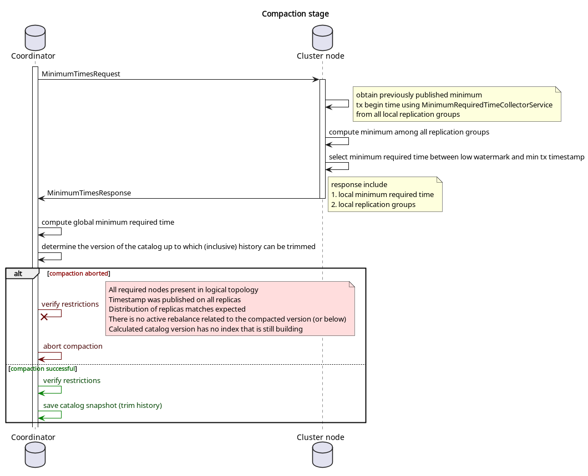

# Catalog compaction module

> Compaction was moved to a separate module from the catalog module to eliminate circular
dependencies, as it requires some components that may themselves depend on the catalog
module. Please refer to the catalog's module [readme](../catalog/README.md) for more
information about catalog service and update log.

## Overview

During schema changes, catalog update log stores incremental updates. Each update
increases the catalog version. Over time, log may grow to a humongous  size. To 
address this, snapshotting was introduced to UpdateLog. Snapshotting means replacing 
incremental updates with a snapshot.

But different components can refer to a specific version of the catalog. Until they 
finish their work with this version, it cannot be truncated.

This module introduces [CatalogCompactionRunner](src/main/java/org/apache/ignite/internal/catalog/compaction/CatalogCompactionRunner.java)
component. This component handles periodical catalog compaction, ensuring that dropped  versions
of the catalog are no longer needed by any component in the cluster.

## Compaction restrictions

1. Catalog compaction can be performed up to the highest version, while excluding those with activation time
   lower or equal to the earliest active transaction begin timestamp.
2. Catalog must not be compacted for the version that may be necessary to replay the raft log during recovery.
3. Index building uses a specific catalog version. This version cannot be truncated until
   the index build is complete.
4. Rebalance uses a specific catalog version. This version cannot be truncated until the rebalance
   is complete.

## Coordinator

Compaction is performed from single node (compaction coordinator) that is also the
metastorage group leader for simplicity. Therefore, when the metastorage group leader
changes, the compaction coordinator also changes.

The [ElectionListener](../metastorage/src/main/java/org/apache/ignite/internal/metastorage/impl/ElectionListener.java)
interface was introduced to listen for metastorage leader elections.

## Triggering factors

The process is initiated by one of the following events:

1. `low watermark` changed (every 5 minutes by default)
2. Compaction coordinator changed

## Overall process description

Catalog compaction consists of two main stages:

1. **Replicas update**. Updates all replication groups with preset minimum begin
   time among all active read-write transactions in the cluster. After some
   time (see below for details) these timestamps are published and become
   available for the next phase.

2. **Compaction**. By using the timestamps published on the previous stage coordinator
   calculates the minimum required version of the catalog and performs compaction.

Publishing timestamps can take a long time, and the success of compaction depends on more
than just these timestamps. That's why both stages run in parallel. Thus, the compaction
stage uses the result of the replicas update calculated at one of the previous iterations.
To minimize the number of network requests, both processes run simultaneously and use a common
[request](src/main/java/org/apache/ignite/internal/catalog/compaction/message/CatalogCompactionMinimumTimesRequest.java)
to collect timestamps from the entire cluster in one round trip.

### Replicas update stage

This stage consists of the following steps:

1. Each node uses [ActiveLocalTxMinimumRequiredTimeProvider](../transactions/src/main/java/org/apache/ignite/internal/tx/ActiveLocalTxMinimumRequiredTimeProvider.java)
   to determine the minimum begin time among all local active read-write transactions and sends it to coordinator.
2. Coordinator calculates global minimum and sends it to all nodes using [CatalogCompactionPrepareUpdateTxBeginTimeMessage](src/main/java/org/apache/ignite/internal/catalog/compaction/message/CatalogCompactionPrepareUpdateTxBeginTimeMessage.java).
3. Each node stores this time within replication groups for which the local node is the leader  
   (using [UpdateMinimumActiveTxBeginTimeReplicaRequest](../partition-replicator/src/main/java/org/apache/ignite/internal/partition/replicator/network/replication/UpdateMinimumActiveTxBeginTimeReplicaRequest.java)
   and [UpdateMinimumActiveTxBeginTimeCommand](../partition-replicator/src/main/java/org/apache/ignite/internal/partition/replicator/network/command/UpdateMinimumActiveTxBeginTimeCommand.java). 
4. This timestamp (let's call it `minTxTime`) is published (becomes available to compaction process) only
   after checkpoint happens (partition data is flushed to disk).

### Compaction stage

1. Each node determines the local minimum required time, this consists of the following steps:
   1. Using the introduced [MinimumRequiredTimeCollectorService](../table/src/main/java/org/apache/ignite/internal/table/distributed/raft/MinimumRequiredTimeCollectorService.java)
      to determine minimum time among all published timestamps (`minTxTime`) in local replication groups.
   2. If `minTxTime` is not published yet, the current iteration of compaction is aborted.
   3. Selects minimum between determined minimum `minTxTime` and current `low watermark`.
2. Each node sends the calculated local minimum timestamp to the coordinator,
   as well as a set of local replication groups that was used to calculate the local minimum.
3. The coordinator determines global minimum required time.
4. Using this time, the coordinator determines the version of the catalog up to which (inclusive)
   history can be trimmed.
5. Based on the calculated catalog version, the coordinator determines the list of required  
   partitions by it and compares actual replication groups distribution with what was received
   from remote nodes, and current iteration will be aborted in the following cases:
   1. the logical topology is missing some node required by catalog
   2. some node is missing required replication group
   3. calculated catalog version has an index that is still building
   4. there is an active rebalance, which refer to the calculated (or below calculated) version of the catalog
6. The coordinator performs catalog compaction.
