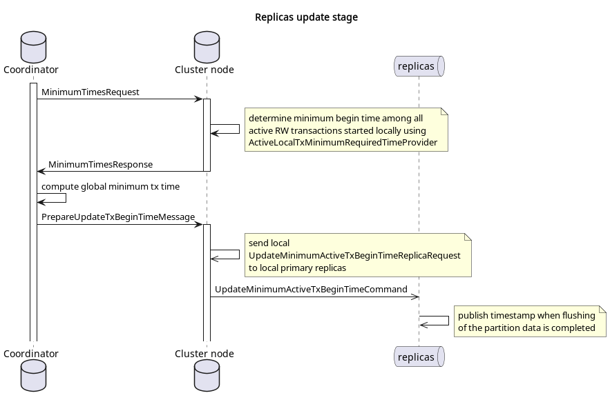

# Catalog compaction module

> **_NOTE_** Compaction has been moved to a separate module to eliminate circular dependencies,
as it requires some components that may themselves depend on the catalog module. Please 
refer to the catalog's module [readme](../catalog/README.md) to see more details about 
catalog service and update log.

## Overview

During schema changes, the catalog update log stores incremental updates. Each update
increases the catalog version. Over time, the log may grow to a humongous  size. To 
address this, snapshotting was introduced to UpdateLog. Snapshotting means replacing 
incremental updates with a snapshot.

But different components can refer to a specific version of the catalog. Until they 
finish their work with this version, it cannot be truncated.

This module introduces [CatalogCompactionRunner](src/main/java/org/apache/ignite/internal/catalog/compaction/CatalogCompactionRunner.java)
component. This component handles periodical catalog compaction, ensuring that dropped  versions
of the catalog are no longer needed by any component in the cluster.

## Compaction restrictions

1. Catalog compaction can be performed up to the highest version (excluding) which activation time is less 
   or equal to the earliest active transaction begin timestamp.
2. Catalog must not be compacted by version which can be required to replay the raft log during recovery.
3. Index building is stick with a specific catalog version. This version cannot be truncated until
   the index build is complete.
4. Rebalance is stick with a specific catalog version. This version cannot be truncated until the rebalance
   is complete.

## Coordinator

Compaction is performed from single node (compaction coordinator) which is the leader
of the metastorage group for simplicity. Therefore, when the metastorage group leader
changes, the compaction coordinator also changes.

The [ElectionListener](../metastorage/src/main/java/org/apache/ignite/internal/metastorage/impl/ElectionListener.java)
interface was introduced to listen for metastore leader elections.

## Triggering factors

The process is initiated by one of the following events:

1. `low watermark` has been changed
2. the compaction coordinator has been changed

## Overall process description

Catalog compaction consists of two main stages:

1. **Replicas update**. Updates all replication groups with determined minimum begin
   time among all active RW transactions in the cluster. After some time (see below for details)
   these timestamps are published and become available for the next phase.

2. **Compaction**. Using the timestamps published on the previous stage calculates
   the minimum required version of the catalog and perform compaction.

Publishing timestamps can take a long time, and the success of compaction depends on more
than just these timestamps. That's why both stages run in parallel. Thus, the compaction
stage uses the result of the replicas update calculated at one of the previous iterations.
To minimize the number of network requests, both processes run simultaneously and use a common
[request](src/main/java/org/apache/ignite/internal/catalog/compaction/message/CatalogCompactionMinimumTimesRequest.java)
to collect timestamps from the entire cluster in one round trip.

### Replicas update stage

This stage consists of the following steps:

1. Each node uses [ActiveLocalTxMinimumBeginTimeProvider](../transactions/src/main/java/org/apache/ignite/internal/tx/ActiveLocalTxMinimumBeginTimeProvider.java)
   to determine the minimum begin time among all local active RW transactions and sends it to coordinator.
2. Coordinator calculates global minimum and sends it to all nodes using [CatalogCompactionPrepareUpdateTxBeginTimeMessage](src/main/java/org/apache/ignite/internal/catalog/compaction/message/CatalogCompactionPrepareUpdateTxBeginTimeMessage.java).
3. Each node stores this time within replication groups for which the local node is the leader  
   (using [UpdateMinimumActiveTxBeginTimeReplicaRequest](../partition-replicator/src/main/java/org/apache/ignite/internal/partition/replicator/network/replication/UpdateMinimumActiveTxBeginTimeReplicaRequest.java)
   and [UpdateMinimumActiveTxBeginTimeCommand](../partition-replicator/src/main/java/org/apache/ignite/internal/partition/replicator/network/command/UpdateMinimumActiveTxBeginTimeCommand.java). 
4. This timestamp (let's call it `minTxTime`) is published (become available to compaction process) only
   after checkpoint (flushing partition data to disk).

### Compaction stage

1. Each node determines the local minimum required time, this consists of the following steps:
   1. Using introduced `RaftGroupStateProvider` determine minimum time among all published
      timestamps (`minTxTime`) in local replication groups.
   2. If `minTxTime` is not published yet, the current iteration of compaction is aborted.
   3. Select minimum between determined minimum `minTxTime` and current `low watermark`.
2. Each node sends to the coordinator the calculated local minimum timestamp,
   as well as a set of local replication groups that was used to calculate the local minimum.
3. Coordinator determines global minimum required time.
4. Using this time, the coordinator determines the version of the catalog up to which (inclusive) history can be trimmed.
5. Based on the calculated catalog version, the coordinator determines the list of partitions 
   required by it and compares actual replication groups distribution with what was received
   from remote nodes, and current iteration will be aborted in the following cases:
   1. the logical topology is missing some node required by catalog
   2. some node is missing required replication group
   3. calculated catalog version has an index that is still building
   4. there is an active rebalance, which refer to the calculated (or below calculated) version of the catalog
6. Perform catalog compaction.
