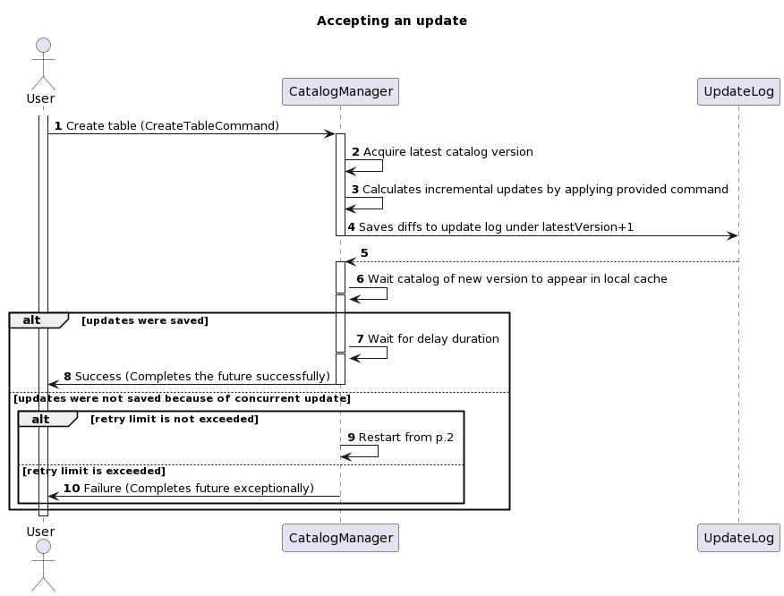
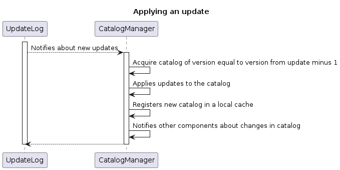

# Catalog module

Catalog is a component that responsible for managing descriptors of objects available in cluster.
Additionally, it serves as access point for other components to obtain proper version of descriptors
with respect to provided version of catalog or timestamp.

This module provides implementation of catalog service as well as internal API for accessing the
objects descriptors.

## Base components description

* [CatalogObjectDescriptor](src/main/java/org/apache/ignite/internal/catalog/descriptors/CatalogObjectDescriptor.java) --
  base class for objects managed by catalog, like tables, indexes, zones, etc.
* [CatalogService](src/main/java/org/apache/ignite/internal/catalog/CatalogService.java) -- provides
  methods to access catalog's objects' descriptors of the exact version and/or last actual version at 
  a given timestamp, which is a logical point-in-time. Besides, components may subscribe for catalog's
  events to be notified as soon as the change of interest is happened.
* [CatalogCommand](src/main/java/org/apache/ignite/internal/catalog/CatalogCommand.java) -- denotes
  particular modification of the catalog, like creation of particular table, for example.
* [CatalogManager](src/main/java/org/apache/ignite/internal/catalog/CatalogManager.java) -- provides
  methods for object manipulation (like creation of new object and/or modification of existing ones),
  also takes care of component lifecycle.
* [UpdateEntry](src/main/java/org/apache/ignite/internal/catalog/storage/UpdateEntry.java) -- 
  result of applying [CatalogCommand](src/main/java/org/apache/ignite/internal/catalog/CatalogCommand.java),
  represents delta required to move current version of catalog to state defined in the given command. 
* [UpdateLog](src/main/java/org/apache/ignite/internal/catalog/storage/UpdateLog.java) -- distributed
  log of incremental updates.

## Guarantee

For modify operation (invocation of `CatalogManager.execute()`), a resulting future will be completed
as soon as version in which results of the command take place becomes available on every node of the
cluster. This "availability" is determined as "version activation time plus some duration to make
sure changes are propagated and applied within the cluster", where `some duration` defined by 
`schemaSync.delayDuration` configuration property. This implies, that consequent read access to 
catalog service with latest timestamp (`HybridClock.now()`) from any node will return the catalog of
version that incorporates results of the command (assuming there were no concurrent updates overwriting
modifications made by initial command). This also implies, that concurrent access to the catalog service
may return catalog of version incorporating results of the command even if resulting future has not been
yet resolved. Additionally, there is an extra await to make sure, that locally new version will 
_always_ be available immediately after resulting future is completed. 

For read access, it's up to the caller to make sure, that version of interest is available in local
cache. Use `CatalogService.catalogReadyFuture` to wait for particular version, or 
`SchemaSyncService.waitForMetadataCompleteness` if you need a version which is active at provided 
point in time.

Consumers of catalog's events are allowed to read catalog at version from event. 

## How it works

### CatalogManager

Every modification of catalog is split on two phases: accept and apply. During accept phase, given command
is validated, then used to generate a list of update entries to save, and, finally, list is saved to 
distributed update log. Below is a sequence diagram describing accept phase:

After update entries are saved to the log, it is the job of the update log to propagate updates across the
cluster. On every node, update log notifies catalog manager about new update entries, and latter applies
them and stores new version of a catalog in a local cache. Below is a sequence diagram describing apply phase:

### UpdateLog

Current implementation of update log based on a metastorage. Update entries of version N are stored by
`catalog.update.{N}` key. Also, the latest known version is stored by `catalog.version` key. Updates
are saved on CAS manner with condition `newVersion == value(catalog.version)`.

#### Update log compaction

Over time, the log may grow to a humongous size. To address this, snapshotting was introduced to UpdateLog.
When saving snapshot of version N, update entries stored by `catalog.update.{N}` will be overwritten with
catalog's snapshot of this version. Every update entries of version lower that version of snapshot will be
removed. The earliest available version of catalog is tracked under `catalog.snapshot.version` key.

#### Update log recovery

During recovery, we read update entries one by one for all version starting with "earliest available" till
version stored by `catalog.version` key, and apply those updates entries once again.

#### Update log entries serialization

Update log entries are serialized by custom marshallers (see 
[UpdateLogMarshaller](src/main/java/org/apache/ignite/internal/catalog/storage/serialization/UpdateLogMarshaller.java)
and [MarshallableEntry](src/main/java/org/apache/ignite/internal/catalog/storage/serialization/MarshallableEntry.java)
for details). At the moment, backward compatibility is preserved by increasing the version of the protocol,
but more sophisticated approach may be introduced later.