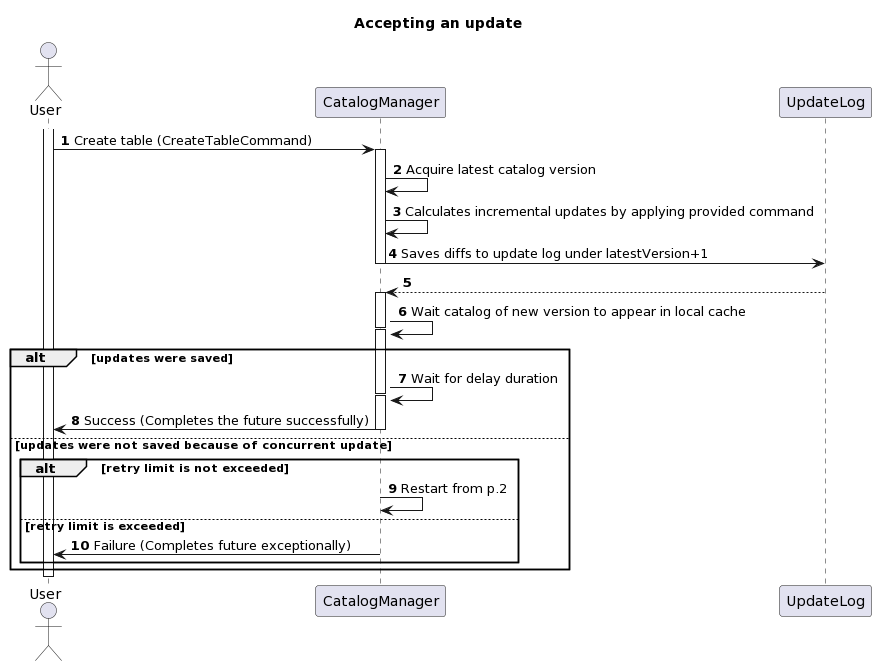
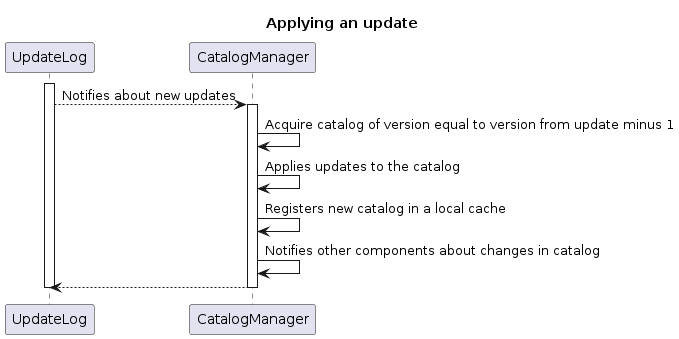

# Catalog module

Catalog is a component that responsible for managing descriptors of objects available in cluster.
Additionally, it serves as access point for other components to obtain proper version of descriptors
with respect to provided version of catalog or timestamp.

This module provides implementation of catalog service as well as internal API for accessing the
objects descriptors.

## Base components description

* [CatalogObjectDescriptor](src/main/java/org/apache/ignite/internal/catalog/descriptors/CatalogObjectDescriptor.java) --
  base class for objects managed by catalog, like tables, indexes, zones, etc.
* [CatalogService](src/main/java/org/apache/ignite/internal/catalog/CatalogService.java) -- provides
  methods to access catalog's objects' descriptors of the exact version and/or last actual version at 
  a given timestamp, which is a logical point-in-time. Besides, components may subscribe for catalog's
  events to be notified as soon as the change of interest is happened.
* [CatalogCommand](src/main/java/org/apache/ignite/internal/catalog/CatalogCommand.java) -- denotes
  particular modification of the catalog, like creation of particular table, for example.
* [CatalogManager](src/main/java/org/apache/ignite/internal/catalog/CatalogManager.java) -- provides
  methods for object manipulation (like creation of new object and/or modification of existing ones),
  also takes care of component lifecycle.
* [UpdateEntry](src/main/java/org/apache/ignite/internal/catalog/storage/UpdateEntry.java) -- 
  result of applying [CatalogCommand](src/main/java/org/apache/ignite/internal/catalog/CatalogCommand.java),
  represents delta required to move current version of catalog to state defined in the given command. 
* [UpdateLog](src/main/java/org/apache/ignite/internal/catalog/storage/UpdateLog.java) -- distributed
  log of incremental updates.

## Guarantee

For modify operation (invocation of `CatalogManager.execute()`), a resulting future will be completed
as soon as version in which results of the command take place becomes available on every node of the
cluster. This "availability" is determined as "version activation time plus some duration to make
sure changes are propagated and applied within the cluster", where `some duration` defined by 
`schemaSync.delayDuration` configuration property. This implies, that consequent read access to 
catalog service with latest timestamp (`HybridClock.now()`) from any node will return the catalog of
version that incorporates results of the command (assuming there were no concurrent updates overwriting
modifications made by initial command). This also implies, that concurrent access to the catalog service
may return catalog of version incorporating results of the command even if resulting future has not been
yet resolved. Additionally, there is an extra await to make sure, that locally new version will 
_always_ be available immediately after resulting future is completed. 

For read access, it's up to the caller to make sure, that version of interest is available in local
cache. Use `CatalogService.catalogReadyFuture` to wait for particular version, or 
`SchemaSyncService.waitForMetadataCompleteness` if you need a version which is active at provided 
point in time.

Consumers of catalog's events are allowed to read catalog at version from event. 

## How it works

### CatalogManager

Every modification of catalog is split on two phases: accept and apply. During accept phase, given command
is validated, then used to generate a list of update entries to save, and, finally, list is saved to 
distributed update log. Below is a sequence diagram describing accept phase:

After update entries are saved to the log, it is the job of the update log to propagate updates across the
cluster. On every node, update log notifies catalog manager about new update entries, and latter applies
them and stores new version of a catalog in a local cache. Below is a sequence diagram describing apply phase:

### UpdateLog

Current implementation of update log based on a metastorage. Update entries of version N are stored by
`catalog.update.{N}` key. Also, the latest known version is stored by `catalog.version` key. Updates
are saved on CAS manner with condition `newVersion == value(catalog.version)`.

#### Update log compaction

Over time, the log may grow to a humongous size. To address this, snapshotting was introduced to UpdateLog.
When saving snapshot of version N, update entries stored by `catalog.update.{N}` will be overwritten with
catalog's snapshot of this version. Every update entries of version lower that version of snapshot will be
removed. The earliest available version of catalog is tracked under `catalog.snapshot.version` key.

#### Update log recovery

During recovery, we read update entries one by one for all version starting with "earliest available" till
version stored by `catalog.version` key, and apply those updates entries once again.

#### Update log entries serialization

Update log entries are serialized by custom marshallers.
[UpdateLogMarshaller](src/main/java/org/apache/ignite/internal/catalog/storage/serialization/UpdateLogMarshaller.java)
is the entry point for catalog object serialization.

Update log entry may contain an hierarchical structure of objects.

For example, `NewSchemaEntry` contains `CatalogSchemaDescriptor` which
contains `CatalogTableDescriptor` which contains
`CatalogTableColumnDescriptor` and so on.

  
NewSchemaEntry example

* NewSchemaEntry
  * CatalogSchemaDescriptor
    * CatalogTableDescriptor[]
      * CatalogTableSchemaVersions
        * CatalogTableColumnDescriptor
      * CatalogTableColumnDescriptor\[\]
      *  ...
  * ...
  * CatalogIndexDescriptor\[\]

To simplify versioning of catalog objects, each serializable catalog object must implement  
[MarshallableEntry](src/main/java/org/apache/ignite/internal/catalog/storage/serialization/MarshallableEntry.java)
which allows the serializer to understand what type is being (de)serialized.
A separate external serializer is used for each object.

type of the object is currently written only for the root entities
(UpdateEntry). In the example with `NewSchemaEntry`, the type is written
for `NewSchemaEntry` but not for `CatalogSchemaDescriptor`,
`CatalogTableDescriptor`, and so on.

**The main change** in the new version of the protocol is that all
objects are written with the **type** of the object and the **version**
of serializer.

Let’s see how the data format must be changed using the
`VersionedUpdate` containing `AlterColumnEntry` serialization as
example.

    class VersionedUpdate {
     int version;
     long delayDurationMs;
     List<UpdateEntry> entries; // List.of(new AlterColumnEntry(...))
    }

    class AlterColumnEntry {
      int tableId;
      CatalogTableColumnDescriptor column;
    }

    class CatalogTableColumnDescriptor {
      String name;
      ...
    }

## Data format description

Current data format (version 1).

<table>
<colgroup>
<col style="width: 33%" />
<col style="width: 33%" />
<col style="width: 33%" />
</colgroup>
<tbody>
<tr class="odd">
<td style="text-align: left;">
field num
</td>
<td style="text-align: left;">
type
</td>
<td style="text-align: left;">
description
</td>
</tr>
<tr class="even">
<td style="text-align: left;">
1
</td>
<td style="text-align: left;">
<code>short</code>
</td>
<td style="text-align: left;">
Protocol version
</td>
</tr>
<tr class="odd">
<td style="text-align: left;">
2
</td>
<td style="text-align: left;">
<code>short</code>
</td>
<td style="text-align: left;">
Entry type
(<code>VersionedUpdate</code>)
</td>
</tr>
<tr class="even">
<td style="text-align: left;">
3
</td>
<td style="text-align: left;">
<code>varint</code>
(<code>int</code>)
</td>
<td
style="text-align: left;">
<code>VersionedUpdate</code>.<code>version</code>
</td>
</tr>
<tr class="odd">
<td style="text-align: left;">
4
</td>
<td style="text-align: left;">
<code>varint</code>
(<code>long</code>)
</td>
<td
style="text-align: left;">
<code>VersionedUpdate</code>.<code>delayDurationMs</code>
</td>
</tr>
<tr class="even">
<td style="text-align: left;">
5
</td>
<td style="text-align: left;">
<code>varint</code>
(<code>int</code>)
</td>
<td style="text-align: left;">
List size
(<code>VersionedUpdate</code>.<code>entries</code>.<code>size()</code>)
</td>
</tr>
<tr class="odd">
<td style="text-align: left;">
6
</td>
<td style="text-align: left;">
<code>varint</code>
(<code>short</code>)
</td>
<td style="text-align: left;">
Entry type
(<code>AlterColumnEntry</code>)
</td>
</tr>
<tr class="even">
<td style="text-align: left;">
7
</td>
<td style="text-align: left;">
<code>varint</code>
(<code>int</code>)
</td>
<td
style="text-align: left;">
<code>AlterColumnEntry</code>.<code>tableId</code>
</td>
</tr>
<tr class="odd">
<td style="text-align: left;">
8
</td>
<td style="text-align: left;">
<code>string</code>
</td>
<td
style="text-align: left;">
<code>CatalogTableColumnDescriptor</code>.<code>name</code>
</td>
</tr>
<tr class="even">
<td colspan="3" style="text-align: left;">
… other
<code>CatalogTableColumnDescriptor</code> fields
</td>
</tr>
</tbody>
</table>

Please note that entry type in field 2 and entry type in field 6 have
different types (short vs varint), this will be fixed by v2.

Description of the data format for protocol v2. Required changes between
protocol v1 and v2 are highlighted.

<table>
<colgroup>
<col style="width: 33%" />
<col style="width: 33%" />
<col style="width: 33%" />
</colgroup>
<tbody>
<tr class="odd">
<td style="text-align: left;">
field num
</td>
<td style="text-align: left;">
type
</td>
<td style="text-align: left;">
description
</td>
</tr>
<tr class="even">
<td style="text-align: left;">
1
</td>
<td style="text-align: left;">
<code>short</code>
</td>
<td style="text-align: left;">
Protocol version
</td>
</tr>
<tr class="odd">
<td style="text-align: left;">
2
</td>
<td style="text-align: left;">
<code>short</code>
</td>
<td style="text-align: left;">
Entry type
(<code>VersionedUpdate</code>)
</td>
</tr>
<tr class="even">
<td style="text-align: left;">
3

<strong>NEW
FIELD</strong>
</td>
<td style="text-align: left;">
<code>varint</code>
(<code>short</code>)
</td>
<td style="text-align: left;">
Serializer version
(<code>VersionedUpdateSerializer</code>)
</td>
</tr>
<tr class="odd">
<td style="text-align: left;">
4
</td>
<td style="text-align: left;">
<code>varint</code>
(<code>int</code>)
</td>
<td
style="text-align: left;">
<code>VersionedUpdate</code>.<code>version</code>
</td>
</tr>
<tr class="even">
<td style="text-align: left;">
5
</td>
<td style="text-align: left;">
<code>varint</code>
(<code>long</code>)
</td>
<td
style="text-align: left;">
<code>VersionedUpdate</code>.<code>delayDurationMs</code>
</td>
</tr>
<tr class="odd">
<td style="text-align: left;">
6
</td>
<td style="text-align: left;">
<code>varint</code>
(<code>int</code>)
</td>
<td style="text-align: left;">
List size
(<code>VersionedUpdate</code>.<code>entries</code>.<code>size()</code>)
</td>
</tr>
<tr class="even">
<td style="text-align: left;">
7
</td>
<td style="text-align: left;">
<code>varint</code>

<strong>CHANGE
TO</strong> <code>short</code>
</td>
<td style="text-align: left;">
Entry type
(<code>AlterColumnEntry</code>)
</td>
</tr>
<tr class="odd">
<td style="text-align: left;">
8

<strong>NEW
FIELD</strong>
</td>
<td style="text-align: left;">
<code>varint</code>
(<code>short</code>)
</td>
<td style="text-align: left;">
Serializer version
(<code>AlterColumnEntrySerializer</code>)
</td>
</tr>
<tr class="even">
<td style="text-align: left;">
9
</td>
<td style="text-align: left;">
<code>varint</code>
(<code>int</code>)
</td>
<td
style="text-align: left;">
<code>AlterColumnEntry</code>.<code>tableId</code>
</td>
</tr>
<tr class="odd">
<td style="text-align: left;">
10

<strong>NEW
FIELD</strong>
</td>
<td style="text-align: left;">
<code>short</code>
</td>
<td style="text-align: left;">
Entry type
(<code>CatalogTableColumnDescriptor</code>)
</td>
</tr>
<tr class="even">
<td style="text-align: left;">
11

<strong>NEW
FIELD</strong>
</td>
<td style="text-align: left;">
<code>varint</code>
(<code>short</code>)
</td>
<td style="text-align: left;">
Serializer version
(<code>CatalogTableColumnDescriptorSerializer</code>)
</td>
</tr>
<tr class="odd">
<td style="text-align: left;">
12
</td>
<td style="text-align: left;">
<code>string</code>
</td>
<td
style="text-align: left;">
<code>CatalogTableColumnDescriptor</code>.<code>name</code>
</td>
</tr>
<tr class="even">
<td colspan="3" style="text-align: left;">
… other
<code>CatalogTableColumnDescriptor</code> fields
</td>
</tr>
</tbody>
</table>

The highlighted changes required to bring the current format to the
following form

<table>
<colgroup>
<col style="width: 50%" />
<col style="width: 50%" />
</colgroup>
<tbody>
<tr class="odd">
<td style="text-align: left;">
Field description
</td>
<td style="text-align: left;">
type
</td>
</tr>
<tr class="even">
<td style="text-align: left;">
Protocol version (2)
</td>
<td style="text-align: left;">
<code>short</code>
</td>
</tr>
<tr class="odd">
<td style="text-align: left;">
Object type
</td>
<td style="text-align: left;">
<code>short</code>
</td>
</tr>
<tr class="even">
<td style="text-align: left;">
Object serialization format
version
</td>
<td style="text-align: left;">
<code>varint</code>
</td>
</tr>
<tr class="odd">
<td style="text-align: left;">
Object payload
</td>
<td style="text-align: left;">
.
</td>
</tr>
</tbody>
</table>

## Implementation description

`CatalogEntrySerializerProvider` - registry of all known serializers.

    interface CatalogEntrySerializerProvider {
        // New method is used to obtain serializer of specific version.
        CatalogObjectSerializer<MarshallableEntry> get(int version, int typeId);

        // Used to obtain the newest serializer (active for writing) version.
        int activeSerializerVersion(int typeId);
    }

`CatalogObjectSerializer` - serializer for a particular version of an
object

    interface CatalogObjectSerializer<T> {
        /** Reads catalog object from data input. */
        T readFrom(CatalogObjectDataInput input) throws IOException;

        /** Writes catalog object to the data output. */
        void writeTo(CatalogObjectDataInput input) throws IOException;
    }

Each serializer implementation should be annotated with the following
(the class name is not final and should be changed)

    @Target(ElementType.TYPE)
    @Retention(RUNTIME)
    public @interface CatalogSerializer {
        /**
         * Returns serializer version.
         */
        short version();

        /**
         * Returns the type of the object being serialized.
         */
        MarshallableEntryType type();

        /**
         * The product version starting from which the serializer is used.
         */
        String since();
    }

It is required to implement a new classes that will hide protocol
implementation details (mixture of `ObjectStream` and
`IgniteDataInput`).

    interface CatalogObjectDataInput extends IgniteDataInput {
        // Reads an object.
        <T> T readObject() throws IOException;
    }

    interface CatalogObjectDataOutput extends IgniteDataOutput {
        // Writes an object.
        void writeObject(MarshallableEntry object) throws IOException;
    }

Depending on the implementation requirements,
`CatalogObjectDataInput`/`CatalogObjectDataOutput` can be extended with
the necessary methods to read/write collections.

## Migration from v1 to v2

-   All existing serializers should be annotated
    `@CatalogSerializer(version=1, since="3.0.0",...)` and moved to
    separate package. The implementation of reading/writing data in them
    does not change.

-   For each existing serializer, a new version (version=2,
    since="3.1.0") must be added, these version 2 serializers will use
    the new methods for reading and writing objects.

-   During startup `CatalogEntrySerializerProvider` will scan existing
    serializers and build registry.

-   Thus, for reading objects (depending on the protocol version), the
    first or second version of the serializer will be used. But writing
    objects will be done under the highest version.

# Versioning rules

-   The serializer version is incremented by 1 (we need to make sure of
    this when building the registry).

-   Each serializer must be annotated with
    `@CatalogSerializer(type=N, version=N, since="X.X.X")`. This
    annotation will be used to build registry of all serializers. The
    version in `since` field will be used to understand which
    serializers are already in use in the "released version" and whose
    data format should not change. For example, all currently existing
    catalog serializers will be marked as `since 3.0.0`.

These rules should be documented in the Javadoc of the
`CatalogEntrySerializerProvider` (or `CatalogObjectSerializer`)
interface.

# Limitation

-   Serialization protocol doesn’t support forward compatibility

-   For consistency, each array/collection object is written with a
    header (type + serializer version), even if all elements have the
    same type (for example `CatalogSchemaDescriptor`.`indexes` has
    elements for which different serializers with different versions
    must be used).

# Testing

It is required to have a "basic" compatibility test to ensure that we
can deserialize data in the first version format.

My suggestion on this matter is as follows:

-   It is necessary to generate binaries in the first version of the
    protocol. At least `VersionedUpdate` with all possible entries and
    `SnapshotEntry` with complex schema.

-   These binaries should be stored in resources.

-   The unit test should make sure we can deserialize it correctly.
