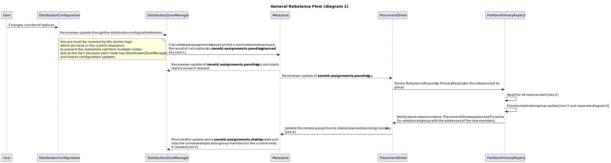

## Introduction
Since the last rebalance design we made some significant decisions and architecture updates:
- Transaction protocol introduced the new cluster/group wide roles like Tracker (Placement Driver), LeaseHolder (Primary replica) and etc. (see [Transaction Protocol](https://cwiki.apache.org/confluence/display/IGNITE/IEP-91%3A+Transaction+protocol))
- The protocol of replication itself will be extended to the pluggable abstraction, instead of RAFT-only one. (TODO: IGNITE-18775 add the document link, when it will be ready to share).
- New distribution zones layer was introduced (see [Distribution Zones](https://cwiki.apache.org/confluence/display/IGNITE/IEP-97%3A+Distribution+Zones)). So, the assignment property is not the part of table configuration anymore.

These changes incline us to the thoughts, that we need to revise the current rebalance flow, because it doesn't suite to the new architecture anymore in general and doesn't use the power of new abstractions on the other side.

## Rebalance triggers
The simplest way to start the journey to the new design: look at the real cases and try to draw the whole picture.

We still has the number of triggers, which trigger a rebalance:
- Change the number of replicas for any distribution zone.
- Change the number of partitions for any distribution zone.
- Change the distribution zone data nodes composition.

Let's take the first one to draw the whole rebalance picture.
## Change the number of replicas


### 1. Update of pending/planned zone assignments
Update of `zoneId.assignments.*` keys can be expressed by the following pseudo-code:
```
var newAssignments = calculateZoneAssignments()

metastoreInvoke: // atomic metastore call through multi-invoke api
    if empty(zoneId.assignments.change.revision) || zoneId.assignments.change.revision < configurationUpdate.revision:
        if empty(zoneId.assignments.pending) && zoneId.assignments.stable != newAssignments:
            zoneId.assignments.pending = newAssignments 
            zoneId.assignments.change.revision = configurationUpdate.revision
        else:
            if zoneId.assignments.pending != newAssignments
                zoneId.assignments.planned = newAssignments
                zoneId.assignments.change.revision = configurationUpdate.revision
            else
                remove(zoneId.assignments.planned)
    else:
        skip
```
### 2. Wait for the all needed replicas to start rebalance routine
It looks like we can reuse the mechanism of AwaitReplicaRequest:
- PrimaryReplica send an AwaitReplicaRequest to all new replicas.
- When all answers received, rebalance can be started 

### 3. Replication group rebalance
Let's zoom to the details of PrimaryReplica and replication group communication for the RAFT case:


* Any replication member can has in-flight RO transactions. But at the same time, if it is not a member of new topology, it will not receive updates of safe time, so these RO transactions will be failed by timeout or even earlier (see [Transaction Protocol](https://cwiki.apache.org/confluence/display/IGNITE/IEP-91%3A+Transaction+protocol)). So, it is not an issue for correctness.

#### 3.1 Notification about the new leader and rebalance events
Current rebalance algorithm based on the metastore invokes and local rebalance listeners.

But for the new one we have an idea, which doesn't need the metastore at all:
- On rebalanceDone/rebalanceError/leaderElected events the local event listener send a message to PrimaryReplica with the description of event
- If PrimaryReplica is not available - we should retry send, until leader didn't find himself outdated (in this case, new leader will send leaderElected event to PrimaryReplica and receives the rebalance request again.

### 4. Update the rebalance state after successful rebalance
Within the single atomic metastore invoke we must update the keys according to the following pseudo-code:
```
    metastoreInvoke: \\ atomic
        zoneId.assignment.stable = newPeers
        remove(zoneId.assignment.cancel)
        if empty(zoneId.assignment.planned):
            zoneId.assignment.pending = empty
        else:
            zoneId.assignment.pending = zoneId.assignment.planned
            remove(zoneId.assignment.planned)
```
About the `*.cancel` key you can read [below](#cancel-an-ongoing-rebalance-process-if-needed)

### 5. Stop the redundant replicas and update replicas clients
Here we need to:
- Stop the redundant replicas, which is not in the current stable assignments
  - We can accidentally stop PrimaryReplica, so we need to use the algorithm of a graceful PrimaryReplica transfer, if needed.
- Update the replication protocol clients (RaftGroupService, for example) on each Replica.

## Failover logic
The main idea of failover process: every rebalance request and cancel rebalance request PlacementDriver->PrimaryReplica or PrimaryReplica->ReplicationGroup must be idempotent. So, redundant request in the worst case should be just answered by positive answer (just like rebalance is already done).

After that we can prepare the following logic:
- On every new PD leader elected - it must check the direct value (not the locally cached one) of `zoneId.assignment.pending`/`zondeId.assignment.cancel` (the last one always wins, if exists) keys and send `RebalanceRequest`/`CancelRebalanceRequest` to needed PrimaryReplicas and then listen updates from the last revision of this key.
- On every PrimaryReplica reelection by PD it must send the new `RebalanceRequest`/`CancelRebalanceRequest` to PrimaryReplica, if pending/cancel (cancel always wins, if filled) key is not empty. 
- On every leader reelection (for the leader oriented protocols) inside the replication group - leader sends leaderElected event to PrimaryReplica, which forces PrimaryReplica to send RebalanceRequest/CancelRebalanceRequest to the replication group leader again.

More over: 
- `RebalanceRequest`/`CancelRebalanceRequest` must include the revision of its' trigger. 
- PrimaryReplica must persist the last seen revision locally.
- When new PrimaryReplica elected, PlacementDriver must initialize the last seen revision of PrimaryReplica to the `currentRevision-1`. So, after that PlacementDriver must send the *Request with current actual revision.
- PrimaryReplica must skip any requests, if their revision < lastSeenRevision.
These actions protect PrimaryReplica from processing the messages from inactive PlacementDriver.

## Cancel an ongoing rebalance process if needed
Sometimes we must cancel the ongoing rebalance:
- We can receive an unrecoverable error from replication group during the current rebalance
- We can decide to cancel it manually


### 1. Put rebalance intent to *.cancel key
For the purpose of persisting for cancel intent, we must save the (oldTopology, newTopology) pair of peers lists to `zoneId.assignment.cancel` key.
Also, every invoke with update of `*.cancel` key must be enriched by revision of the pending key, which must be cancelled:
```
    if(zoneId.assignment.pending.revision == inputRevision):
        zoneId.assignment.cancel = cancelValue
        return true
    else:
        return false
```
It's needed to prevent the race, between the rebalance done and cancel persisting, otherwise we can try to cancel the wrong rebalance process.

### 2. PrimaryReplica->ReplicationGroup cancel protocol
When PrimaryReplica send `CancelRebalanceRequest(oldTopology, newTopology)` to the ReplicationGroup following cases are possible:
- Replication group has ongoing rebalance oldTopology->newTopology. So, it must be cancelled and cleanup for the configuration state of replication group to oldTopology must be executed.
- Replication group has no ongoing rebalance and currentTopology==oldTopology. So, nothing to cancel, return success response.
- Replication group has no ongoing rebalance and currentTopology==newTopology. So, cancel request can't be executed, return the response about it. Result recipient of this response (placement driver) must log this fact and do the same routine for usual rebalanceDone.
