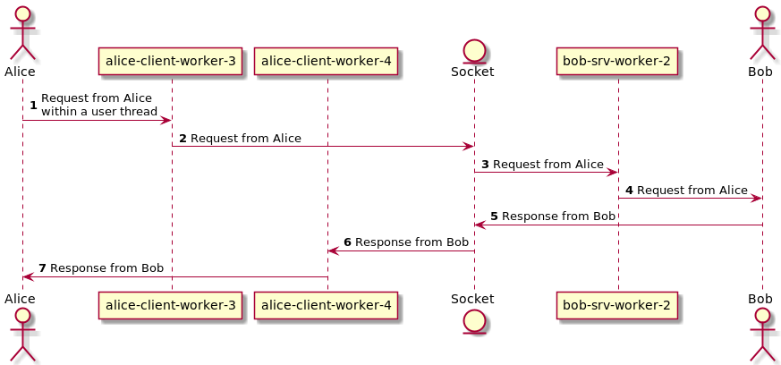
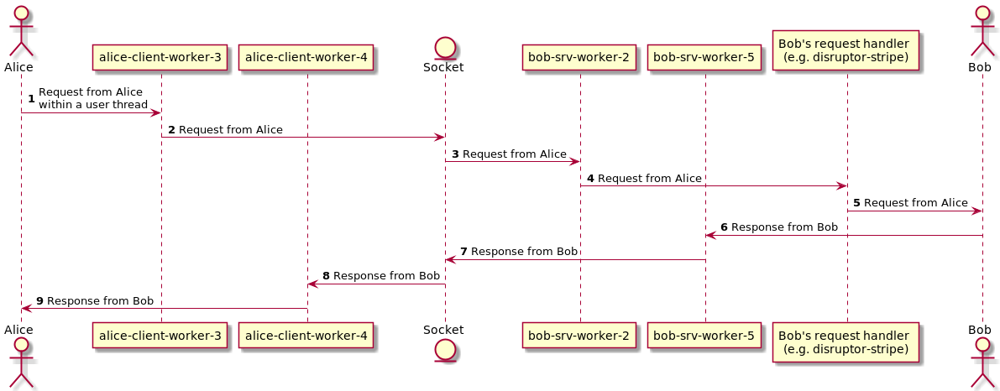
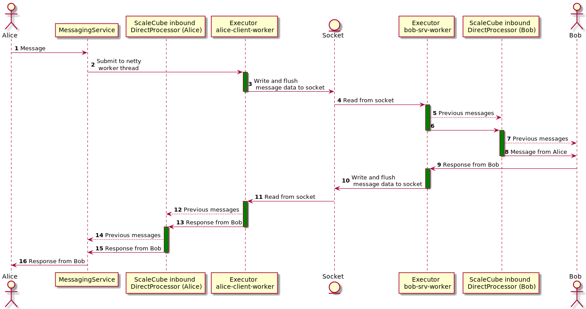

This module provides implementations for the Network API module.

## Brief overview
Ignite uses ScaleCube to form a network cluster. Ignite uses channels opened via Netty to exchange messages between
nodes. ScaleCube also sends its messages over this transport.

## Channel types
A couple of nodes might have a channel per each channel type. Each of these channels is only used to exchange messages
using the given channel type. There a few standard channel types:

 * Default (used by default when channel type is not specified), id=0
 * Scalecube (used by all ScaleCube messages), id=1
 * Deploy (used to send deployment artifacts that might be quite heavy), id=2
 * Files (used to exchange files), id=3

## Message serialization
Ignite uses direct marshalling to serialize and deserialize messages.
For every `@Transferable` message interface `ignite-network-annotation-processor` generates
an implementation for the message interface, a serializer and a deserializer.
Supported types:
 + All primitives
 + Other `@Transferable` objects
 + `java.lang.String`
 + `java.util.UUID`
 + `org.apache.ignite.lang.IgniteUuid`
 + `java.util.BitSet`
 + `java.util.Collection<V>` where `V` can be any supported type
 + `java.util.Map<K, V>` where `K` and `V` can be any supported type
 + Arrays of all supported types

If one wants to have a property in the message, that shouldn't be serialized, `@Transient` annotation should be used.
Such properties will still be available in builder, like the rest.

## Threading
Every Ignite node has three network thread pool executors and thread naming formats:
+ Client worker - handles channel events on a client (`{consistentId}-client-X`)
+ Server boss - accepting incoming connections (`{consistentId}-srv-accept-X`)
+ Server worker - handles channel events on a server (`{consistentId}-srv-worker-X`),
where `X` is the index of the thread in a pool.

Messages are then passed on to message listeners of the ConnectionManager.   
In case of ClusterService over ScaleCube (see `ScaleCubeClusterServiceFactory`),
messages are passed down to the ClusterService via the Project Reactor's Sink which enforces a strict order of message handling:
a new message can't be received by ClusterService until a previous message is **handled** (see [message handling](#message-handling)).

Message handling can also be offloaded to another thread:

Note that in this case the network message would be considered **handled** before it is processed  
by another thread.

The default `MessagingService` implementation handles incoming messages in the inbound thread pool, threads are named
`{consistentId}-MessagingService-inbound-X-Y` (one per channel type), where X stands per channel ID. Deserialization of the
incoming messages happens in these threads as well.

It also uses an outbound thread `{consistentId}-MessagingService-outbound-X` for sending messages (message serialization also happens in this thread).

ScaleCube uses `sc-cluster-X` (where X is an address of the node, e.g. `localhost-3344`) scheduler for the failure 
detector, gossip protocol, metadata store and the membership protocol.

## Message handling
Message handlers are called in the order they were added.  
Message is considered **handled** after all the message handlers have been invoked.

## Message's flow example
Two nodes, Alice and Bob.
User is sending a message from Alice to Bob within any thread.

