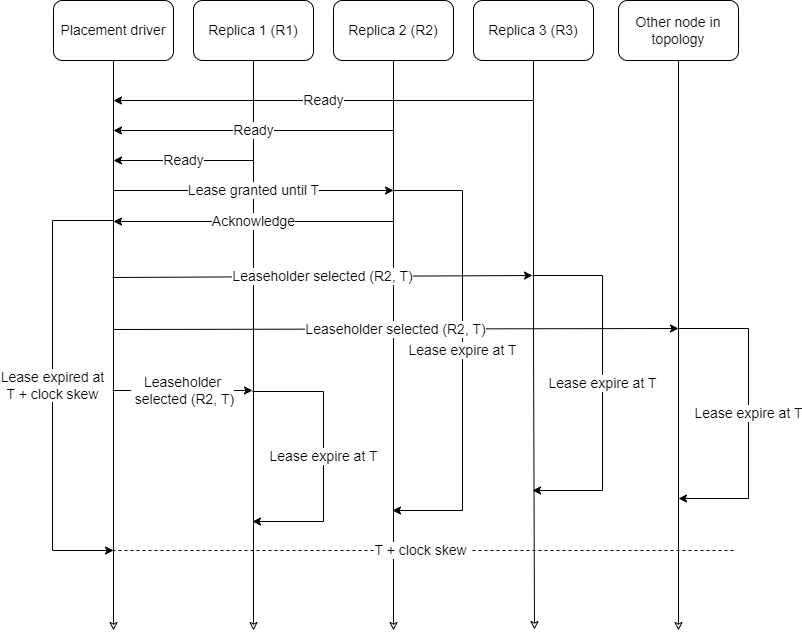
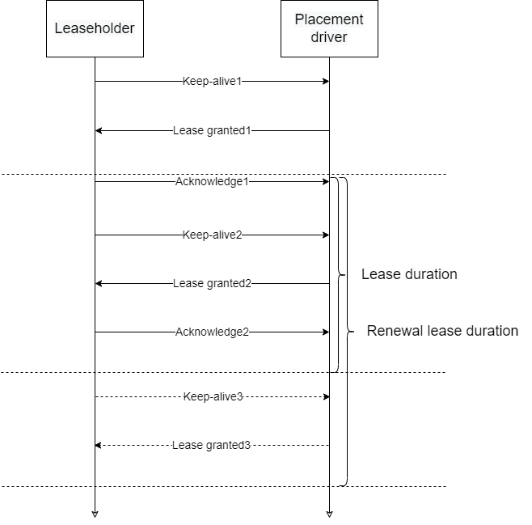

# Placement driver

The module performs two functions:
- responsible for a primary replica (member or replication group, which holds a lease) selection and fail-over;
- provides an API in order to retrieve the information about available primary replicas along with corresponding meta such as leaseholder 
interval.

The primary replica is a replica which holds a lease. Only a primary replica can execute RW transaction operations (RW transaction is
described in ignite-transaction module).

## Leaseholder management
Placement driver logically depends on the assignments and logical topology. The manager listens change of group members (due to a particular
data zone shrink or growing) and appear / disappear nodes in logical topology. The list of possible leaseholders depends on nodes in 
assignment according to nodes available in the current topology. The process of acquire lease:
1. Any change of topology or assignment can be a trigger of lease providing.
2. One replica among of available replica is chosen by the placement driver.
3. An information about The chosen replica is spread across all cluster nodes.

The leaseholder is able to be elected only when group members are enough. This is the reason for the placement driver to await all group
members before primary replica selection.

The initial lease grant process is represented in the diagram:

All members know that the lease is already released when a lease expired in placement driver, because it has correction on clock skew
interval.

After the primary replica is elected, it starts sending keep-alive messages in order to renew its lease interval. Otherwise, a new 
leaseholder will be elected.

