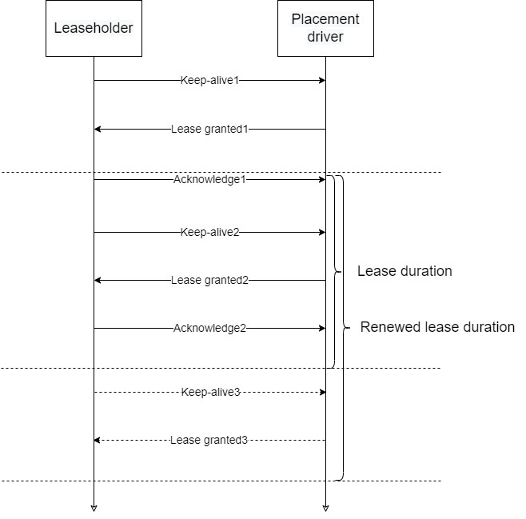

# Placement driver

The module performs two functions:
- responsible for a primary replica (member or replication group, which holds a lease) selection and fail-over;
- provides an API in order to retrieve the information about available primary replicas along with corresponding meta such as leaseholder 
interval.

## Leaseholder management
Placement driver logically depends on the assignments and logical topology. The manager listens change of group members (due to a particular
data zone shrink or growing) and appear / disappear nodes in logical topology. The list of possible lease leaseholders depends on nodes in 
assignment according to nodes available in the current topology.

The leaseholder will be able to be elected only when group members are enough. By the reason the module waits the members at first and then
the defines a leaseholder of the group.

When a leaseholder is selected, it should renew their lease before the lease does not expire. Otherwise, a new leaseholder will be elected.

