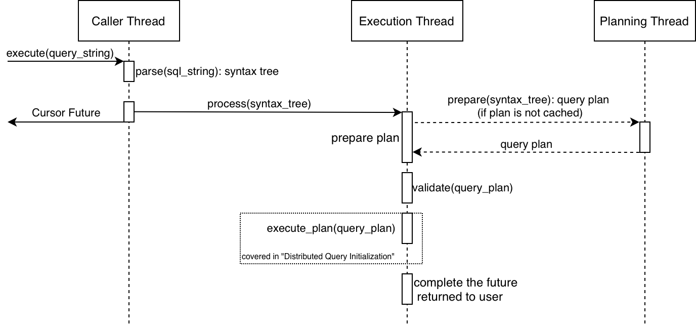
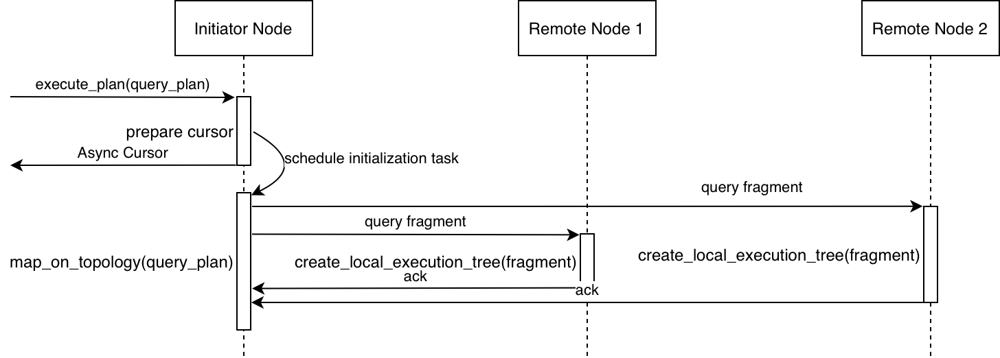
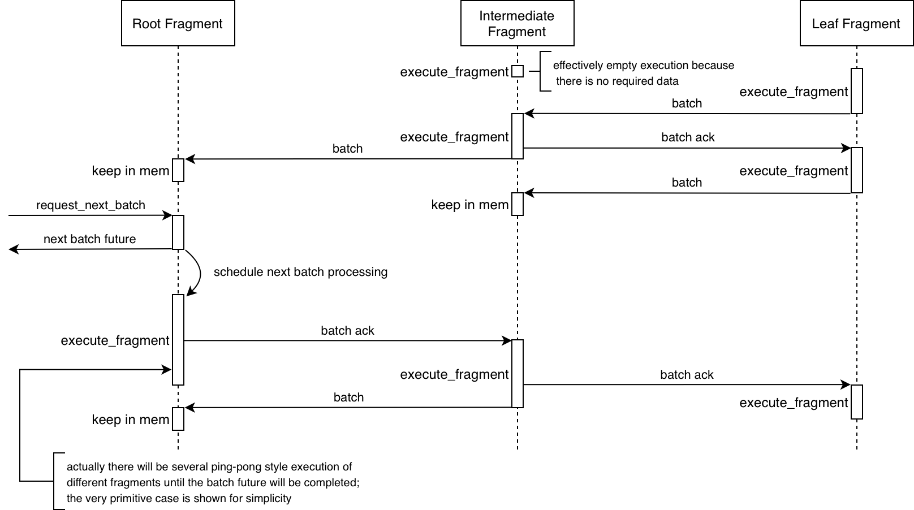

# Apache Ignite SQL Engine

## Threading Model

Every Ignite node uses two thread pools for query processing.

### Planning pool

This pool is used to optimize queries and DML statements.

The unit of work for this pool is a query that should be optimized. An optimization task is compute-heavy. Besides, the planning cycle is not optimized well enough, hence some tasks might require unreasonable amounts of time to complete, thus should be killed by a timeout.

The size of this pool was chosen by a dice roll and hardcoded to 4. The pool is named ‘sql-planning-pool’.

### Execution pool

This pool is used to process every step of query execution, except for planning.

It is very important that the threads of this pool stay alive and not block, because each query fragment is tied to a specific thread from this pool, otherwise all queries will stop executing or even fail if the thread dies.

Every task submitted to this pool is compute-heavy. The task should be limited to the reasonable size of computation to give a chance to others to make progress.

The size of this pool was chosen by a dice roll and hardcoded to 4. The pool is named ‘sql-execution-pool’.

## Query Execution Flow

A distributed query execution is divided into 3 steps:

1. Query preparation step.
   
2. Distributed query initialization.
   
3. Query execution.

### Query Preparation Flow

Below is a sequence diagram for the query preparation.

It includes query parsing, validation, and optimization, as well as creation of the cursor through which the results of the query could be fetched.

Query preparation is processed solely on an initiator node. 

After preparation is complete, rest of query execution is processed inside execution pool only, hence the information about processing thread is omitted on the rest of diagrams.

The network threads could be ignored since the message is immediately dispatched to the execution pool as soon as it hit the message handler provided by sql engine. 

### Distributed Query Initialization Flow

At this step query plan is mapped on current state of topology, query fragments are sent to appropriate node.

### Query Actual Execution Flow

Below is a sequence diagram of a distributed query three.

At this point information about a node executing the fragment doesn't matter, thus omitted.

Amount of intermediate fragments may vary, as well as amount of leaf fragments.

The very primitive case with only one leaf and one intermediate fragments is shown, yet this case is sufficient to shed a light on a general concepts of distributed query tree execution.

Note: the execution of non-root fragments begins as soon as they initialized on a remote node; execution of a root fragment is started after the first batch is requested.

